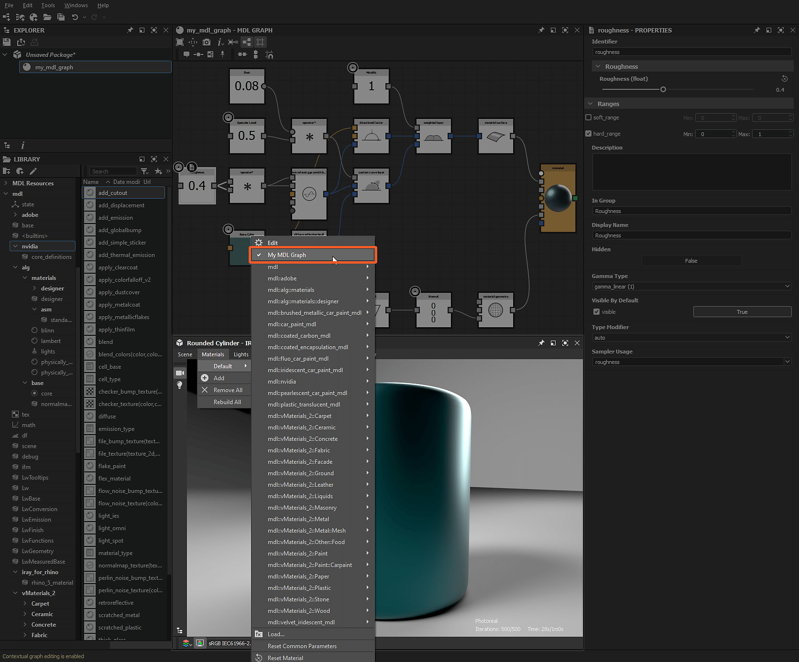

# MDL-Bibliothek

Auf dieser Seite wird die Inhaltsbibliothek von [MDL-Diagramms](../../mdl-graphs/mdl-graphs.md) und in Substance 3D Designer enthaltenen Materialien angezeigt. Außerdem wird erläutert, wie benutzerdefinierte Inhalte in der [Bibliothek](../../interface/the-library/the-library.md) installiert und verwaltet werden.

## MDL-Inhalte in der Bibliothek

In MDL-Diagrammen verwendbare Knoten sind im Abschnitt <b>mdl</b> der [Library](../../interface/the-library/the-library.md) verfügbar. Die Knotenpunkte sind nach dem MDL-Modul, in dem sie definiert sind, zu Filtern zusammengefasst.\
Wenn Module in Unterordnern gespeichert sind, wird diese Hierarchie *gespiegelt* in der Bibliothek als *Kategorien*.

Dieser Abschnitt enthält Inhalte aus den folgenden Quellen:

<table>
<tr style="border: 0;">
<td style="border: 0;" valign="top">

### Integrierte Inhalte.

Designer umfasst MDL-Modul mit grundlegenden Bausteinen für die Erstellung von MDL-Diagrammen sowie vollständige Material-Definitionen, die sofort verwendet werden können.

Dieser Inhalt wird an diesem Speicherort unter dem Installationsverzeichnis gespeichert: `./resources/view3d/iray/`

### Benutzerdefinierter Inhalt

Zusätzlich zum integrierten Inhalt können Sie der Bibliothek *Ihre eigenen* MDL-Module hinzufügen.

Jedes MDL-Modul, das unter den Verzeichnissen im Abschnitt <b>MDL</b> der [Projekteinstellungen](../../interface/preferences-window/project-settings/project-settings.md) gefunden wird, wird diesem Abschnitt *kumulativ* in allen Projektdateien hinzugefügt.

### NVIDIA vMaterials

Wenn die Bibliothek [vMaterials](https://developer.nvidia.com/vmaterials) von NVIDIA installiert ist, wird sie *automatisch* in der Bibliothek unter der *eigenen Kategorie* hinzugefügt.

</td>
<td style="border: 0;" valign="top">

*&quot;mdl&quot;-Abschnitt in der Bibliothek, die vMaterials-Bibliothek und der benutzerdefinierte Inhalt werden eingerahmt*

</td>
</tr>
</table>

## MDL-Inhalt in der 3D-Ansicht

Alle in der Library verfügbaren MDL-Module können in der [3D-Ansicht](../../interface/3d-view/3d-view.md) verwendet werden, wenn der Iray-Renderer verwendet wird.

Öffnen Sie das Menü <b>Materials</b> und öffnen Sie das Untermenü *eines* Szene-Materials, um die verfügbaren MDL-Moduls zu durchsuchen. Die Listen umfassen:

* Integrierte Inhalte.
* Benutzerdefinierter Inhalt
* NVIDIA [vMaterials](https://developer.nvidia.com/vmaterials)
* [MDL-Diagramme geladen](../../mdl-graphs/mdl-graphs.md)

*MDL-Materialien in der 3D-Ansicht*
