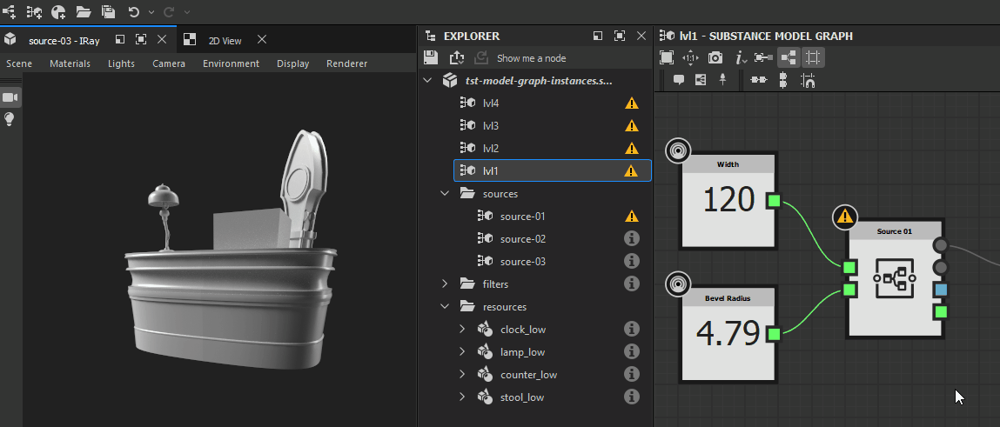

# Warnungen in MDL-Diagrammen

Auf dieser Seite werden Warnungen und Fehlermeldungen aufgelistet, die von MDL-Diagrammen in [Substance 3D Designer](https://www.adobe.com/products/substance3d-designer.html) ausgelöst werden können. Außerdem werden für jedes dieser Diagramme häufige Schritte zur Fehlerbehebung angeboten.

Warnungen werden in der QuickInfo des Warnsymbols für die Diagrammressource im Bereich [Explorer](../../interface/the-explorer-window/the-explorer-window.md) sowie in der unteren linken Ecke der [Diagrammansicht](../../interface/the-graph-view/the-graph-view.md) angezeigt, wenn das Diagramm geladen ist.

>[!NOTE]
>
> Die Abbildungen in diesem Abschnitt wurden in <b>Substance-Modellgrafiken</b> aufgezeichnet, die *eingestellt* in der Version <b>13.0.0</b> von Substance 3D Designer waren. Sie gelten jedoch auch für MDL-Grafiken.

##  Kein Ausgabeknoten definiert

Für das Diagramm ist kein Ausgabeknoten definiert.

<b> Lösung</b>

Wählen Sie einen beliebigen Knoten im Diagramm aus, der einen Wert ausgibt, dessen Typ dem erwarteten Typ für diese Funktion entspricht (falls vorhanden), klicken Sie dann auf RMB und wählen Sie im Kontextmenü die Option <b>Als Stamm festlegen</b> oder doppelklicken Sie auf LMB auf dem Knoten.\
Der Ausgabeknoten eines Substance-Modelldiagramms ist *orange*.

###  Mindestens ein Eingabewert wurde abgelehnt.

Der für einen Parameter angegebene Wert führt nicht zu einer gültigen Berechnung des Knotens.

<b> Lösung</b>

Passen Sie den Wert so an, dass er für den Zielparameter sinnvoll ist.

###  Kein Eingabewert

Ein Eingabewert, der von einem Knoten zur Durchführung seiner Berechnung erwartet wird, wird nicht bereitgestellt.

<b> Lösung</b>

Einige Knotenparameter können nicht auf einen Standardwert zurückgreifen, wenn keine Daten an den Eingangsanschluss geliefert werden. Dies ist häufig der Fall bei Szeneneingaben.

Schließen Sie die Knoteneingänge an den entsprechenden Ausgangsanschluss eines anderen Knotens an.

###  Knoten wurde nicht berechnet

Die dem Knoten bereitgestellten Informationen sind unvollständig oder ungültig, sodass der Knoten seine Berechnungen nicht durchführen konnte.

<b> Lösung</b>

Gehen Sie im Diagramm stromaufwärts und suchen Sie nach Warnungen, die durch Probleme ausgelöst werden, die Knoten daran hindern, eine gültige Ausgabe bereitzustellen.

###  Die referenzierten Daten enthalten einige Warnungen.

Die Ressource, auf die von einem Knoten verwiesen wird, enthält eine oder mehrere Warnungen. Im Folgenden finden Sie einige Knoten, die auf eine Ressource verweisen:

* Ein Grapheninstanzknoten verweist auf ein Diagramm
* Ein Szenenressourcenknoten verweist auf eine Bitmap-3D-Szenenressource

<b> Lösung</b>

Suchen Sie im Explorer-Bedienfeld nach der referenzierten Ressource und beheben Sie alle von der Ressource ausgelösten Warnungen:

* Weitere Diagramme finden Sie auf dieser Seite.
* Informationen zu anderen Ressourcentypen finden Sie auf der Seite Warnungen von Abhängigkeiten .

###  Referenzierte Ressource nicht gefunden

Die Ressource, auf die von einem Knoten verwiesen wird, wurde unter dem in der Substance 3D-Datei (SBS) gespeicherten Pfad nicht gefunden. Im Folgenden finden Sie einige Knoten, die auf eine Ressource verweisen:

* Ein Grapheninstanzknoten verweist auf ein Diagramm
* Ein Szenenressourcenknoten verweist auf eine Bitmap-3D-Szenenressource

<b> Lösung</b>

Für Knoten der Diagramminstanz

Überprüfen Sie, ob das Quelldiagramm im Paket vorhanden ist, das sich in dem Pfad befindet, der in ihrem <b>Package</b>-Attribut gespeichert ist.\
Ist dies nicht der Fall, löschen Sie den Instanzknoten und ersetzen Sie ihn durch einen Instanzknoten, der auf ein gültiges Paket verweist. Alternativ können Sie das Paket und das Diagramm, auf das der Instanzknoten verweist, neu erstellen und dann das Hostpaket neu laden, indem Sie im Bedienfeld [Explorer](https://substance3d.adobe.com/documentation/display/DRAFTDESIGNER/.The+Explorer+window+vDraftVersion) auf *RMB* klicken und im Kontextmenü die Option <b>Erneut laden</b> auswählen.

Für Szenenressourcenknoten

Suchen Sie die referenzierten Ressourcen im Bereich [Explorer](https://substance3d.adobe.com/documentation/display/DRAFTDESIGNER/.The+Explorer+window+vDraftVersion) und überprüfen Sie, ob sie an dem Speicherort vorhanden sind, der in ihrem <b>Dateipfad</b>-Attribut gespeichert ist.\
Wenn dies nicht der Fall ist, klicken Sie auf *RMB* auf dem Ressourcenelement im Explorer, und wählen Sie <b>Verschieben...Option &quot;</b>&quot; im Kontextmenü, um eine neue gültige Zieldatei für diese Ressource festzulegen.

###  Der weiche Bereich enthält den Wert nicht.

Der Standardwert eines exponierten Parameters ist nicht in dem für diesen Parameter definierten weichen Bereich enthalten.

<b> Lösung</b>

Passen Sie den Standardwert bzw. den Soft-Range so an, dass Erstere in Letztere aufgenommen wird.

>[!NOTE]
>
> Diese Warnung kann nicht über die Benutzeroberfläche ausgelöst werden, da *den Soft-Bereich automatisch so anpasst, dass er den Standardwert enthält.* Nur das Ändern der Daten in der Substance 3D-Datei (SBS) *direkt* kann dazu führen, dass diese Warnung ausgelöst wird.

&quot; des Werts.

###  Der weiche Bereich liegt außerhalb des festen Bereichs.

Der weiche Bereich von und der exponierte Parameter sind nicht vollständig in dem für diesen Parameter definierten harten Bereich enthalten.

<b> Lösung</b>

Passen Sie den Soft- oder Hard-Bereich so an, dass Erstere vollständig in Letztere aufgenommen wird.

>[!NOTE]
>
> Diese Warnung kann nicht über die Benutzeroberfläche ausgelöst werden, da *automatisch den weichen Bereich anpasst, der vollständig in den harten Bereich einbezogen werden soll.* Nur das Ändern der Daten in der Substance 3D-Datei (SBS) *direkt* kann dazu führen, dass diese Warnung ausgelöst wird.

###  Der Wert liegt außerhalb des zulässigen Bereichs.

Der Standardwert eines angezeigten Parameters ist nicht in dem für diesen Parameter definierten festen Bereich enthalten.

<b> Lösung</b>

Passen Sie den Standardwert bzw. den festen Bereich so an, dass Erstere in Letztere einbezogen werden.

>[!NOTE]
>
> Diese Warnung kann nicht über die Benutzeroberfläche ausgelöst werden, da *automatisch den Standardwert anpasst, der in den festen Bereich aufgenommen werden soll.* Nur das Ändern der Daten in der Substance 3D-Datei (SBS) *direkt* kann dazu führen, dass diese Warnung ausgelöst wird.

