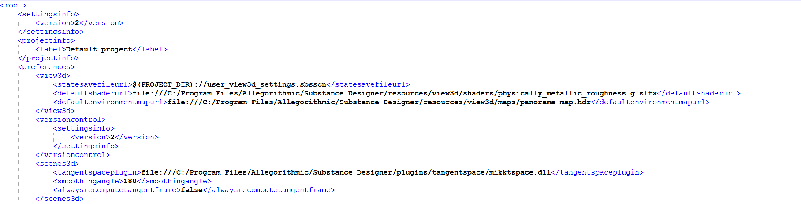

# Überblick

<table>
<tr style="border: 0;">
<td width="100.00%" style="border: 0;" valign="top">

<b>Projektkonfigurationsdateien</b> sind die komplexesten und umfangreichsten Dateien, die zum Konfigurieren von Substance 3D Designer verwendet werden.

Sie sind insofern besonders, als Sie mehrere Projektkonfigurationsdateien verwenden können, bei denen jedes nächste &quot;untergeordnete&quot; Projekt das vorherige &quot;übergeordnete&quot; Projekt erweitert oder überschreibt. Sofern nicht ausdrücklich erforderlich, sollten die Einstellungen nicht geändert oder den Projektdateien hinzugefügt werden, sodass Designer auf die übergeordnete Konfiguration oder sogar auf die Standardeinstellungen zurückgreifen kann.

</td>
<td width="25.00%" style="border: 0;" valign="top">


</td>
</tr>
</table>

Standardmäßig sind in Designer zwei Projektkonfigurationen aktiv:

<b>Standardprojekt: </b>Enthält alle Standardeinstellungen und die Designer-Bibliothek wird bei einer Neuinstallation mitgeliefert.*Schreibgeschützt, kann nicht geändert oder entfernt werden.*

<b>Benutzerprojekt: </b>Da die Standardwerte schreibgeschützt sind, werden *alle Änderungen des Benutzers* standardmäßig in dieses Projekt übernommen. *Kann nicht entfernt werden.*

Dieses grundlegende Setup stellt sicher, dass die Standardbibliothek und andere Einstellungen nicht beschädigt oder geändert werden können, aber dennoch einzelnen Amateurbenutzern erlaubt, ihre eigenen Änderungen hinzuzufügen, ohne sich mit komplexen Einstellungen zu beschäftigen.

## Erweitern oder Überschreiben

Die meisten Einstellungen in einem aufeinander folgenden Projekt überschreiben <b>die Einstellungen aus dem vorherigen Projekt.</b> Zum Beispiel überschreibt eine andere Tangentialraum-Plug-in in einer benutzerdefinierten Projektdatei jedes TS-Plugin, das im Standard- oder Benutzerprojekt definiert ist. Dies bedeutet, dass es empfohlen wird, Einstellungen in untergeordneten Projekten nicht zu überschreiben oder zu ändern, sofern dies nicht explizit erforderlich ist.

Es gibt jedoch einige Einstellungen, die <b>nach den übergeordneten Einstellungen erweitert</b> werden, anstatt sie zu überschreiben. Diese Einstellungen sind vor allem die Bibliothekspfade und Filter. Daher fügen Sie der Bibliothek immer mehr Inhalt hinzu, anstatt ihn zu überschreiben. Darüber hinaus werden die Aliasse (Pfadschlüsselwörter für relative Dateipfade) erweitert und überschrieben, wenn ein Duplikat definiert ist. Dies ermöglicht eine hervorragende Kontrolle über die Pfade und Referenzen der Inhaltsdatei.

## Inhalt der Projektdatei

Projektdateien können die folgenden Einstellungen enthalten:

<b>3D-Ansicht: </b>Standardstatusdefinitionen für Shader, HDR und Szene.

<b>Aliase: </b>Stichwortaliasse für relative Pfade.

<b>Baking: </b>Einstellungen für das Baking von Namenskonventionen.

<b>Allgemein: </b>Standardeinstellungen für Graf-Vorlagen, Tangentialraum-Plug-ins, normale und Bildformate.

<b>Bibliothek: </b>Überwachte Pfade zur Anzeige in der Bibliothek.

<b>Skripterstellung: </b>Rückrufskripts und Interpreter.

<b>Versionskontrolle: </b>Einstellungen für die Integration von Versionskontrolle in Designer.

## Ändern von Projektdateien

Projektkonfigurationen werden wie alle anderen Typen als strukturierte XML-Dateien gespeichert (mit einer <b>.sbsprj</b>-Erweiterung), die über die Designer-Benutzeroberfläche oder einen externen Texteditor geändert werden können.

## Inside Substance 3D Designer

Weitere Informationen zum Verwalten von Projektdateien und zum Ändern von Projekteinstellungen finden Sie auf der Seite [Projekteinstellungen](../../interface/preferences-window/project-settings/project-settings.md).

Projektdateien enthalten auch benutzerdefinierte <b>Kategorien</b> und <b>Filter</b> für die [Bibliothek](../../interface/the-library/the-library.md). Weitere Informationen erhalten Sie auf der Seite [Verwalten von benutzerdefiniertem Inhalt und Filtern](../../interface/the-library/managing-custom-content/managing-custom-content-and-filters.md).

## Externes Bearbeiten von XML

Unter Windows ist [Notepad++](https://notepad-plus-plus.org) eine gute kostenlose Option. Unter macOS ist [Sublime Text](https://www.sublimetext.com/) eine Alternative. Das heißt, jeder Editor mit korrekter Einrückung, Abschnittsreduzierung und irgendeiner Form von Syntax-Hervorhebung wird Ihnen das Leben viel leichter machen.

Sobald Sie die SBSPRJ-Datei in einem Editor geöffnet haben, sollten Sie ein relativ einfaches strukturiertes Layout sehen, mit Abschnitten, die den Registerkarten in der Benutzeroberfläche entsprechen. Nicht jede Einstellung wird hier dokumentiert, da es ziemlich selbsterklärend ist.



## Relative Pfade und Aliasse

Relative Pfade in Kombination mit Aliasen sind einer der komplizierteren, aber wichtigsten Teile einer Projektkonfiguration. In diesem Abschnitt werden sie erläutert. Das Hinzufügen benutzerdefinierter Aliase für eine bestimmte Projektdatei erfolgt in den [Projekteinstellungen](../../interface/preferences-window/project-settings/project-settings.md).

Eines der Hauptprobleme bei Dateien, die auf andere Dateien in einem System auf dem PC mehrerer Benutzer verweisen, ist, dass absolute Dateipfade nicht funktionieren. Benutzer können ihre SVN-Repositorys an völlig anderen Speicherorten definieren (z. B. C:/John/Gamedev/SubstanceLibrary oder D:/Dev/SubstanceLibrary). Aliase und relative Pfade arbeiten beide zusammen, um dieses Problem zu lösen. Andernfalls können Sie die Datei einer anderen Person öffnen und es wird versucht, nach dem benutzerdefinierten Knoten zu suchen, der an dem bestimmten Speicherort verwendet wird, an dem der Benutzer die Datei lokal gespeichert hat, was Sie wahrscheinlich nicht genau auf die gleiche Weise definiert haben.

Ein <b>Alias </b> ist ein Schlüsselwort, das (einen Teil) eines Pfads ersetzt. Es ähnelt einer Windows-Umgebungsvariable wie %TEMP%, bei der ein einzelnes Wort einen häufig verwendeten Pfad ersetzt, der dann zentral definiert wird. Der Vorteil ist, dass alle Pfade vereinfacht sind und Sie alle Referenzen auf einmal ändern können, wenn Sie diesen Pfad verlagert haben.

>[!NOTE]
>
> **Alias-Beispiel**
> 
> | Alias | Tatsächlicher Pfadwert |
> | --- | --- |
> | <b>sbs</b> | *C:\Program Files\Adobe\Adobe Substance 3D Designer\resources\packages* |
> | <b>benutzerdefiniert</b> | *D:\Dev\CustomProject\Substance* |
> 
> Die Standardbibliothek befindet sich standardmäßig unter *C:\Program Files\Adobe\Adobe Substance 3D Designer\resources\packages*, und alle Graf, die Standardinhalte verwenden, verweisen auf dieses Verzeichnis. Anstatt auf den vollständigen Pfad zu verweisen, wird ein Alias &quot;<b>SBS</b>&quot; (ohne Anführungszeichen) definiert. Im Fall einer Standardbibliothek wird der genaue Wert für den SBS bei der Installation in dem Verzeichnis festgelegt, das der Benutzer für Designer auswählt.
> 
> Intern wird eine Referenz wie folgt geändert, wenn sie einen Pfad mit einem Alias enthält:
> 
> **C:\Program Files\Adobe\Adobe Substance 3D Designer\resources\packages\blur\_hq.sbs => <b>sbs://</b>blur\_hq.sbs**

<b>Relative Pfade</b> sind immer relativ zu der Datei, in der sie definiert sind. Das bedeutet, dass der aktuelle Speicherort der Konfigurationsdatei den größten Teil des Pfads bestimmt und Alias-Pfade darauf basieren, hauptsächlich durch Hinzufügen eines Unterordners. <b>Es wird daher dringend empfohlen, die sbsprj-Dateien neben den Ordnern abzulegen, die Sie ansehen möchten!</b>

Nehmen Sie beispielsweise ein Repository unter *C:/Versioncontrol/Substance/* mit *CustomProject.sbsprj* und dann zwei Ordnern, */Base* und */Tools,* mit Knoten.

Das Definieren von zwei relativen Aliasen für &quot;Basis&quot; und &quot;Werkzeuge&quot; würde wie folgt in der SBSPRJ-Datei durchgeführt:

### C:/Versioncontrol/Substance/CustomProject.sbsprj

```
   <urlaliases> 

    <size>2</size> 

    <_2 prefix="_"> 

     <path>file:Base</path> 

     <name>BaseAlias</name> 

    </_2> 

    <_1 prefix="_"> 

     <path>file:Tools</path> 

     <name>ToolsAlias</name> 

    </_1> 

   </urlaliases>
```


Das Ergebnis dieser Konfigurationsdatei lautet:

**BaseAlias://** ist *C:/Versioncontrol/Substance/Base/* und **ToolsAlias://** ist *C:/Versioncontrol/Substance/Tools/.*

Wenn Sie nur *C:/Versioncontrol/Substance/* definieren möchten, wird der Pfad als **&quot;file:.&quot;** angegeben, wobei der Punkt den Speicherort der Datei selbst angibt.
