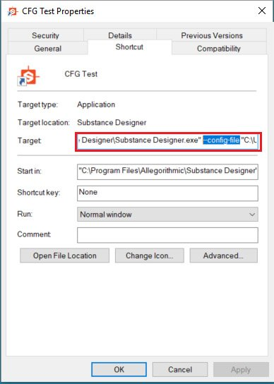

# Benutzereinstellungen - Automatisieren der Einrichtung

<table>
<tr style="border: 0;">
<td width="100.00%" style="border: 0;" valign="top">

Die Datei &quot;user\_preferences.xml&quot; enthält alle benutzerspezifischen Einstellungen außerhalb der in einer [Projektkonfiguration](../../pipeline-and-project-con/project-configuration-fil/project-configuration-files-sbsprj.md) definierten Einstellungen. Diese beziehen sich hauptsächlich auf bestimmte UI- und Leistungseinstellungen.

Die einzige relevante Einstellung, die geändert werden muss, ist die [Konfigurationsdatei](../../pipeline-and-project-con/configuration-list-sbscfg/configuration-list-sbscfg.md), die eine Liste von Projekten enthält. Dies kann auf verschiedene Weise geschehen, wie unten aufgeführt.

Alternativ können Sie das Ändern der Benutzereinstellungen vollständig umgehen und die SBSCFG-Datei sitzungsbasiert überschreiben, indem Sie ein Befehlszeilenargument für den Designer-Tastaturbefehl verwenden (siehe unten).

</td>
<td width="25.00%" style="border: 0;" valign="top">


</td>
</tr>
</table>

## Dauerhaft oder sitzungsbasiert

Es gibt zwei verschiedene Möglichkeiten, Designer so zu konfigurieren, dass eine andere [Konfigurationsdatei](../../pipeline-and-project-con/configuration-list-sbscfg/configuration-list-sbscfg.md) als die Standardkonfigurationsdatei verwendet wird, und zwar mit Vor- und Nachteilen:

* <b>Benutzer\_preferences.xml dauerhaft ändern\
  </b>Diese Datei befindet sich in *~User\AppData\Local\Adobe\Adobe Substance 3D Designer* für Windows. Wenn Sie Änderungen daran vornehmen, verwendet Designer immer die dort definierten Elemente, unabhängig davon, wie, wann oder wo Sie damit beginnen. Um Änderungen vorzunehmen, müssen Sie die XML-Datei erneut ändern. Beides wird im Folgenden beschrieben und ist in der Regel etwas aufwändig.
* <b>Die Sitzung wird vorübergehend über ein Befehlszeilenargument festgelegt.\
  </b>Designer kann beim Start ein Befehlszeilenargument verwenden, um die SBSCFG-Datei für diese Sitzung zu überschreiben (siehe unten). Dies ist eine einfache, elegante Lösung, mit der Sie viel schneller zwischen Projekten wechseln können als durch das Ändern eines XML-Codes. Die Gefahr besteht darin, dass beim Öffnen über mehrere Tastaturbefehle (z. B. Startmenü und Desktop unter Windows) unterschiedliche Ergebnisse erzielt werden, ohne dass dies völlig offensichtlich ist. Darüber hinaus ist es nicht so manipulationssicher, da Benutzer ihre Tastaturbefehle viel einfacher löschen, verschieben oder ändern können als ihre user\_preferences.xml.

## XML-Änderung

### Manuelles Ändern von Voreinstellungen

Wenn kein automatisches Setup vorhanden ist, oder zu Testzwecken, können Sie manuell zu <b>Bearbeiten > Voreinstellungen... wechseln.</b> und klicken Sie dann links auf den Abschnitt &quot;<b>Projekte</b>&quot;.


Mit der rot markierten Schaltfläche kann der Benutzer eine andere [SBSCFG-Datei](../../pipeline-and-project-con/configuration-list-sbscfg/configuration-list-sbscfg.md) auswählen.

### Änderung über Skript

Genau wie die Projekt- und Konfigurationsdateien ist die Benutzervoreinstellung eine strukturierte XML-Datei, wobei die entsprechende Einstellung eindeutig erkennbar ist. Anstatt über einen Texteditor wie Notepad++ oder Sublime Text zu ändern, ist es sehr gut für Änderungen durch ein externes Skript-Setup geeignet.

Der Vorteil der Skripterstellung ist, dass der Benutzer nichts anderes tun muss als auf eine Schaltfläche zu klicken. Wenn ein ausreichend kompliziertes System erstellt wird, ist es möglich, Projekte einfach zu verwalten und auszutauschen, ohne dass Dateien und Einstellungen manuell verwaltet werden müssen.

Die entsprechende Zeile sieht folgendermaßen aus:

```
  <configuration> 

   <configurationfile>file:///C:/Users/John/AppData/Local/Adobe/Adobe Substance 3D Designer/default_configuration.sbscfg</configurationfile> 

  </configuration>
```


#### Python-Beispiel

Im Folgenden finden Sie eine einfache Python 2.7-Beispielfunktion für Windows, mit der die Datei &quot;user\_preferences.xml&quot; für eine andere Konfigurationsdatei geändert wird. Dadurch wird der Wert dauerhaft geändert, bis er wieder geändert wird. Die Funktion SetConfigurationFile kann dann mit dem Pfad der benutzerdefinierten sbscfg-Datei als Parameter aufgerufen werden.

Ein Python-Skript ermöglicht einen leistungsstarken, sauberen Code und kann leicht an anderer Stelle integriert werden, aber der Nachteil ist, dass ein Benutzer es ausführen kann, wenn es in eine ausführbare Datei kompiliert werden muss oder wenn der Benutzer eine Python-Bereitstellung benötigt.

```
import xml.etree.ElementTree as ElementTree 

import os 

 

##Example Python script for changing Substance 3D Designer user preference file## 

 

def SetConfigurationFile(p_ConfigPath): 

## Check is the path passed as parameter exists.

    if(os.path.isfile(p_ConfigPath)): 

## replace backslashes by forwardslahes to ensure consistency

        p_ConfigPath = p_ConfigPath.replace("\", "/") 

## get Local Appadata path from Environment variables, construct full path to user_preferences.xml and check if it exists.

        m_AppDataPath = os.environ.get('LOCALAPPDATA') 

        if m_AppDataPath != None: 

            m_UserPrefsPath = os.path.join(m_AppDataPath, str("Adobe/Adobe Substance 3D Designer/user_preferences.xml")) 

            if(os.path.isfile(m_UserPrefsPath)): 

## read XML elementtree from file, find correct element until we get to the actual line that defines the configurationfile path

                m_PrefsTree = ElementTree.parse(m_UserPrefsPath) 

                m_PrefsRoot = m_PrefsTree.getroot() 

                m_PrefsElement = m_PrefsRoot.find("preferences") 

                m_XMLError = True 

                if(m_PrefsElement != None): 

                    m_ConfigElement = m_PrefsElement.find("configuration") 

                    if(m_ConfigElement != None): 

                        m_ConfigFileElement = m_ConfigElement.find("configurationfile") 

                        if(m_ConfigFileElement != None): 

                            m_XMLError = False 

## Check if path is already set, to avoid double work

                            if m_ConfigFileElement.text.replace("file:///","") == p_ConfigPath: 

                                print "configurationfile is already set to desired path. Aborting." 

                                return True 

                            else: 

## construct correctly formatted path, insert into elementtree

                                m_ConfigPath = str("file:///" + p_ConfigPath) 

                                m_ConfigFileElement.text = m_ConfigPath 

 

## Write to file

                                m_XMLString = str("<?xml version="1.0" encoding="UTF-8"?>n") + ElementTree.tostring(m_PrefsRoot, 'utf-8') 

                                m_File = open(m_UserPrefsPath,'w') 

                                m_File.write(m_XMLString) 

                                m_File.close() 

                                print "configuration file path succesfully changed!" 

                                return True 

                if m_XMLError: 

## if this flag was not set to false, we can assume something was missing or went wrong when walking through the XML

                    print("Error: malformed content in user_preferences.xml!") 

                    return False 

            else: 

                print "Error: user_preferences.xml does not exist, try starting Substance 3D Designer first!" 

                return False 

        else: 

            print "Error: LocalAppData path returned None" 

            return False 

    else: 

        print "Error: Invalid Configuration File path!" 

        return False
```


## Befehlszeilenargument-Tastaturbefehl

Viel einfacher kann Designer angewiesen werden, beim Start ein bestimmtes SBSCFG zu verwenden, indem das Argument &quot;—config-file&quot; (optional) verwendet wird.

### Manuelle Einrichtung

Es wird zwar nicht empfohlen, in einer Produktionsumgebung eine manuelle Methode zu verwenden, aber zu Testzwecken kann dies ziemlich schnell erfolgen, wenn Sie Ihre SBSCFG-Datei bereits eingerichtet haben.

1. Leerzeichen hinzufügen
1. Fügen Sie im Abschnitt &quot;Ziel&quot; nach dem Pfad zur Designer die Datei —config hinzu.
1. Hinzufügen eines weiteren Leerzeichens
1. Fügen Sie Ihren Pfad hinzu, *, der in Anführungszeichen eingeschlossen ist*, um Probleme mit Leerzeichen in Ihrem Pfad zu vermeiden
1. Das Ergebnis sollte wie folgt aussehen:

   *&quot;C:\Program Files\Adobe\Adobe Substance 3D Designer\Adobe Substance 3D Designer.exe&quot; —config-file &quot;C:\Dev\Substance\custom\_configuration.sbscfg&quot;*


