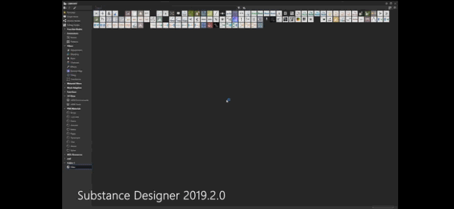
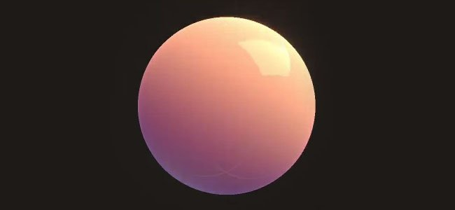

# Version 2019.2 (9.2)

**Substance Designer 2019.2** stellt den neuen Punktknoten, HDR-Filter und leistungsstarke Optimierungen bereit.

## Wichtigste Funktionen

### Neuer Punktknoten

Der Knoten &quot;Punkt&quot; ist eine lange erwartete Anforderung. Sein Zweck ist es, Verbindungen zwischen Knoten umzuleiten, um Ihr Diagramm neu zu organisieren. Im Gegensatz zu unserem vorherigen Umleitungspunkt kann dieser hier Links sammeln und verschwindet nicht, wenn seine Verbindungen unterbrochen werden.

Weitere Informationen zum Punktknoten finden Sie auf der Seite [Graph-Elemente](../../../interface/the-graph-view/graph-items/graph-items.md).

### Verbessertes Menü zur Knotenerstellung

Das Menü Knotenerstellung, das beim Drücken der &quot;Leertaste&quot; erscheint, kann nun Ihre Favoriten definieren und mit Priorität auflisten. Es wurden auch einige neue Verhaltensweisen um das Menü herum hinzugefügt, um die Verwendung zu erleichtern.

* **Favoriten zuerst anzeigen**\
  Wenn Sie auf das Symbol neben dem Textfeld klicken, können Sie die Favoritenauflistung zunächst aktivieren oder deaktivieren.

  
* **Favoriten hinzufügen oder entfernen**\
  Wenn Favoriten angezeigt werden, können Sie Knoten in der Liste hinzufügen oder entfernen, indem Sie auf das Symbol neben dem Knotennamen klicken.\
  (Favoriten können auch direkt im Fenster &quot;Bibliothek&quot; verwaltet werden.)

  
* **Öffnen Sie das Menü, wenn Sie auf einen Knoten klicken und einen Link ziehen**\
  Wenn Sie auf die Verbindung eines Knotens klicken und ziehen und die Maus loslassen, wird jetzt das Menü Knotenerstellung geöffnet. Der erstellte Knoten wird dann mit dem Link verbunden. Die in der Liste verfügbaren Knoten sind von der eingehenden Verbindung abhängig. 

### Neue Techniken für Echtzeit-Renderer

Der Echtzeit-Viewport von Substance Designer wurde verbessert und unterstützt jetzt neue Rendering-Funktionen: **Anisotropie**, **Beschichtung** und **Untergrundstreuung**. Alle neuen Kanäle und Nutzungen, die durch diese Funktionen eingeführt wurden, sind auch mit Iray kompatibel.

* **Anisotropie**\
  Anisotropie ist eine Eigenschaft, die definiert, wie sich eine Spiegelung in einer bestimmten Richtung verhalten soll. Es wird häufig für bestimmte Haartypen wie Material und gebürstete Metalle verwendet.\
  Um ein anisotropes Material zu erstellen, benötigen Sie zwei Ausgaben in Ihrem Graf mit den folgenden Verwendungen:

  * **AnisotropyAngle**: Definiert die Richtung der Anisotropie. Wechselt von Schwarz zu Weiß in eine Schleife.
  * **AnisotropyLevel**: Definiert die Intensität der Anisotropie. Empfohlene Werte sind 0,9 bis 0,98 (Graustufen).

  Hinweis: Anisotropie wird von allen unseren Standard-PBR-Shadern unterstützt.

  {width="400px"}
* **Beschichtung**\
  Die Beschichtung erlaubt es, eine zweite Schicht aus Material über dem Basismaterial zu definieren. Es kann verwendet werden, um Auto-Malen oder Filme auf metallic Flächen zu simulieren.\
  Um ein beschichtetes Material zu erstellen, können Sie die neue Substance-Vorlage &quot;PBR Coated (Metallic/Rauheit)&quot; verwenden oder die folgenden Ausgaben in Ihrem Graf hinzufügen:

  * **Fellgewicht**: Deckkraft der Überzugsschicht.
  * **coatSpecularLevel**: Specular level für die Überzugsschicht.
  * **coatColor**: Farbe der Überzugsschicht.
  * **coatNormal**: Normal für die Beschichtungsschicht.
  * **coatRoughness**: Rauheit für die Beschichtungsschicht.

  Hinweis: Die Beschichtung erfordert den neuen Shader &quot;physically\_metallic\_roughness\_coated&quot;.

  {width="400px"}
* **Volumenstreuung**\
  Volumenstreuung simuliert die Absorption und Diffusion des Lichts in einem Material. Es ist sehr nützlich, um Haut und andere organische Oberflächen zu simulieren.\
  Um ein Material vom Typ &quot;Untergrund&quot; zu erstellen, können Sie die neue Substance-Vorlage &quot;PBR-Untergrundstreuung (Metallic/Rauheit)&quot; verwenden oder die folgende Ausgabe zu Ihrem Graf hinzufügen:

  * **Streuung**: Steuert die Lichtintensität innerhalb des Materials.

  Hinweis: Subsurface benötigt den neuen Shader &quot;physically\_metallic\_roughness\_sss&quot; . Die Streufarbe kann in den Shader-Parametern gesteuert werden.

  {width="400px"}

>[!NOTE]
>
> All diese neuen Rendering-Funktionen sind durch eine Überarbeitung des Shader-Systems von Substance Designer möglich. Das **GLSLFX**-Format unterstützt jetzt die Definition von &quot;**Techniques**&quot;, die einen mehrfachen Rendervorgang zulässt. Einige Beispiele finden Sie in unseren Standard-Shadern unter: **Substance Designer/resources/view3d/shaders**

### Verbesserte Leistung

Es wurden einige Verbesserungen an der Substance-Engine (die zu Version 7.2.0 springt) vorgenommen, die in mehreren Situationen von Vorteil sind:

* **Zwischenspeichern von Diagrammberechnungen zum schnelleren Anpassen**\
  Das Diagramm-Rendering wurde durch ein neues Caching-System verbessert. Dadurch wird das Anpassen eines Diagramms viel schneller als zuvor, da wir jetzt unveränderte Knoten überspringen.
* **Verbesserte Ladezeit der Bibliothek**\
  Das Laden der Bibliothek wurde durch die neuen Kochoptimierungen und Verbesserungen der Decodiergeschwindigkeit erheblich verbessert. Die Bibliothek lässt sich jetzt 2- bis 8-mal schneller generieren.

### Neue Inhalte mit HDR-Filtern

Mit dieser neuen Version führen wir eine Menge neuer Filter ein, die der Bearbeitung von HDR-Umgebungskarten gewidmet sind.

* **HDR-Zusammenfügung**:Bring mehrerer LDR-Fotos (Low Dynamic Range) zum Erstellen eines HDR-Bildes.
* Der **Nadir Patch**:This-Knoten ermöglicht das Klonen/Ausbessern des Bodenteils eines HDRI unter Berücksichtigung der kugelförmigen Verformung.
* **Nadir Extract**: Dieser Knoten kann eine Textur aus einem HDRI extrahieren. Sie kann verwendet werden, um eine Grundstruktur in einer 3D-Szene abzubilden.
* **Color Temperature Adjustment**: Passen Sie die Farbtemperatur eines Eingabebildes an, einschließlich der Unterstützung von HDR-Werten.
* **Horizont begradigen**: Drehen Sie den Breiten-/Längengrad einer Umgebungskarte. Je nach Aufnahmebedingungen ist das resultierende 360°-Panorama möglicherweise nicht gerade.
* **Physische Sonne und Himmel**: Dieser Knoten ist eine Implementierung des Hosek-Wilkie Skylight-Modells. Wenn du die Sonnenposition festlegst, wird ein physikalisch genaues Himmelspanorama erzeugt.
* **Flachlicht**: Generieren Sie ein rechteckiges Licht, als wäre es eine 3D-Form. Sie können ihre Position in der 2D-Ansicht ändern, eine Textur anwenden und die Farbe mit einer Temperatur oder einem RGB-Wert einstellen.
* **Linienlicht**: Generiere ein linienförmiges Licht, und ändere seine Position in der 2D-Ansicht. Es hat ähnliche Optionen wie das Flachlicht, außer dass es für dünne lange Formen wie Neonlichter entwickelt wurde.
* **Kugellicht**: Generieren Sie ein kugelförmiges Licht und ändern Sie seine Position mithilfe des Gizmos &quot;2D-Ansicht&quot;. Du kannst auch eine kugelförmige Textur anwenden, um weit entfernte Planeten zu erstellen.

Alle neuen [HDRI-Werkzeug](../../../compositing-graphs/nodes-reference-for-com/node-library/3d-view-library/hdri-tools/hdri-tools.md) sind im Abschnitt [Knotenbibliothek](../../../compositing-graphs/nodes-reference-for-com/node-library/node-library.md) dokumentiert.

## Versionshinweise

### 2019.2.3

*(veröffentlicht am 26. November 2019)*

**Fest:**

* [Bäcker] Absturz beim Backen mit einer Skew-Map-Ressource mit einem ungültigen Link
* [Bäcker] UV-Sets außer 0 werden bei Embree nicht berücksichtigt
* [Bäcker] &quot;Gebeugte Normale aus Mesh&quot; gibt falsche Ergebnisse mit anderen UV-Sätzen als 0 auf DXR aus
* [Bäcker] Die Parameter &quot;UV Set&quot; werden beim erneuten Öffnen des Backfensters auf den Wert &quot;0&quot; zurückgesetzt.
* [Baker] &quot;Position&quot; gibt ein schwarzes Bild mit anderen UV-Sätzen als 0 aus.
* [Inhalt] Smart Auto Tile: Probenahme in 8k
* Atlas Splitter [Inhalt]: Die Formerkennung schlägt in einigen Fällen fehl, der Genauigkeitsparameter sollte angezeigt werden.
* [Content] Pow gibt in einigen Fällen nicht den richtigen Wert zurück.
* [Inhalt] Flood Fill zu indizieren: Falsches Ergebnis bei Veröffentlichung in SBSAR
* [Library] Absturz beim Laden des ersten SBS-Pakets der Sitzung
* [Bibliothek] Die Einstellung &quot;Ressourcen standardmäßig in der Bibliothek anzeigen&quot; wird bei Ressourcen ignoriert, die direkt in das Explorer-Bedienfeld importiert werden
* [Console] Unerwartete Meldung in der Konsole bei Verwendung des Knotenmenüs
* [Parameter] Ein einzelner Eintrag in der Ausgabenverwendungsliste kann nicht entfernt werden.
* [3DView] Die Szene wird nicht korrekt neu geladen, wenn die Szenendatei auf der Festplatte geändert wird[Graph] Die Knotenmenü-Filterung ist falsch, wenn Werteausgaben verwendet werden.

**Hinzugefügt:**

* [MacOS] Beglaubigen Sie der Software, die neuen MacOS Catalina-Verteilungsanforderungen zu folgen

### 2019.2.2

*(veröffentlicht am 23. Oktober 2019)*

**Fest:**

* [Graph] Die Knotenmenüfilterung ist falsch, wenn Wertausgaben verwendet werden
* [Graph] Absturz bei Anzeige des Knotenmenüs
* [Diagramm] Suchwerkzeug wird angezeigt, wenn ein Umschaltbefehl verwendet wird
* [Graph] Absturz beim aufeinander folgenden Starten von Knotenmenüs aus dem Werteingabe-Connector
* [Diagramm] Kommentare, die lange Zeichenfolgen enthalten, werden beschnitten
* [Graph] Die Flow-Hervorhebung ist falsch, wenn ein Knoten mit dem Ziehen aus dem Konnektormenü erstellt wird
* [Graph] Absturz beim Entfernen aller Diagrammelemente aus der Szene beim Laden eines anderen Diagramms
* [Graph] Absturz bei Verwendung zum Erstellen eines Knotens bei Verwendung von Klick- und Ziehvorgängen vom Connector
* [Graph] Absturz bei Verwendung des Tools &quot;Node Finder&quot;
* [Graph] Ausgabe-Pin-Farbe ist im Modus &quot;Material Compact&quot; falsch
* [Cooker] Knoten hinter Knoten mit mehreren Ausgängen werden nicht korrekt aktualisiert
* [Cooker] Problem mit Value-Ausgaben und Passthrough-Knoten
* [Cooker] Value Processor gibt falsche Ergebnisse aus, wenn nur ein Get-Knoten verwendet wird.
* [Inhalt] Der Knoten &quot;Kontrast/Luminanz&quot; gibt einen Alpha-Wert von 1,0 aus.
* [Inhalt] Vorlage &quot;Studio Panorama&quot; hat keine Beschreibung
* [Inhalt] Flood Fill zu indizieren: Falsches Ergebnis, wenn die Eingabe eine Umbruchform enthält
* [Inhalt] &quot;HDR-Zusammenfügung&quot;: interne Expositionsberechnung ist falsch
* [Punktknoten] Absturz bei Verwendung einer Ebene und eines Punktknotens
* [Abhängigkeits-Manager] Die Aktion &quot;Gehe zu&quot; funktioniert nicht mehr.
* [PSD] Absturz beim Rückgängigmachen des Löschens mehrerer Knoten, die im PSD Exporter enthalten waren
* [UI] Absturz beim Schließen des Diagramms über das Menü &quot;Fenster&quot; und beim erneuten Öffnen, während ein Diagramm angeheftet ist
* [Verlaufseditor] Die Schaltfläche &quot;Taste entfernen&quot; ist zu groß
* [Engine] Genauigkeitsproblem mit sqrt() acos() und asin()
* [Bäcker] AO aus Mesh: Der Schieberegler &quot;Überstreichungswinkel&quot; hat einen falschen Wertebereich, wenn er optimiert wird

### 2019.2.1

*(veröffentlicht am 20. September 2019)*

**Hinzugefügt:**

* [Vorlagen] Hinzufügen von Standardeingabeknoten zu Specular/Glossiness und zu anderen Vorlagen
* [Vorlagen] Vorlage für PBR-Anisotropie hinzufügen
* [3D-Ansicht] Automatische Clipebene über weite Entfernungen vergrößern
* [3D-Ansicht] PBR-beschichtet: Ändern des Standardwerts für die normale Vererbung von Coat
* Atlas Splitter [Inhalt]: Hinzufügen der Option für die Funktion &quot;Auto-Freistellung&quot;
* [Knotenmenü] Knoten nicht ohne Eingabe filtern

**Fest:**

* Atlas Splitter [Inhalt]: Einige Ausgaben werden bei Verwendung der Option &quot;Auto-Freistellung&quot; nicht korrekt zugeschnitten
* [Inhalt] Material Height Blend: Kochfehler in Zusammenhang mit nicht vorhandenem Parameter
* [Inhalt] &quot;Flächenlicht&quot;: Muster-UV-Modus funktioniert nicht richtig
* [Content] &quot;Height to Normal World Unit&quot;: Eingang wird auf 16 Bit erzwungen
* [Inhalt] Unerwartete Formen bei Verwendung des angular-Knotens &quot;Abgeflachte Kante&quot; ohne Unterteilung in kleine Formen
* [Library] Symbole für SBSAR sind in der Bibliothek nicht sichtbar
* [Bibliothek] Verwenden von &quot;\&quot; zum Filtern der URL funktioniert nicht mehr
* [Library] Bei Filterwerten wird Groß- und Kleinschreibung unterschieden
* [Library] Suchfilter funktioniert nicht, wenn &quot;Compositing&quot; aktiviert ist
* [Bäcker] Durch Doppelklicken auf bestimmte Zellen und Schließen der Änderung werden sie auf falsche Werte zurückgesetzt
* [Baker] Der Backend-Statustext im Baker-Fenster zeigt immer &quot;GPU-Beschleunigung : enable&#39;
* [Cooker] Absturz beim Verarbeiten einer &quot;Hochstapler&quot;-Abhängigkeit in einem Diagramm
* [Cooker] Graustufen-Konvertierung hat falsche Ausgabegröße, wenn Wert verwendet wird
* [Explorer] Absturz beim Verarbeiten von &quot;Publish auf Freigeben&quot;
* [Graph] Absturz beim Öffnen eines bestimmten Pakets
* [MDL] Absturz bei Verwendung des Casting-Operators
* [Vorlagen] Ausgabe-IDs sind in der mit PBR beschichteten Vorlage nicht korrekt.

### 2019.2

*(veröffentlicht am 29. August 2019)*

**Hinzugefügt:**

* [Inhalt] Neue Formen für &quot;Panorama Light&quot;
* [Inhalt] Neuer Filter &quot;Panorama-Nadir Patch&quot;
* [Inhalt] Neuer Filter &quot;Panorama-Nadir Extract&quot;
* [Inhalt] Neuer Filter &quot;Panorama gerade Horizont&quot;
* [Inhalt] Neuer Filter &quot;Panorama-Drehung&quot;
* [Inhalt] Neuer Knoten &quot;Panorama-Position&quot;
* [Inhalt] Neuer Knoten &quot;Panorama Physical Sun and Sky&quot;
* [Inhalt] Neue Knoten &quot;Panoramaverläufe&quot;
* [Inhalt] Neuer Filter &quot;HDR. Zusammenfügen&quot;
* [Inhalt] Neuer Filter &quot;HDR. Vorschau&quot;
* [Inhalt] Neuer &quot;Color Temperature Adjustment&quot;-Filter
* [Inhalt] Neuer Knoten &quot;Blackbody&quot;
* [Inhalt] Neuer Belichtungsfilter
* Menü zur Knotenerstellung [UI]: Anzeigen und Verwalten von Favoriten im Menü
* [UI] Hinzufügen/Entfernen eines Knotens aus den Favoriten aus dem Knotenerstellungsmenü
* Menü zur Knotenerstellung [UI]: Das Menü beim Klicken auf/Ziehen eines Links in einer Ausgabe aufrufen
* Menü zur Knotenerstellung [UI]: den Inhalt nach dem aktuellen Auswahltyp filtern
* [3D-Ansicht] Support-Anisotropie
* [3D-Ansicht] Effekt &quot;Beschichtung unterstützen&quot;
* [3D-Ansicht] Unterstützung von Untergrundstreuung
* [Graph] Punktknoten
* [Graph] Optimieren Sie das Rendern von Graphen durch Zwischenspeichern von Kochergebnissen
* [Voreinstellungen] Ändern Sie den Standardwert für die Begrenzung der Kochgröße auf 8192.
* [Voreinstellungen] Fügen Sie einen Schalter hinzu, um die neue Funktion der Tabulatortaste zu aktivieren/deaktivieren
* [API] Add SDResource.getPackage()-Methode
* [Iray] Update für NVIDIA Iray RTX 2019.1.3 SDK (317500.3714)
* [Explorer] Verknüpfen eines beliebigen Dateityps als Ressource im Paket zulassen
* [GradientNode] Drücken Sie ESC, um die Auswahl des Verlaufs abzubrechen.
* [Parameter] Automatische Groß-/Kleinschreibung für Bezeichner entfernen
* [Projekt] Fügen Sie eine Option hinzu, um anzugeben, ob Graf und Ressourcen standardmäßig &quot;In Bibliothek sichtbar&quot; sind.
* [Vorgaben] Automatische Fixierung geänderter Parameter

**Fest:**

* [MDL] Modul kann aufgrund eines Problems mit dem Parametertyp nicht exportiert werden
* [MDL] Beim Laden ist die exponierte int nicht sichtbar.
* [MDL] Absturz beim MDL-Export
* [MDL] Absturz beim Ändern der Farbe eines Materialoberflächenknotens
* [MDL] void MDLGraphNodeControllerSelector::updateSelectorCurrentMember(const DataMessage&amp; msg) ist beschädigt
* [Graph] Falsche Link-Thickness in der Diagrammanzeige
* [Graph] Beim Anpassen von Parametern werden zu viele Invalidierungen ausgelöst
* [Graph] Absturz beim Schließen eines Pakets, während zwei Fenster davon geöffnet sind, und bei Verwendung der kontextbezogenen Bearbeitung
* [Funktions-Graf] Beim Schließen der Funktionsansicht wird keine Warnung angezeigt
* [3D-Ansicht] Absturz bei der 3D-Ansicht-Initialisierung, wenn die Kamera-Projektion als &quot;orthografisch&quot; als Standardzustand der Szene festgelegt wurde
* [3D-Ansicht] DOF-Aufenthalte nach FX in Irak aktiviert
* [2D-Ansicht] Pinselauswahlfenster verschwindet beim Ändern der Pinselgröße
* Informationsbereich [2D-Ansicht]: werden mit einem bestimmten Layout beschnitten
* [2D-Ansicht] Das Bild wird versetzt, wenn das Hauptfenster minimiert und wiederhergestellt wird.
* [Baker] Auswahlliste &quot;Aus Ressource&quot; wird nicht richtig gefiltert
* [Baker] Absturz beim Verketten von &quot;Farb-Map aus Mesh&quot;- und &quot;Normalen-Map aus Mesh&quot;-Bakern auf Embree
* [Bäcker] Krümmung pro Scheitelpunkt Backen führt zu schweren Artefakten
* [Explorer] UDIM-Ressourcen können nicht importiert werden, wenn sie per Drag &amp; Drop in den Explorer verschoben werden
* [Explorer] Explorer-Fenster wird beim Verknüpfen von Gittern und Schriften nach dem Verknüpfen ungewöhnlicher Dateiformate nicht korrekt gefiltert
* [Explorer] Ressourcen sind sichtbar, wenn &quot;in Bibliothek anzeigen&quot; auf &quot;Nein&quot; festgelegt ist.
* [Inhalt] &quot;Pow&quot;- und &quot;Clamp&quot;-Eingaben sind nicht in der richtigen Reihenfolge
* [Inhalt] &quot;RGBA Merge&quot;-Knoteneingaben sind nicht gekennzeichnet
* [Cooker] Ungültige Verbindungen von numerischen Werten werden trotzdem ausgewertet
* [Cooker] Assert beim Verbinden einer Bildeingabe mit einem Eingabewert
* [UI] Der Maus-Cursor bleibt in bestimmten Fällen im Zustand &quot;Skalieren&quot; hängen
* [UI] Ein Rechtsklick in der Paketansicht zeigt unter Linux nicht das richtige Menü an
* [Abhängigkeiten] Der Dateipfad der temporären Ressourcen ist nicht korrekt.
* [Abhängigkeiten] Warnung zu fehlenden Bitmapressourcen bleibt nach der Verschiebung aktiv.
* [Bibliothek] Einige Miniaturansichten werden nicht generiert.
* [Library] MDL-Dateien werden in der Bibliothek angezeigt
* [Parameter] Absturz beim Verfügbarmachen von Parametern
* [Parameter] Absturz nach dem Neuerstellen eines neuen Elements in der Dropdown-Liste
* [Export] Fehler beim Export von 8K-Stapeln
* [Vorgaben] Absturz beim Anwenden einer Vorgabe mit booleschen Werten in SBS-Instanzen
* [Scripting] Der Begrüßungsbildschirm wird weiterhin angezeigt, wenn das Befehlszeilenargument &quot;—quit&quot; verwendet wird
