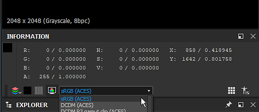

# Version 2019.3 (9.3)

**Substance Designer 2019.3** führt das Farbmanagement mit Unterstützung von OpenColorIO sowie verbesserte Bäcker-Updates und einen neuen Atlas Scatter-Knoten ein.

Freigabedatum: *19. Dezember 2019*

## Wichtigste Funktionen

### Farbmanagement und OpenColorIO-Unterstützung

Substance Designer unterstützt jetzt das Farbmanagement, mit dem Sie steuern können, wie Farben interpretiert und transformiert werden. Diese Funktion unterstützt [OpenColorIO](https://opencolorio.org/), ein in der Unterhaltungs- und VFX-Branche weit verbreitetes Farbmanagementsystem.

* **Einrichten des Farbmanagements in den Haupteinstellungen**\
  Standardmäßig wird der Substance Designer auf &quot;Legacy&quot; festgelegt, d. h., er lädt keine bestimmte Konfiguration und funktioniert weiterhin wie zuvor. Wenn Sie beispielsweise zu OpenColorIO wechseln möchten, öffnen Sie einfach die Haupteinstellungen und dann in den Projekteinstellungen, um sie zu konfigurieren und zu aktivieren.

  {width="600px"}
* **Das Farbmanagement wird auf drei verschiedene Arten angewendet**\
  Verschiedene Teile der Anwendung erhalten das Farbmanagement, das unterschiedliche Auswirkungen hat:

  * **2D- und 3D-Ansicht**\
    Sowohl der Echtzeit-Viewport für OpenGL als auch für Irak können farbverwaltet werden. Dies ermöglicht eine Vorschau des Materials und der Texturierung im Kontext. Das Farbprofil lässt sich über die dedizierte Dropdown-Liste einfach umschalten. Es ist auch möglich, die Ansicht in Linear Gamma anzuzeigen, um ohne Farbkorrektur eine Vorschau anzuzeigen.

    {width="400px"}

    {width="400px"}
  * **Diagrammeingänge und -ausgänge und Bitmapexport**\
    Beim Lesen und Schreiben von Bitmapbildern am Eingang und am Ausgang eines Diagramms kann das Farbmanagement das Bild anpassen und konvertieren, um unter den richtigen Bedingungen zu arbeiten. Dies kann in der Hauptvoreinstellung für Bitmap im Diagramm gesteuert und im Exportdialog während des Exportvorgangs geändert werden. Wenn Sie ein Bild in der 2D-Ansicht speichern, können Sie auch den Farbraum auswählen.

    {width="400px"}

    {width="505px"}

### Neue Krümmung von Mesh Baker

Die Krümmung von mesh baker wurde von Grund auf überarbeitet. Es nutzt jetzt Raytracing, das die GPU-Beschleunigung ermöglicht, aber auch die Unterstützung von Gitterschnittstellen hinzufügt.

Weitere Informationen finden Sie in der Dokumentation [Krümmung aus Mesh](https://experienceleague.adobe.com/en/docs/substance-3d/bakers/bakers-settings/curvature-from-mesh).

>[!NOTE]
>
> Die vorherige Krümmung vom Gitterbackautomaten ist jetzt veraltet. Wir empfehlen, zur neuen Version zu wechseln.

### Verbesserte umgebende Verdeckung von Mesh Baker

Die neue Einstellung &quot;Grundebene&quot; des Bäckereis &quot;Umgebungs-Verdeckung aus Gitter&quot; simuliert eine Ebene unter dem Gitter, um eine Verdeckung auf dem Boden zu erzeugen. Dies kann dazu beitragen, ein interessanteres Ergebnis für statische Geometrie oder nicht organische Objekte zu erzielen. Die Grundebene befindet sich standardmäßig am unteren Rand des Gitterbegrenzungsrahmens, kann jedoch mit eigenen Einstellungen weiter verschoben werden.

Weitere Informationen finden Sie in der Dokumentation zur [Umgebungs-Verdeckung aus Mesh](https://experienceleague.adobe.com/en/docs/substance-3d/bakers/bakers-settings/ambient-occlusion-from-mesh).

### Verbesserte Eigenschaften und Vorgaben-Editor

Der Eigenschaften-Editor wurde ebenso wie der Vorgaben-Editor verbessert:

* **Schnellerer Vorschaumodus**\
  Der Wechsel in den Vorschaumodus beim Bearbeiten von Diagrammparametern ist jetzt viel schneller, insbesondere bei Diagrammen mit vielen exponierten Parametern. Der Vorschaumodus ist jetzt eine dedizierte Registerkarte, die das Hin und Her zwischen dem Parameter-Editor und seiner Vorschau erleichtert.
* **Überarbeiteter Vorgabeneditor**\
  Die Verwaltung von Vorgaben in Substance Designer ist jetzt viel einfacher und schneller: Der Voreinstellungs-Editor hat jetzt seine eigene Registerkarte und jede Voreinstellung listet jetzt auf, welche Parameter sie beeinflussen.
* **Sichtbar, wenn jetzt 2D-Transformations-Gizmos berücksichtigt**\
  Wenn ein 2D-Gizmo für die Transformation eine Sichtbar-wenn-Bedingung hat, kann es jetzt in der 2D-Ansicht ausgeblendet werden, um den Kontext der Parameter herzustellen.

### Neue Inhalte

In dieser Version wird der neue Knoten **Atlas Scatter** eingeführt. Dieser Knoten ermöglicht es, ein Atlasbild (ein Bild, das Teilbilder enthält) zu lesen und seinen Inhalt automatisch in einzelne Komponenten aufzuteilen, die dann nach dem Zufallsprinzip gestreut werden können. Dieser Knotenpunkt kann beispielsweise dazu verwendet werden, Äste und Blätter auf einem Dirt-Bodenmaterial zu platzieren. [Substance Source](https://source.substance3d.com/allassets?q=atlas) enthält jetzt viele Atlas-Materialien, die mit diesem neuen Knoten gestreut werden können.

>[!WARNING]
>
> Diese Version unterstützt CentOS 6.x nicht mehr.\
> Unter CentOS 7.x kann es sein, dass die Anwendung aufgrund einiger Abhängigkeitsprobleme nicht gestartet wird. Aktualisieren Sie entweder das System, oder kopieren Sie die [folgende Bibliothek](https://centos.pkgs.org/7/centos-x86_64/freetype-2.8-12.el7.x86_64.rpm.html) in den Installationsordner, um das Problem zu beheben.

## Versionshinweise

### 2019.3.3

*(veröffentlicht am 14. Februar 2020)*

**Hinzugefügt:**

* [Batch Tools] Versand von Standard-OCIO-Profilen mit Batch Tools

**Fest:**

* [Inhalt] Atlas Scatter: Probleme bei der Verwendung von zufälliger Farbe/Normal in einigen Situationen

### 2019.3.2

*(veröffentlicht am 04. Februar 2020)*

**Hinzugefügt:**

* [SBSRender] Unterstützung für das Hinzufügen von Farbmanagement

**Fest:**

* [Inhalt] Linearer sRGB-Knoten zu ACEScg: E/A-Beschriftungen sind falsch
* [Inhalt] ACEScg zu sRGB-Knoten: Ausgabebeschriftungen sind falsch
* [Inhalt] Panorama Lichtknoten: Temperaturbereich einstellen
* [Graph] Schwerer Leistungsabfall und Einfrieren beim Anpassen eines verschachtelten Diagramms mit aktiver &quot;In-Context Editing&quot;-Bearbeitung
* [Graph] Absturz beim Löschen mehrerer Knoten in FX-Map
* [Vorstellungen] Der Designer-Prozess kann nach dem Beenden lebendig bleiben

### 2019.3.1

*(veröffentlicht am 27. Januar 2020)*

**Fest:**

* [Graph] Schwerer Leistungsabfall und Einfrieren beim Anpassen eines verschachtelten Diagramms mit aktivierter Option &quot;Kontextabhängige Bearbeitung&quot;
* [Graph] Von [0, 99] kann kein enum-Wert in Integer1 tweak eingegeben werden.
* [Diagramm] Kommentar wird nicht verschoben, wenn der entsprechende Frame verschoben wird
* [Graph] Eingabenamen fehlen im Knoten der benutzerdefinierten Instanz
* [Diagramm] Miniaturansichten können beim Laden des Diagramms gerendert werden, auch wenn die entsprechende Option in den Voreinstellungen deaktiviert ist
* [2D-Ansicht] Negatives Alpha zeigt Checker an, unabhängig von der Anzeigeoption
* [2D-Ansicht] Die Konvertierung von 32f in 8 Bit schlägt mit hohen Werten fehl.
* [2D-Ansicht] Verzerrung oben/links und &quot;Platz erstellen&quot; legen einige Koordinaten auf große Werte in Vorwärtstransformationsmatrizen fest
* [2D-Ansicht] UVs aller Mesh-Objekte werden nur auf &quot;0&quot;-UV-Sätzen angezeigt.
* [Inhalt] Abgeflachte Kante: Angular-Modus funktioniert nicht ordnungsgemäß auf Kachelmaske
* [Inhalt] Flood Fill zu Verlauf: Der Bildwert der Steigung wird nicht in der Mitte der Form aufgenommen
* Funktion [Inhalt]; &quot;Boolescher Wert für Gleichheit&quot; ist defekt
* [Bäcker] Artefakte bei Verwendung der automatischen Tonzuordnung im Bäcker &quot;Krümmung aus Mesh&quot; in bestimmten Fällen
* [Bäcker] Absturz in DXR beim Backen, während kein Material ausgewählt ist
* [Bäcker] Leistungsproblem in der 2D-Ansicht bei Aktivierung der &quot;Info&quot;
* [Engine] Die Funktion &quot;Pow&quot; gibt bei Verwendung eines sehr niedrigen Eingangswerts und eines hohen Exponenten auf der SSE2-Engine enorme Werte aus.
* [Engine] Absturz bei Verwendung einer hohen JPG-Komprimierung auf Bitmap-Ressourcen
* [Engine] Der Wertprozessor gibt einen falschen $size-Wert zurück, wenn er sich in einem Untergraph befindet.
* [Parameter] Bei Auswahl eines Instanzknotens mit einer hohen Anzahl von Parametern wird ein leeres Popup angezeigt.
* [Parameter] Der Ganzzahlwert wird in Dropdown-Parameterelementen nicht angezeigt.
* [Parameter] Die Schaltfläche &quot;Bearbeiten&quot; der Transformationsmatrix ist im Vorschaumodus nicht verfügbar.
* [Cooker] $size in ValueProcessor ist falsch, wenn innerhalb einer Diagramminstanz
* [Cooker] Die Ausgabegröße ist falsch, wenn der Wert-Link über einen Punktknoten zu einem atomaren Knoten führt
* [UI] Schaltfläche zum Anzeigen aller Elemente in der unteren Leiste der 2D-Ansicht ist nicht sichtbar
* [UI] Die Vorschau ausgewählter RGB-Werte zeigt bei Verwendung des Farbmanagements falsche Zahlen an
* [Exportieren] 16f RGBA-Bilder werden als Graustufen exportiert
* [3D-Ansicht] OBJ mit mehreren Leerzeichen kann nicht importiert werden
* [Farbmanagement] Die OCIO-Konfiguration wird beim Veröffentlichen von SBSAR nicht berücksichtigt.
* [Farb-Widget] Farbschieberbereiche können in einem bestimmten Fall exponentiell erweitert werden
* [Dok] Der Abschnitt &quot;paramValue&quot; ist in der Sbs-Formatreferenz unvollständig
* [MDL] Farb-Widget in SBSAR-Instanzen ist nicht korrekt
* [Vorgaben] Absturz beim Aktualisieren von Vorgaben in einem bestimmten Fall
* [PSD] FreeImage-Fehler beim Laden von PSD-Dateien aus aktuellen Versionen von Photoshop
* [Ressourcen] Absturz beim Rückgängigmachen der Bitmapverknüpfung direkt im Diagramm
* [SVG] SVG-Knoten werden bei Verwendung der Vektorwerkzeuge nicht automatisch aktualisiert

### 2019.3.0

*(veröffentlicht am 19. Dezember 2019)*

**Hinzugefügt:**

* [Allgemein] Unterstützung des Farbmanagements mithilfe der OpenColorIO-Konfigurationsdatei
* [Vorgaben] Verbessern der Vorgaben-Verwaltung
* [Vorgaben] Synchronisieren von 2D-Ansicht-Gizmos und Vorschau-Schiebereglern
* [Vorgaben] Wiederherstellen von Vorschauwerten beim Wechseln in den Vorschaumodus
* [Vorgaben] Beibehalten des Vorschaumodus beim Bearbeiten anderer Knoten, Ressourcen oder Diagramme
* [Vorgaben] Rückgängig funktioniert reibungslos, wenn Sie zwischen den drei Vorgaben-Registerkarten navigieren
* [Vorgaben] Ermöglicht das Zurücksetzen von Parametern auf den Standardwert des Diagramms oder den Wert der Vorgabe im Vorschaumodus.
* [Vorgaben] Verbesserung des Anheftens von Parametern
* [Vorgaben] Importieren/Exportieren aller Vorgaben eines Diagramms in eine Datei
* [Bäcker] Neuer Bäcker für &quot;Krümmung aus Gitter&quot; auf Basis von Raytracing
* [Bäcker] Fügen Sie die Option &quot;Grundebene&quot; im Bäcker &quot;AO from Mesh&quot; hinzu
* [Bäcker] Fügen Sie die Option &quot;Match by Name&quot; hinzu, um die Rückseite in &quot;AO from Mesh&quot;-Bäcker zu ignorieren
* [Inhalt] Neuer Atlas Scatter-Knoten
* [Inhalt] Neue Farbraum-Konvertierungsknoten und -funktionen (ACEScg)
* [Content] Verbessern der Namenskonsistenz für Knoten mit Farb-/Graustufenversionen
* [Graph] Verbessern der Leistung im Vorgabenvorschaumodus
* [Graph] Hinzufügen eines $(Farbraum)-Makros zum Exportieren der Diagrammausgabeoption
* [Parameter] Wenn ein Parameter auf &quot;unsichtbar&quot; eingestellt ist, blenden Sie das entsprechende Gizmo in der 2D-Ansicht aus.
* [Parameter] Fügen Sie &#39;Graph input group&#39; nicht als Präfix hinzu, wenn Parameter angezeigt werden.
* [Parameter] Hinzufügen einer QuickInfo für &quot;VisibleIf&quot; in Diagrammparametern
* [AXF] AXF SDK auf Version 1.6 aktualisieren

**Fest:**

* [Linux] Designer wird auf CentOS 8 aufgrund eines Qt-Plattformladefehlers nicht gestartet.
* [Linux] WARNUNG: Die Freetype-Bibliothek wurde aus der SD-Anwendung entfernt: Benutzer mit CentOS-Version &lt;= 7.5 müssen sie manuell installieren.
* [AxF] Absturz beim Importieren von Dateien, die mit neueren AxF-Versionen erstellt wurden
* [2DView] Pinseltexturen, die von einer Ressource zugeführt werden, werden nicht angewendet
* [2DView] Absturz beim Ändern der Eingaben des instanzierten Diagramms mit Positionsanpassung
* [3DView] Absturz beim Abbrechen von &quot;Laden...&quot; Aktion
* [3DView] Option &quot;Farbraum hinzufügen&quot; für Emissionstexturen in GLSLFX-Shadern
* [Bäcker] Karten, die durch Ressourcen gespeist werden, werden während des Backens ignoriert.
* [Bäcker] Optionen für &quot;Weltraumrichtung&quot; sind falsch gesperrt
* [Bitmap] EXR-Bitmaps mit Gleitkommawerten werden als schwarzes Bild dargestellt
* [Inhalt] Flood Fill zu indizieren: Formerkennung schlägt in einem bestimmten Fall fehl
* [Inhalt] Freistellen: Sampling-Problem, wenn der Zuschneideknoten eine niedrigere Auflösung als die Eingabe hat
* [Allgemein] Absturz beim Schließen von Designer beim Generieren der Bibliothek
* [Graph] Bitmap-Knoten spiegeln die Komprimierung der zugeordneten Bitmap nicht wider
* [Graph] Cache wird nicht gelöscht, wenn Knoten-Miniaturansichten nach dem ersten Rendern gelöscht werden
* [Graph] Die Knotengröße wurde fälschlicherweise ungültig gemacht.
* [Graph] Absturz, wenn in einigen Fällen Eingangsverbindungen an einem Pixelprozessorknoten geändert werden
* [MDL Graph] Fehler beim Wiederherstellen eines Funktionsaufruf-Standardwert
* [Eigenschaften] Die Schaltflächen &quot;Bearbeiten&quot; und &quot;Transformationsmatrix&quot; in Matrixparametern sind verwirrend.
