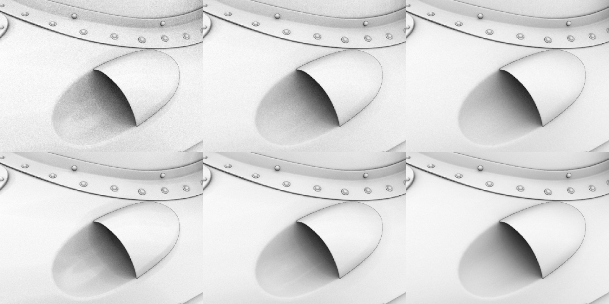

# Version 2020.1 (10.1)

**Substance Designer 2020.1** umfasst einen neuen Tastaturbefehl-Editor, ein MaterialX-Plug-in und viele neue Verbesserungen für das Farbmanagement mit Adobe Color Engine- und neuen Baker-Funktionen.

Freigabedatum: *10. April 2020*

>[!NOTE]
>
> Ab dieser Version ändert die Versionsnummer der Anwendung ihr Format. Der eigentlich **2020.1** sein sollte, wird jetzt zu **10.1.0**.

## Wichtigste Funktionen

### Neuer Tastaturbefehl-Editor für Knotenerstellung

In dieser Version wird ein neuer Tastaturbefehl-Editor eingeführt, der es ermöglicht, Tastaturkürzel zu definieren, um die Knotenerstellung in den verschiedenen Graf-Modi zu beschleunigen.

Der neue Tastaturbefehl-Editor kann in den Haupteinstellungen über **Bearbeiten > Voreinstellungen > Tastaturbefehle** aufgerufen werden. Standardmäßig sind alle Tastaturbefehl-Felder leer.

* **Kurzbefehle für jeden Graf-Typ**\
  Es ist möglich, einen Tastaturbefehl für jeden im Substance Designer verfügbaren Graf-Typ zu definieren, vom regulären Compositing-Graf bis hin zu fortgeschritteneren Funktionen und MDL.

  
* **Zuweisen von Tastaturbefehlen sowohl für elementare Knoten als auch für benutzerdefinierte Filter**\
  Standardmäßig werden in der Benutzeroberfläche die elementare Knoten für jeden Graf-Typ angezeigt. Mithilfe des Suchfelds können Sie die Liste verfeinern, aber auch benutzerdefinierte Bibliotheksfilter und Knoten zugänglich machen:

  
* **Erstellen eines neuen Tastaturbefehl**\
  Um einen neuen Tastaturbefehl für einen bestimmten Node zu erstellen, klicken Sie einfach in das Textfeld neben dessen Namen und geben die gewünschten Tasten auf der Tastatur ein. Um einen Tastaturbefehl zu löschen, verwenden Sie die Kreuzschaltfläche.

  
* **Konflikte mit Tastaturbefehlen verwalten**\
  Verwenden Sie die QuickInfo auf dem Warnsymbol, um mehr über einen Konflikt zu erfahren. Es wird angegeben, ob ein Schlüssel mit einem vorhandenen in Konflikt steht oder ob er bereits von der Anwendung für einen anderen Zweck verwendet wird.

  

  
* **Nach Tastaturbefehlen suchen**\
  Falls zu viele Tastaturbefehle zum Nachverfolgen verfügbar sind oder ein Knoten standardmäßig nicht sichtbar ist, verwenden Sie das Suchsystem, um sie zu isolieren:

  

### Neues MaterialX-Plugin (Beta)

Während der SIGGRAPH 2019 haben wir ein MaterialX Plugin für Substance Designer vorgestellt. [MaterialX](http://www.materialx.org/) ist ein von [Industrial Light &amp; Magic (ILM)](https://www.ilm.com/) entwickeltes Format, mit dem Künstler Materialien erstellen können, die dann für eine Vielzahl von Plattformen und Verwendungsmöglichkeiten (z. B. Filme, Fernsehsendungen, Spiele, VR-Erlebnisse und Fertigung) genutzt werden können. Mit diesem neuen Plug-in, das jetzt als Beta-Version verfügbar ist, können MaterialX-Material für die Verwendung in anderen kompatiblen DCC-Anwendungen erstellt werden. Werfen Sie einen Blick auf unseren letzten [Artikel über MaterialX](https://magazine.substance3d.com/research-a-portable-shader-graph/), um mehr über den Prozess und die Ziele dieses neuen Plug-ins zu erfahren.

Dieses neue Plug-in bietet folgende Möglichkeiten:

* Entwickle prozedurale Shader und Texturen parallel dazu.
* Erstellen Sie erweiterte Shader für den Substance Painter mit Funktionen wie Detailzuordnungen und prozeduralen Masken, die zur Laufzeit geändert werden können.
* Shader-Funktionen aus einem Game-Engine oder einer VFX-Pipeline im Substance Designer- und Substance Painter-Viewport abgleichen.

Um das Plug-in zu erhalten, gehen Sie einfach über [Substance share](https://share.substance3d.com/libraries/6111), um es herunterzuladen.

### Neue Integration von Adobe Color Engine (ACE)

Zusätzlich zu OpenColorIO ist es jetzt möglich, ICC-Profile für das Farbmanagement mit Adobe Color Engine (ACE) zu unterstützen. Das bedeutet, dass Sie jetzt kalibrierte Bilder importieren und exportieren können, damit sie mit anderer Software wie Photoshop und Illustrator übereinstimmen.

* **Adobe Color Engine wird aktiviert**\
  Verwenden Sie die Projekteinstellungen, um festzulegen, welches Farbmanagementsystem verwendet werden soll:

  
* **Bildschirmprofil ändern**\
  Wenn Sie eine Vorschau der Bilder über die 2D- oder 3D-Ansicht anzeigen, legen Sie in der Dropdown-Liste fest, welches Profil verwendet werden soll:

  
* **ACE für Legacy-Farbmanagement**\
  Der transformieren ACE Ausgabe ist jetzt mit dem alten Farbmanagementmodus verfügbar.

### Verbesserte Bäcker

Wir haben einige unserer Baker mit zwei Hauptänderungen verfeinert:

* **Verbessertes Sampling**\
  Der Baker Ambient occlusion, Thickness und Krümmung verwendet nun ein neues Sampling-Verfahren, das die Qualität der Baking geführt Ergebnisse erheblich verbessert. Es erzeugt eine ansprechendere Rauschen und stabilere Ergebnisse, ohne dass die Sample-Anzahl erhöht werden muss. Die Abbildung unten zeigt die vorherige Sampling-Methode oben und die neue Methode unten mit 4, 8 und 16 Samples von links nach rechts (alle Renderings wurden mit Anti-Aliasing-Einstellungen von 4x4 Subsampling durchgeführt).

  {width="600px"}
* **Neue Normalisierungseinstellung**\
  Die Baker &quot;Thickness&quot; und &quot;Heightmap&quot; verfügen über einen neuen Normalisierungsparameter, mit dem Sie RAW-Werte in die Textur Baking führen können, anstatt festgeklemmte Werte im Bereich von 0-1 zu verwenden. Dies ist bei einem Höhen-Map nützlich, um beispielsweise die Rohabstände zwischen einem Low-Poly- und einem High-Poly-Mesh zu kennen. Der Divisor-Wert entspricht genau der Versatz-Intensität, die auf dem Low-Poly-Mesh eingerichtet wird, um der Silhouette des High-Poly-Meshs zu entsprechen. Um den Höhen-Map richtig zu interpretieren, haben wir auch einen neuen &quot;Skalar Null Wert&quot; Parameter gelegt, um den Pixelwert zu definieren, der 0 entspricht. Darüber hinaus ermöglicht der manuelle Faktor die Behebung potenzieller Naht-Probleme auf UDIM-Meshs, die durch eine UV-Tile-Normalisierung verursacht werden.

  

### Verbesserte 3D-Ansicht

Die 3D-Ansicht erhielt verschiedene Verbesserungen der Lebensqualität, die die tägliche Arbeit angenehmer machen sollten:

* **Parametersynchronisierung zwischen Renderern**\
  Shader-Parameter werden jetzt zwischen OpenGl und Iray synchronisiert, was das Springen zwischen ihnen wesentlich erleichtert.
* **Vorschau der Textur-Eingabe anzeigen und Deaktivierungsparameter hinzufügen**\
  Shader-Eingabeparameter zeigen jetzt eine Vorschau ihrer Eingabe an: Es kann sich um einen einheitliche Farbe-Parameter, einen Graf-Knoten oder eine Bitmap handeln. Es ist auch möglich, einen Parameter zu deaktivieren, um ihn vorübergehend zu deaktivieren.

  

  
* **Umgebungs-Map-Vorschau in den Einstellungen**\
  Wenn Sie zu **3D-Ansicht > Umgebung > Bearbeiten** wechseln, wird jetzt eine Vorschau der Umgebungs-Map angezeigt, mit der die Szene beleuchtet wurde.

  
* **Neuer unbeleuchteter Shader**\
  Ein neuer Shader mit dem Namen &quot;unlit&quot; wurde standardmäßig hinzugefügt. Es reagiert nicht auf Beleuchtung und kann stattdessen verwendet werden, um eine einzige Textur im Viewport über einen Mesh anzuzeigen. Dies ist nützlich, um zum Beispiel Baking geführt Texturen zu betrachten.

  {width="500px"}
* **Verbesserte Leistung auf Bildschirmen mit hoher DPI-Auflösung mit Verkleinerung des Ansichtsports**\
  Ähnlich wie bei Substance Painter gibt es jetzt einen neuen Parameter mit dem Namen **Viewport Scaling** in den Hauptvoreinstellungen, der erkennt, dass ein Bildschirm die HDPI-Skalierung verwendet (z. B. Retina-Bildschirme auf MacOS) und die Viewport-Auflösung automatisch durch 2 teilt. Durch dieses Verhalten wird vermieden, dass der Viewport mit einer zu hohen Auflösung gezeichnet wird, und die allgemeine Leistung wird verbessert.\
  Die aktuellen Einstellungswerte sind:

  * **Keine**: Keine Viewport-Skalierung.
  * **Auto** (Standard): Wenn sich die Anwendung auf einem HDPI-Bildschirm befindet, wird die Viewport-Auflösung durch zwei dividiert.

  

### Neue Inhalte

Diese Version enthält auch einige neue oder verbesserte Knoten:

* **Verbesserter PBR-Rendering-Knoten**\
  Dieser Knoten wurde bereits in einer früheren Version eingeführt und erheblich verbessert. Es bietet jetzt Kamerasteuerungen, neue Formen (z. B. eine Ebene und einen Zylinder), Nacheffekte (Tiefe von Halbbild, Blüte/Blendung, Vignette usw.) und neue Materialtypen (z. B. Klarlack und Anisotropie) sowie Unterstützung für Materialien mit Deckkraft.\
  Weitere Informationen finden Sie auf der dedizierten [Dokumentationsseite &#x200B;](../../../compositing-graphs/nodes-reference-for-com/node-library/material-filters/pbr-utilities/pbr-render/pbr-render.md).

  {width="250px"}

  {width="250px"}

  {width="250px"}
* **Neuer PBR-Rendering-Zuordnungsknoten**\
  Als Erweiterung für den PBR-Rendering können Sie diesen neuen Knoten verwenden, um zusammengesetzte Kartenkanalvorschauen zu erstellen.\
  Weitere Informationen finden Sie auf der dedizierten [Dokumentationsseite &#x200B;](../../../compositing-graphs/nodes-reference-for-com/node-library/material-filters/pbr-utilities/pbr-render-mapping/pbr-render-mapping.md).

  {width="250px"}

  {width="250px"}
* **Neuer FXAA-Filter**\
  Der neue Filter implementiert den Fast Approximate Anti-Aliasing (FXAA)-Algorithmus, bei dem es sich um eine Anti-Aliasing-Methode handelt. Sie kann mit normaler Textur verwendet werden, um gezackte Linien oder Kanten zu glätten.\
  Weitere Informationen finden Sie auf der dedizierten [Dokumentationsseite &#x200B;](../../../compositing-graphs/nodes-reference-for-com/node-library/filters/effects/fxaa/fxaa.md).

  {width="600px"}
* **Neuer Hald-CLUT-Filter**\
  Mit diesem Filter können Sie den Farbton und die Farbe eines Bildes mit einer Eingabe-Nachschlagetabelle (LUT) anpassen. Es verwendet das Hald CLUT-Format, um eine ID-LUT [&#x200B; zu erstellen, die hier verfügbar ist](http://www.quelsolaar.com/technology/clut.html).\
  Weitere Informationen finden Sie auf der dedizierten [Dokumentationsseite &#x200B;](../../../compositing-graphs/nodes-reference-for-com/node-library/filters/adjustments/hald-clut/hald-clut.md).

  {width="600px"}

## Versionshinweise

### 2020.1.3

*(veröffentlicht am 11. Juni 2020)*

**Hinzugefügt:**

* [Inhalt] Parameter &quot;Matte Farbe&quot; im Knoten &quot;Sicheres Transformieren von Graustufen&quot; anzeigen
* [Inhalt] PBR-Rendering: Option &quot;Hintergrundeingabe&quot; hinzufügen
* [Inhalt] Panorama Lichtknoten: neue Option zum Aufnehmen der Farbe aus dem Hintergrundbild
* [Parameter] Ausblenden von Parametern mit dem Flag &quot;not-supported&quot; aus der Liste des Fensters &quot;Exposé-Parameter&quot;

**Fest:**

* [3D-Ansicht] Absturz beim Wechseln benutzerdefinierter Meshes in einem bestimmten Fall
* [3D-Ansicht] Normalformat ist beim Start immer DirectX
* [Inhalt] 3D-Worley-Rauschen: Artefakt bei Verwendung eines hohen Rastergrößenwerts rendern
* [Inhalt] Die Überblendung von Knoten ist falsch.
* [Inhalt] PBR-Rendering: Cooker-Warnung entfernen
* [Inhalt] PBR-Rendering: result enthält in einigen Fällen negative Farben
* [Cooker] Cache-Injection-Problem für Knoten mit mehreren Ausgabeinstanzen
* [Explorer] Absturz beim Schließen eines Pakets, das ein angezeigtes MDL-Diagramm enthält
* [Schaubild] 2 Durchgänge kochen: Knotentypänderung löst keine Wiederherstellung aus
* [Graph] Absturz beim Löschen von Eingaben während der Verwendung der Verbindung
* [Graph] Link-Endpunkte können in einen leeren Raum verschoben werden.
* [MDL] Absturz beim Abbrechen des MDL-Exports aus dem MaterialX-Diagramm
* [MDL] Fehler beim Abbrechen des Exports nach MDLE
* [Vorgaben] Absturz auf der Registerkarte &quot;Vorgaben&quot; nach dem Ändern des Parametertyps in der Vorgabe
* [Ressourcen] Die Materialliste ist im Kontextmenü des Diagramms für als Nicht-UDIM verknüpfte Gitter leer

### 2020.1.2

*(veröffentlicht am 27. April 2020)*

**Hinzugefügt:**

* [Inhalt] Alchemist-Filtervorlage hinzufügen
* [Inhalt] PBR-Rendering: Parameter hinzufügen, um die Intensität der Diffus-/Specular-Schatten zu steuern
* [Inhalt] Shape Light-Knoten: Kamerapositionsparameter hinzufügen
* [News] Der Stil &quot;Pfeil&quot; der Gruppe wird bei der ersten Anzeige des Fensters beschädigt
* [Bäcker] Fügen Sie den Z-Shortcut zur 2D-Ansicht hinzu, um das Bild bei 1:1 anzuzeigen.
* [Project] Alias $(PROJECT\_DIR) in der Liste ausblenden
* [Explorer] Erstellen Sie keine benutzerdefinierte Ressource für Ressourcen, die keine Datei auf dem Datenträger sind.

**Fest:**

* [Player] Fehlende Aliase beim Laden SBS Paketen melden
* [Player] Zeigt den Wert für Zufallsverteilung in der Dezimalbasis an.
* [Player] Alle Umgebungs-Map im Substance Designer enthalten
* [Player] Absturz beim Beenden in macOS High Sierra
* [Player] Pakete, die sbs:// verwenden, können nicht geladen werden.
* [Content] 3D Worley Rauschen: Artefakt bei Verwendung eines hohen Raster-Größenwerts rendern
* [Content] Die Eingabe &quot;größer als Null&quot; im Knoten &quot;Welle&quot; wird nicht verwendet.
* [Inhalt] Flächenlicht: Welt-Raum-Positionsmodus funktioniert nicht
* [Inhalt] Sphäre Licht: Innenbeleuchtungsposition funktioniert nicht richtig
* [Baker] Absturz beim Baking führ mit dem Fenster &quot;Baking&quot;, während ein &quot;Alle durch Baking erzeugte Map aktualisieren&quot; ausgeführt wird
* [Bäcker] Backen schlägt bei Optix für AO aus Mesh fehl, wenn &quot;Niedrig bis Hoch&quot; mit einer normalen Karte verwendet wird
* [Bäcker] Die Auflösung der Vorschau der UVTiles entspricht nicht der Bildschirmgröße
* [3D-Ansicht] Zugewiesene Bitmaps werden beim Laden einer MDL überschrieben, wenn der Standardwert nicht Textur2d ist.
* [3D-Ansicht] Widgets für Materialien-Eigenschaften ändern sich, nachdem eine Eigenschaft zurückgesetzt wurde
* [3D-Ansicht] Globale Voreinstellung Normalformat funktioniert nicht mehr
* [MatX] Bibliothek: Die Kategorie &quot;MaterialX-Graf&quot; zeigt nicht alle verfügbaren Knoten an.
* [MatX] Das Kontextmenü eines benutzerdefinierten Diagramms kann leere Unterordner im Ordner &#39;Knoten hinzufügen&#39; enthalten
* [SBSAR] Primäre Eingabe wird auf die erste Eingabe in der Liste zurückgesetzt
* [Library] Es ist nur der erste Graf aus SBSAR mit mehreren Grafen enthalten.
* [CustomGraph] Graf, die nicht Teil des aktuellen Knotentyps sind, werden in einigen Fällen automatisch erstellt
* [Iray] Der Parameter &quot;Tiefe&quot; der Box-Projektion funktioniert nicht ordnungsgemäß.
* [Voreinstellungen] Verbessern des Layouts in den Projekteinstellungen
* [Parameter] Absturz beim Verschieben eines Positions-Widgets nach dem Löschen eines Parameters
* [UI] Absturz beim Ändern der Benutzerhierarchie im Ausgabeknoten
* [Graph] Absturz bei Verwendung eines Auswahlfelds für Kommentar und einen gekennzeichneten Knoten

### 2020.1.1

*(veröffentlicht am 10. April 2020)*

**Fest:**

* [3D-Ansicht] Die Speichernutzung ist zu hoch, wenn an einem Compositing-Diagramm gearbeitet wird
* [Inhalt] Unerwartete Formen in nicht quadratischer Ausgabe von &#39;Polygon&#39;-Knoten
* [Inhalt] PBR-Rendering: Die orthogonale Kamera funktioniert bei Verwendung einer nicht quadratischen Auflösung nicht korrekt
* [Inhalt] PBR-Rendering: Wirbelndes Bokeh erhöht die Helligkeit des Bildrands
* [Farbmanagement] Der Farbwähler im Dialogfeld &quot;Neue Bitmap&quot; ist nicht farbverwaltet.
* [Farbmanagement] Farbwähler in Mal- und Vektorwerkzeugen in der 2D-Ansicht sind nicht farbverwaltet.

### 2020.1.0

*(veröffentlicht am 09. April 2020)*

**Hinzugefügt:**

* [Shortcuts] Shortcuts-Manager für Knotenerstellung
* [Content] Neuer PBR-Rendering-Knoten
* [Inhalt] Neuer FXAA-Filter
* [Inhalt] Neuer Hald CLUT-Filter
* [Inhalt] Filter in Knoten &quot;Zuschneiden&quot; verfügbar machen
* [3D-Ansicht] Verbessern der Shader-Parameter / Arbeitsablauf für die Texturzuweisung
* [3D-Ansicht] Neuer unbeleuchteter Shader
* [3D-Ansicht] Hinzufügen eines &quot;Skalaren Nullwerts&quot; zu den Versatz-Shadern
* [3D-Ansicht] Fügen Sie eine Option hinzu, um die Viewport-Auflösung herunterzuskalieren, wenn &quot;Hohe DPI&quot; aktiviert ist.
* [3D-Ansicht] GLSLFX: Erlaubt das Festlegen von GUI-Informationen für Sampler (Standard, Min, Max, guiMin, guiMax, guiStep, guiWidget, guiName, guiGroup).
* [3D-Ansicht] Fügen Sie &quot;Ladezustand mit Gitter...&quot; hinzu. im Menü &quot;Szene&quot;
* [3D-Ansicht] Hinzufügen der tonemapped ACES-Ausgabetransformation im Legacy-Farbmanagementmodus
* [Bäcker] Neue Sampling-Methode in AO, Krümmung, Biegung Normal, Thickness Bäcker
* [Bäcker] Neue Normalisierungsoptionen in Height- und Thickness-Bäcker
* [Farbmanagement] Integrieren von Adobe ACE (Adobe Color Engine)
* [Farbmanagement] Hinzufügen von Optionen zum Festlegen des Standardverhaltens, wenn das ICC-Profil fehlt
* [Parameter] Konsistente Inkrementierung der Regler für Substance Painter
* [Verpacken] Bundle so viele Qt dlls wie möglich für Python-Skripte
* [Projekt] Deaktivieren Sie die Einstellungen für schreibgeschützte Projektdateien, und stellen Sie diesen Status klar
* [Voreinstellungen] Ausblenden spezifischer unklarer Einstellungen im Zusammenhang mit Reaktionszeiten und Berechnungszeiträumen
* [UI] Pow2 umbenennen -> 2Pow
* [Eigenschaften] Anzeige der Compositing-Eigenschaften von Graphen optimieren
* [AXF] Aktualisierung auf AXF SDK 1.7.1

**Fest:**

* [3D-Ansicht] Umgebungslichtparameter sind nicht sichtbar, obwohl sie aktiviert sind
* [3D-Ansicht] glslfx: Das Farb-Widget ist immer ein vec3 ohne Alpha
* [3D-Ansicht] Die Umgebungszuordnung, die aus einer Ressource festgelegt wurde, wird nicht in der Szenenressource gespeichert
* [3D-Ansicht] Irak: Umgebungslicht wird am Ursprung der Szene in ein Punktlicht konvertiert
* [3D-Ansicht] glslfx: Das Farb-Widget ist immer ein vec3 ohne Alpha
* [Parameter] Die URL des Instanzpakets ist in der Attributgruppe nicht korrekt.
* [Parameter] Absturz beim Verfügbarmachen von Parametern
* [Parameter] Symbole werden in den Parametern von Kurvenknoten nicht korrekt ausgerichtet.
* [Parameter] Die Knotenzeichenfolge &quot;Text&quot; wird nur im Vorschaumodus angezeigt, wenn sie angezeigt wird.
* [Parameter] Absturz beim Umbenennen eines in der Anweisung &quot;Visible If&quot; verwendeten Eingabeparameters
* [Parameter] Absturz beim Löschen eines Levels-Knotens, der eine in einem seiner Parameter festgelegte Funktion aufweist
* [UI] Warnsymbol in der Liste der Eingabeparameter wird oben auf einer vorhandenen Schaltfläche platziert
* [UI] Warnungen werden für das richtige Eingabeparameterelement in einem bestimmten Fall nicht gelöscht.
* [UI] Verhindern des &quot;Is mesh UDIM ?&quot;- Popup, das angezeigt wird, wenn sich die Gitter-UVs ausschließlich in der Kachel [0,1] befinden
* [UI] Dropdown-Listen mit Vorgaben können mit dem Mausrad bei einfachem Mauszeiger verschoben werden
* [UI] Option zur Berechnung der Ausgabe(en) in Diagrammattributen ist falsch benannt
* [MDL] Absturz beim Platzieren einer SBS-Diagrammressource in einem MDL-Diagramm
* [MDL] SBS-Knoten mit Bildeingabe funktioniert nicht ordnungsgemäß.
* [MDL] Falsche Texturbindungen und Verwendungsnamen
* [Graph] Eingabewertgruppe und Verwendung werden im Modus &quot;Material&quot; für die Erstellung von Verknüpfungen ignoriert.
* [Graph] Eingabewerte verwenden den Standardwert anstelle von Eingabedaten für Booleans
* [Bäcker] Falsche Normale im World Space Normale Bäcker, der eine tangente Normalmap in bestimmten Fällen verwendet
* [Bäcker] Übermäßige Speichernutzung beim Backen mit geöffnetem Vorschaufenster
* [Vorgaben] Beschädigte Voreinstellung führt zum Absturz beim Rendern
* [Vorgaben] Boolescher Parameter aus altem SBS wird von der Vorgabe nicht beeinflusst.
* [Library] Ressourcen aus dem ersten geöffneten Paket werden im Floating-Menü zur Knotenerstellung aufgeführt.
* [Publish] Veröffentlichung auf SBSAR gibt Fehlercode 13 in SBSCooker auf macOS zurück
* [Publish] Veraltete Argumentwarnung in SBSCooker beim Veröffentlichen in SBSAR
* [API] Die Metadaten können nicht von einem Paket abgerufen werden, das aus einer .sbsar-Datei stammt
* [Exportieren] Im Legacy-Modus wird die Farbraumoption für bestimmte Ausgaben auf die Standardeinstellungen zurückgesetzt
* [2D-Ansicht] Beim Kopieren in die Zwischenablage wird der Farbmanagement-Status nicht berücksichtigt
* [Unix] Designer ignoriert Systemsignale
* [Library] Einige Filter in der Bibliothek funktionieren aufgrund übersetzter Tags nicht richtig
* [Herd] Quadratische Wurzel negativer Zahlen sollte 0 anstelle von NaN zurückgeben
* [2D-Ansicht] Rote und blaue Kanäle werden ausgetauscht, nachdem der erste Malstrich rückgängig gemacht wurde
* [Console] Zu viele Warnmeldungen in der Konsole &quot;QPixmap::scaled: Pixmap ist NULL-Pixelmap&quot;
* [Inhalt] &quot;Glühen in Form&quot;: Kochwarnung
* [Abhängigkeiten] Das Zuweisen eines Diagramms, das sich in einem anderen Paket befindet, zu einem Gitter erzeugt keine Abhängigkeiten
* [Iris] Materialeigenschaften werden nach dem Wechsel der Geometrie inaktiv

**Hinzugefügt:**

* [Shortcuts] Shortcuts-Manager für Knotenerstellung
* [Content] Neuer PBR-Rendering-Knoten
* [Inhalt] Neuer FXAA-Filter
* [Inhalt] Neuer Hald CLUT-Filter
* [Inhalt] Filter in Knoten &quot;Zuschneiden&quot; verfügbar machen
* [3D-Ansicht] Verbessern der Shader-Parameter / Arbeitsablauf für die Texturzuweisung
* [3D-Ansicht] Neuer unbeleuchteter Shader
* [3D-Ansicht] Hinzufügen eines &quot;Skalaren Nullwerts&quot; zu den Versatz-Shadern
* [3D-Ansicht] Fügen Sie eine Option hinzu, um die Viewport-Auflösung herunterzuskalieren, wenn &quot;Hohe DPI&quot; aktiviert ist.
* [3D-Ansicht] GLSLFX: Erlaubt das Festlegen von GUI-Informationen für Sampler (Standard, Min, Max, guiMin, guiMax, guiStep, guiWidget, guiName, guiGroup).
* [3D-Ansicht] Fügen Sie &quot;Ladezustand mit Gitter...&quot; hinzu. im Menü &quot;Szene&quot;
* [3D-Ansicht] Hinzufügen der tonemapped ACES-Ausgabetransformation im Legacy-Farbmanagementmodus
* [Bäcker] Neue Sampling-Methode in AO, Krümmung, Biegung Normal, Thickness Bäcker
* [Bäcker] Neue Normalisierungsoptionen in Height- und Thickness-Bäcker
* [Farbmanagement] Integrieren von Adobe ACE (Adobe Color Engine)
* [Farbmanagement] Hinzufügen von Optionen zum Festlegen des Standardverhaltens, wenn das ICC-Profil fehlt
* [Parameter] Konsistente Inkrementierung der Regler für Substance Painter
* [Verpacken] Bundle so viele Qt dlls wie möglich für Python-Skripte
* [Projekt] Deaktivieren Sie die Einstellungen für schreibgeschützte Projektdateien, und stellen Sie diesen Status klar
* [Voreinstellungen] Ausblenden spezifischer unklarer Einstellungen im Zusammenhang mit Reaktionszeiten und Berechnungszeiträumen
* [UI] Pow2 umbenennen -> 2Pow
* [Eigenschaften] Anzeige der Compositing-Eigenschaften von Graphen optimieren
* [AXF] Aktualisierung auf AXF SDK 1.7.1
