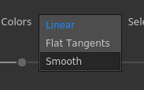
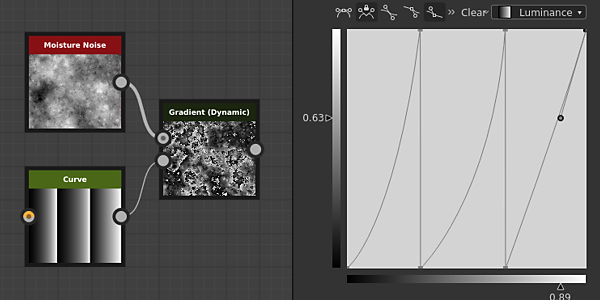

# Version 2020.2 (10.2)

**Substance Designer 2020.2** bietet ein neues Substance Engine-Update, einen verbesserten Arbeitsablauf zum leg von Parametern, einige Leistungsverbesserungen und neue Inhalte.

Freigabedatum: *12. Oktober 2020*

## Wichtigste Funktionen

### Neues Engine-Update (Version 8)

In dieser neuen Version ist das Substance Engine jetzt in Version 8 enthalten und bietet neue Funktionen und einige Verbesserungen:

* **Standardwerte für Eingabebilder**\
  Bildeingaben in Graf können jetzt eine Standardfarbe definieren, sodass es praktisch ist, auf einen geeigneten Wert zurückzugreifen, wenn nichts geladen oder mit diesem Eingang verbunden ist.

  {width="600px"}

* **Neue Abstandsmodi**\
  [Der Distanzknoten &#x200B;](../../../compositing-graphs/nodes-reference-for-com/atomic-nodes/distance/distance.md) verfügt jetzt über zwei neue Modi, die die Art und Weise ändern, wie die Berechnung ausgeführt wird:

  * **Euclidean** (Originalmodus): Abstand zwischen den Punkten in euklidischer Geometrie.
  * **Manhattan**: Abstand zwischen den Punkten, jedoch auf einen Raster beschränkt, ähnlich wie in Stadtblöcken.
  * **Chebyshev**: größte Entfernung zwischen zwei Punkten auf einem Raster gleicher Größe.

  {width="600px"}

* **Neue Verlaufsinterpolation**&#x200B;[&#x200B; Der Verlaufsknoten &#x200B;](../../../compositing-graphs/nodes-reference-for-com/atomic-nodes/gradient-map/gradient-map.md) verfügt über einen neuen Modus **Glätten** zum Interpolieren von Tasten, der viel natürlichere Farbübergänge erzeugt. Es funktioniert, indem man sich Nachbarschlüssel anschaut. Der vorherige Modus &quot;**Interpolation**&quot; wurde in &quot;**Flache Tangente**&quot; umbenannt.

  {width="600px"}

  

  Es gibt auch einen zusätzlichen Parameter für den **Smooth**-Modus, der die Länge der Tangente steuert, die zum Berechnen der Kurve verwendet wird, die zwischen den Farben überblendet wird. Ein Wert von 0 bedeutet, dass die Tangenten eine Länge von 0 haben, während ein Wert von 1 bedeutet, dass die Tangenten die Hälfte der Länge zwischen zwei Tasten haben.

  

* **Verbesserter Kurvenknoten**&#x200B;[&#x200B; Der Kurvenknoten](../../../compositing-graphs/nodes-reference-for-com/atomic-nodes/curve/curve.md) kann jetzt direkt ein Graustufenbild ausgeben. Mit dieser Änderung können Sie eine Kurve definieren und direkt ausgeben, ohne dass Sie zuerst eine Gradienten-Textur einstecken müssen.

  

### Verbesserter leg-Parameter

Der Arbeitsablauf zum leg und Bearbeiten von Parametern wurde verbessert und ist jetzt einfacher:

* **Verbesserte Menüaktionen** Aktionen zum leg und Bearbeiten von freigelegten Parametern wurden getrennt, um expliziter zu sein. Außerdem wurde ein neuer Tastaturbefehl eingeführt, um exponierte Parameter einfacher und schneller zu bearbeiten. Es gibt jetzt beispielsweise eine eigene Schaltfläche, um die Funktion eines Parameters zu bearbeiten, und eine eigene Aktion, um zum angezeigten Parameter &quot;Graph&quot; zu springen.

  

  

* **Direktes Konfigurieren neuer Parameter aus dem Dialogfeld** Wenn ein Parameter angezeigt wird, sind jetzt alle regulären Steuerelemente, wie die Beschreibung und die Standardwerte, über das Dialogfeld **Parameter verfügbar machen** zugänglich. Dadurch wird die Konfiguration und Erstellung neuer Parameter für das Diagramm wesentlich einfacher und schneller, sodass Sie nicht sofort nach der Erstellung eines Parameters zur Ansicht des Parameters &quot;Diagramm&quot; wechseln müssen.

  {width="600px"}

### Verbesserte Symbolkonfiguration für das Substance-Diagramm

Das Einrichten von Miniaturansichten im Substance-Diagramm ist mit der verbesserten Benutzeroberfläche jetzt viel einfacher:

* **Automatische Miniaturbildgenerierung für Diagramme**\
  Es ist jetzt möglich, automatisch eine Vorschau für ein Substance-Diagramm zu generieren, indem Sie einfach auf die Schaltfläche Generieren neben dem Symbol in den Diagrammparametern klicken. Es unterstützt derzeit nur Diagramme, die den PBR-Workflow &quot;Metallisch/Raueit&quot; als Ausgabeknoten verwenden. Bei der Erzeugung der Miniaturansicht wird die Intensität des Versatzes aus dem Wert der Physische Größe berechnet, falls definiert, andernfalls wird standardmäßig der Wert 0,1 verwendet.

  {width="600px"}

* **Hinzufügen benutzerdefinierter Miniaturansichten mit den neuen Schaltflächen**\
  Wir haben mehrere neue Schaltflächen hinzugefügt, um die Einrichtung benutzerdefinierter Miniaturansichten zu vereinfachen:

  * **Durchsuchen**: Öffnen Sie ein Dateidialogfeld, um ein Bild zu laden. Sie können dies auch tun, indem Sie auf das Ordnersymbol neben den Schaltflächen klicken.
  * **Generieren**: Sehen Sie sich die Demonstration oben an.
  * **Einfügen**: Ein Bild aus der Zwischenablage laden.
  * **Entfernen**: Entfernen Sie das aktuell zugewiesene Bild für das Symbol.

  

### Verbesserte Leistung

In dieser neuen Version wurden zwei neue Optimierungen vorgenommen, die die Zeit zwischen Iterationen verkürzen:

* **Verbesserte Diagrammberechnungsleistung**\
  Ausgabeknoten werden jetzt direkt berechnet, wenn sie angefordert werden, anstatt die Zwischenknoten auf dem Weg zu berechnen (was jetzt in einem zweiten Schritt ist). Mit dieser Änderung können Sie die Ergebnisse eines Diagramms viel schneller anzeigen, selbst wenn Sie Stammknoten anpassen. Im folgenden Vergleich ermöglicht diese Optimierung, mehr Iterationen des Diagramms im selben Zeitraum zu sehen (hier mit einem Material mit einer 4K-Auflösung):

  

* **Verbesserte Baker-Erweiterung und Diffusionserzeugung**\
  Die Dilatation und Diffusion von gebackenen Texturen ist jetzt bis zu viermal schneller als in früheren Versionen. Dadurch wird die Wartezeit zwischen den Baking führte reduziert.

  

### Neue Inhalte

In dieser Version werden einige neue Knoten hinzugefügt sowie zusätzliche Möglichkeiten für einige bereits vorhandene Knoten:

* **[Neuer Schwellenwert-Filter](../../../compositing-graphs/nodes-reference-for-com/node-library/filters/adjustments/threshold/threshold.md)**&#x200B;Dieser Knoten ermöglicht die schnelle Isolierung eines Teils eines Bildes als Schwarz und weiße Maske auf der Grundlage einer Graustufeneingabe. Dies ähnelt in der Praxis dem bereits vorhandenen Histogramm Scan-Filter, ist aber für die tägliche Verwendung komfortabler. Erfahren Sie mehr darüber auf der [dedizierten Dokumentationsseite](../../../compositing-graphs/nodes-reference-for-com/node-library/filters/adjustments/threshold/threshold.md).

  {width="650px"}

* **[Neuer Querschnittfilter](../../../compositing-graphs/nodes-reference-for-com/node-library/filters/effects/cross-section/cross-section.md)** Dieser Knoten ermöglicht die Darstellung der Form einer Graustufeneingabe als Profil. Dadurch wird das Erstellen von Höhenzuordnungen und Formen mit diesem Filter als Debugtool wesentlich einfacher. Weitere Informationen finden Sie auf der [Seite der dedizierten Dokumentation](../../../compositing-graphs/nodes-reference-for-com/node-library/filters/effects/cross-section/cross-section.md) .

  {width="600px"}

  {width="600px"}

* **[Tile Generator &#x200B;](../../../compositing-graphs/nodes-reference-for-com/node-library/texture-generators/patterns/tile-generator/tile-generator.md) und** [**Sampler anordnen**](../../../compositing-graphs/nodes-reference-for-com/node-library/texture-generators/patterns/tile-sampler/tile-sampler.md) wurde verbessert.\
  Diese beiden Knoten verfügen jetzt über neue Parameter, mit denen weitere Funktionen und Verwendungsmöglichkeiten erweitert werden können:

  * **Verhältnis beibehalten**: Behalten Sie das Verhältnis der Kacheln, keine Notwendigkeit, manuell die Größe zu kompensieren, wenn die Zählung auf der X- und Y-Achse ungleichmäßig ist.
  * **Absolut**: Behalte die Kachel einen vordefinierten Prozentsatz der Breite des finalen Bildes bei.
  * **Pixel**: Lege die Kachelgröße in Pixel fest.

  Weitere Informationen finden Sie auf der [Seite der dedizierten Dokumentation](../../../compositing-graphs/nodes-reference-for-com/node-library/texture-generators/patterns/tile-generator/tile-generator.md).

  

### Sonstiges

**Iray** wurde auf Version 2020.1.0 aktualisiert, durch die die Unterstützung der neuen Ampere-GPU von Nvidia (z. B. RTX 3080 und RTX 3090) hinzugefügt wurde.

## Versionshinweise

### 2020.2.0

*(veröffentlicht am 12. Oktober 2020)*

**Hinzugefügt:**

* [Inhalt] Knoten &quot;Querschnitt&quot; hinzufügen
* [Inhalt] Hinzufügen der Funktion &quot;Cross product vec2&quot; zu functions.sbs
* [Inhalt] Hinzufügen des Werteknotens &quot;Größe abrufen&quot;
* [Inhalt] Hinzufügen der Funktion &quot;Orthogonal vec2&quot; zu functions.sbs
* [Content] Hinzufügen von Durchschnittfunktionen zu functions.sbs
* [Inhalt] Filter &quot;Schwellenwert hinzufügen&quot;
* [Inhalt] Farbabgleich: Hinzufügen einer Maskeneingabe, um anzugeben, wo der Filter angewendet werden soll
* [Inhalt] Tile Generator/Sampler: neue Optionen zur Steuerung der Mustergröße hinzufügen
* [Content] PBR-Rendering-Knoten mit Standardwert für Bildeingaben aktualisieren
* [Parameter] Fügen Sie Warnsymbole hinzu, um Probleme in Instanzparametern hervorzuheben
* [Parameter] Sichtbare If-Anweisungen für Ein-/Ausgänge ignorieren, die Parameter enthalten, auf die eine Funktion angewendet wurde
* [Parameter] Verbessern der UX für die Gruppenzuordnung
* [Parameter] Überarbeitung der Methode zum Anzeigen eines einzelnen Parameters
* [Parameter] Belichtete Parameter hervorheben
* [Parameter] Verbessern Bereinigung nicht verwendeter Parameter
* [Engine] Kurvenknoten: Neue Option zum Ausgeben der Kurvenstruktur
* [Engine] Standardwerte für Eingabebilder
* [Engine] Distanzknoten: neue Entfernungsmodi (Entfernungen Manhattan und Chebyshev)
* [Engine] Verlaufsknoten: Neuer Interpolationsmodus für natürlichere Farbmischung
* [Engine] Einige Parameter sind jetzt abhängig von anderen Parametern ausgegraut.
* [UX] Akzeptieren Sie 6-stellige RGB-Farben im Hexadezimalfeld des Farbwählers
* [UX] Vermeiden Sie, Kommentareigenschaften anzuzeigen, sobald sie ausgewählt sind
* [UX] Relevante Gruppen anzeigen, wenn mit dem Schreiben eines Gruppennamen begonnen wird
* [UX] Verknüpfung zum erneuten Exportieren von Diagrammausgaben
* [UX] Aussehen aller Dropdown-Textfeld-Kombinationsfelder anders als in regulären Kombinationsfeldern
* [GraphRender] Zeigen Sie Knoten-Miniaturansichten nacheinander an, nicht nur, wenn sie alle berechnet werden.
* [GraphRender] Verbessern der Abbruchverzögerung beim Rendern von Diagrammen
* [GraphRender] Verbessern der Genauigkeit der Rendering-Fortschrittsleiste
* [Miniaturansichten] Automatische Berechnung der Miniaturansichten (Symbol)
* [Miniaturansichten] Überarbeitung der UX, um einem Paket eine Miniaturansicht (Symbol) hinzuzufügen
* [Voreinstellungen] GPU-Raytracing standardmäßig für neue Benutzer aktivieren
* [Voreinstellungen] 3DView / OpenGL / Qualität: Schieberegler zum Ersetzen der Sampleanzahl durch eine intuitivere Auswahlliste
* [Bäcker] Verbessern der Leistung von Nachbearbeitungsprozessen
* [Farbmanagement] Anzeigen des aktuellen Arbeitsfarbraums im Dialogfeld &quot;Voreinstellungen&quot;.
* [Iray] Automatischer Wechsel in den CPU-Modus, wenn keine kompatible GPU vorhanden ist
* [Leistung] Verbessern Sie die Reaktionszeit, um den Knoten zu berechnen, an dem wir interessiert sind (jetzt zuerst berechnet).
* [Python-API] Neue Methode addActionToExplorerToolbar zum Hinzufügen von Symbolen zur Explorer-Symbolleiste
* [Ressourcen] Upgrade auf FBX 2020.0.1
* [iRay] Update für Irak 2020.1.0
* [API] Hinzufügen von Python-Zugriff auf Farbmanagementeinstellungen und -eigenschaften

**Fest:**

* [Diagramm] Das Ändern der übergeordneten Größe oder der UV-Kachel bricht das aktuelle Rendering nicht ab
* [Graph] Absturz beim Verschieben einer Ausgabeverbindung und anschließendem Drücken von Alt+LMB
* [Graph] Absturz beim Verschieben von Verbindungen im Modus &quot;Material&quot; oder &quot;Kompaktes Material&quot;
* [Graph] Eingabeknoten können keine Vorschau von Bitmapressourcen anzeigen
* [Graph] Knotenkompatibilität bei Instanzen unterbrochen
* [Graph] Zu viele Knoten werden ungültig, wenn ein Diagrammparameter geändert wird
* [Inhalt] Die Ausgabeform &quot;Shape Extrude&quot; wird in bestimmten Fällen gespiegelt: neue Version erforderlich, alte Version ist veraltet
* [Inhalt] Falsches Ergebnis bei Verwendung der benutzerdefinierten Farbvariation im Knoten &quot;Farbabgleich&quot;
* [Inhalt] Das Größenverhältnis x x/y in der Atlas Scatter hat den entgegengesetzten Effekt.
* [Inhalt] Das Größenverhältnis x x/y in der Formaufteilung hat den entgegengesetzten Effekt
* [3D-Ansicht] Absturz beim Rückgängigmachen nach dem Laden einer Szenenressource aus einem Paket
* [3D-Ansicht] Benutzerdefinierte Umgebung wird nicht in SBSSCN gespeichert, wenn der Pfad Alias mit Sonderzeichen enthält
* [3D-Ansicht] Das Wechseln des Normalformats in den Materialeinstellungen führt zu gespiegelten Zuständen
* [UI] Schaltflächentext &quot;Als primär festlegen&quot; fließt vom Anzeigebereich über.
* [UI] Die Position des Hauptfensters wird beim Arbeiten im Fenstermodus nicht korrekt wiederhergestellt
* [UI] Text in der Statusleiste wird versetzt, wenn das Fenster im Vollbildmodus angezeigt wird oder wenn der Text in die Nähe des Bildschirmrandes gezogen wird
* [Iray] Absturz mit der Meldung &quot;Ungültiges Tag&quot; beim Hin- und Herschalten zwischen Renderern
* [Iray] Sichtbare Gesichter auf nicht-opaken Oberflächen
* [Vorgaben] Absturz beim Anwenden von Vorgaben in Instanzen einiger Substance Source-Graphen
* [Vorgaben] falscher Name nach Rückgängigmachen auf SBS-Instanz
* [Rendern] Falsches Rendering beim Anpassen eines Parameters im Vorschaumodus
* [Bäcker] Das Aktualisieren mehrerer durch Baking erzeugte Map führt dazu, dass Warnungen einige Backen blockieren.
* [Cooker] Das Anpassen von SBSAR-Knoten in SBS-Instanzen führt zu einer 0-Ausgabe von der Instanz
* [Explorer] Benutzerdefinierte Aliase werden bei Verwendung von &quot;Speichern und auf Substance Player öffnen&quot; nicht weitergegeben
* [Verlaufseditor] Die absolute Farbauswahl wirkt sich nicht auf alle ausgewählten Tasten aus
