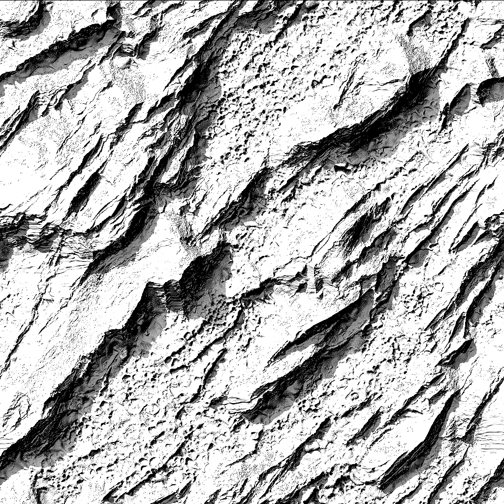

# Version 11.2

**Substance 3D Designer 11.2** hat den Namen leicht geändert und ist jetzt mit Adobe Creative Cloud verbunden. Es enthält die allererste Version von Substance Model Graphs, die Funktion &quot;Senden an&quot;, eine Reihe von Raytrace-basierten Knoten und einige Änderungen an der Benutzeroberfläche.

Freigabedatum: *23. Juni 2021*

## Wichtigste Funktionen

### Neue Substance-Modellgrafiken

Mit Substance Model Graph, einem völlig neuen Graf-Typ, kannst du prozedurale 3D-Modelle mit einer vertrauten Knotenschnittstelle erstellen.

<table>
<tr style="border: 0;">
<td style="border: 0;" valign="top">

{width="300px"}

</td>
<td style="border: 0;" valign="top">

{width="300px"}

</td>
</tr>
</table>

Tauche ein in den neuen, speziellen Dokumentationsbereich, um mehr zu erfahren.

Dies ist eine erste Version. Erwarten Sie also einige Einschränkungen.

### Funktion &quot;Senden an&quot;

Adobe-Versionen von Substance 3D Designer verfügen über eine neue Funktion &quot;Senden an&quot;, mit der Sie Elemente schnell an andere Substance 3D-Anwendungen senden können. Das Veröffentlichen als SBSAR und Laden einzelner Dateien ist nicht mehr erforderlich. Senden an löst dies mit einem Klick.

>[!NOTE]
>
> In Steam-Versionen von Substance 3D Designer ist die Funktion &quot;Senden an&quot; nicht verfügbar.

### Neue Raytrace-Knoten

Keine Designer-Version ohne neue Knoten abgeschlossen. Aufbauend auf der phänomenalen Stärke des PBR-Rendering werden in dieser Version fünf neue RT-basierte Nodes eingeführt.

<table>
<tr style="border: 0;">
<td style="border: 0;" valign="top">

{width="300px"}

</td>
<td style="border: 0;" valign="top">

{width="300px"}

</td>
</tr>
</table>

RTAO macht noch bessere Arbeit bei der scharfen, korrekten AO als der vorherige HBAO-Knoten.

{width="300px"}

&quot;Kaustik&quot; generiert physikalisch korrekte, raytraced Kaustik, die auf einer Höhenkarte basiert, wie z. B. eine einfache Perlin-Rauschen. Ideal für realistische animierte Flipbook-Texturen für Kaustik in Echtzeit.

{width="300px"}

RT Shadow erzeugt präzise, raytraced Schatten mit ein paar einfachen Steuerelementen.

<table>
<tr style="border: 0;">
<td style="border: 0;" valign="top">

{width="200px"}

</td>
<td style="border: 0;" valign="top">

{width="200px"}

</td>
<td style="border: 0;" valign="top">

{width="200px"}

</td>
</tr>
</table>

RT Irradiance ist der fortschrittlichste der neuen Knoten. Es führt eine Raytraced-Bestrahlung auf der Grundlage eines Materials mit Höhen-Map und einer Umgebungs-Map und/oder einer Emissive-Map durch.

{width="600px"}

Das bedeutet, dass du Texturen mit vorab Baking geführt Beleuchtung vornehmen kannst, z. B. für stilisierte Projekte, oder du kannst Baking in Raytraced Glow hinzufügen, das von deiner Lupe reflektiert wird.

{width="300px"}

Und zuletzt gibt es den Knoten &quot;Gebeugte Normal&quot;. Im Vergleich zu einer normalen regulären Konvertierung verwendet dieser Knoten AO, um Ihre normale Zuordnung so zu ändern, dass diese AO-Informationen verwendet werden. Bevor Sie Gitterbäcker benötigen, um den Effekt zu erstellen, erledigt dieser Knoten dies in texturespace für Sie.

### Adobe Standard Material Shader

In unseren Bemühungen, Materialien und Rendering in all unseren Anwendungen zu vereinheitlichen, ist der neue Standard-Shader in der 3D-Ansicht der Adobe Standard Material Shader. Auf den ersten Blick ist es nicht anders als der alte Shader für die metallische Raueit von PBR (der ohnehin darauf basiert), aber er unterstützt viele weitere exotische Kanäle, sodass du diese in der Vorschau testen kannst, ohne einen externen Renderer zu benötigen.

### Änderungen an der Benutzeroberfläche

An der Benutzeroberfläche wurden kleine Änderungen vorgenommen, die offensichtlichsten sind jedoch das verbesserte Menü &quot;Datei&quot; > &quot;Neues Paket&quot;, über das Sie den Diagrammtyp auswählen können, sowie die verbesserten und aktualisierten Schaltflächen auf der Hauptsymbolleiste, die Verknüpfungen für neue Diagrammtypen bereitstellen und an andere Anwendungen senden können.

## Tutorials

Im Folgenden finden Sie unsere Videotutorials zu den neuen Funktionen:

## Versionshinweise

### 11.2.0

*(veröffentlicht am 23. Juni 2021)*

**Hinzugefügt:**

* [Branding] Substance Designer wird zu Adobe Substance 3D Designer
* [Substance Models] Neue Substance-Modellgrafiken zur Erstellung prozeduraler 3D-
* [Inhalt] Neue HDR-Umgebungszuordnungen hinzufügen
* [Inhalt] Neuer Knoten Gebogenes Normal
* [Inhalt] Neuer Knoten &quot;RT Ambient Verdeckung&quot;
* [Inhalt] Neuer RT-Kaustikknoten
* [Inhalt] Neuer RT-Kaustikknoten
* [Inhalt] Neuer RT-Bestrahlungsknoten
* [Inhalt] Neuer Knoten &quot;RT Shadows&quot;
* [Interoperabilität] Element an Painter senden startet Painter und fügt das Element der Bibliothek hinzu oder aktualisiert es (Adobe Substance 3D erforderlich).
* [Interoperabilität] Element an Sampler senden startet Sampler und fügt das Element der Bibliothek hinzu oder aktualisiert es (Adobe Substance 3D erforderlich).
* [Interoperabilität] Durchsuchen Sie Ihr Asset in Adobe Bridge und starten Sie Bridge am Speicherort des Assets (erfordert ein Adobe Substance 3D-Abo).
* [ASM] Unterstützung des neuen Adobe-Standardmaterials (ASM) in Substance-Grafen und MDL Graph
* [ASM] ASM-Vorlagen hinzufügen
* [ASM] OpenGL-Shader für ASM hinzufügen
* [ASM] ASM-Shader als Standard-Shader festlegen
* [Allgemein] Aggregieren aller temporären Dateien in das vom Benutzer festgelegte temporäre Verzeichnis
* [Allgemein] Neuer Befehl &quot;Kopie speichern unter&quot;
* [Allgemein] Menü &quot;Datei aktualisieren&quot;
* [Allgemein] Menü &quot;Hilfe aktualisieren&quot;
* [Publish] Neues Veröffentlichungsfenster
* [Publish] Fügen Sie in den Einstellungen die Option hinzu, um die SBS beim Veröffentlichen einer Sbsar-Datei nicht zu speichern
* [Eigenschaften] Hinzufügen eines Felds vom Typ &quot;Graf&quot; zu den Eigenschaften &quot;Graf&quot;
* [Eigenschaften] Ordnen Sie die Eigenschaften von Grafen relevanter an
* [Branding] Fenster &quot;Neues Info&quot;
* [Branding] Anwendungsstil aktualisieren
* [GLSLFX] Label zu Techniken hinzufügen
* [GLSLFX] Möglichkeit hinzufügen, die Kennzeichnung eines GLSLFX Shader festzulegen.
* [Metadaten] Hinzufügen von Metadaten zu den Paketressourcen
* [Metadaten] Metadaten-Edition für Graf, Eingaben, Ausgaben und Ressourcen zulassen
* [Lokalisierung] Neue Übersetzungen in Deutsch, Französisch und vereinfachtem Chinesisch
* [UX] Zoom in der 3D-Ansicht bei Ziehen mit der Maus umkehren
* [AXF] Update auf Version 1.8.0
* [Protokolle] Hinzufügen installierter Plug-ins zu den Protokollen
* [VFX] ACE 1.2 OpenColorIO Konfiguration hinzufügen
* [Python-API] Hinzufügen einer Methode zum Abfragen des in den Einstellungen angegebenen TMP-Verzeichnisses
* [Python-API] Hinzufügen einer isModified-Methode zu SDPackage, um zu überprüfen, ob ein Paket gespeichert ist
* [Python-API] Hinzufügen einiger Farbkonvertierungsmethoden zu SDColorManagementEngine
* [Python API] Löschen von Kommentarobjekten (Grafen, Nadeln, Rahmen, ...)
* [Python API] Gelegt Physische Größe-Eigenschaft für Grapheninstanz-Knoten
* [Python API] Verfügbarmachen und Speichern einer Kopie als
* [Python-API] SDPackageMgr.savePackage-Methode reparieren
* [Python API] Liste der ausgewählten Diagrammobjekte abrufen
* [Python-API] Einführung neuer Methodennamen für die Arbeit mit Diagrammauswahlen
* [Python-API] Plug-ins können dem zuerst erstellten Explorer-Bedienfeld keine Aktionen hinzufügen

**Fest:**

* [Parameter] Negative Werte bei Dropdown-Integer1-Parametern führen zu inkongruentem Verhalten in der Instanz
* [Parameter] Problem beim Erhöhen eines Werts auf einem Winkel-Widget
* [Graph] Timing-Probleme bei der Anzeige der Ausgabe in der 2D- oder 3D-Ansicht.
* [Internationalisierung] Einige bestimmte Zeichen werden in Leerzeichen in Dateikennungen geändert.
* [Voreinstellungen] Die Dateibezeichnung &quot;Benutzerprojekt&quot; wird nicht aus dem Japanischen zurückübersetzt
* [Python-API] RecursionError beim Ausführen der SDUIMgr.getCurrentGraphSelectedNodes()-Methode
* [Python-API] SDApplication.getPath(SDApplicationPath.InstallationDir) gibt nichts zurück.
* [Python-API] SDSBSARExporter sendet keine Benachrichtigungen zum Speichern von Dateien
