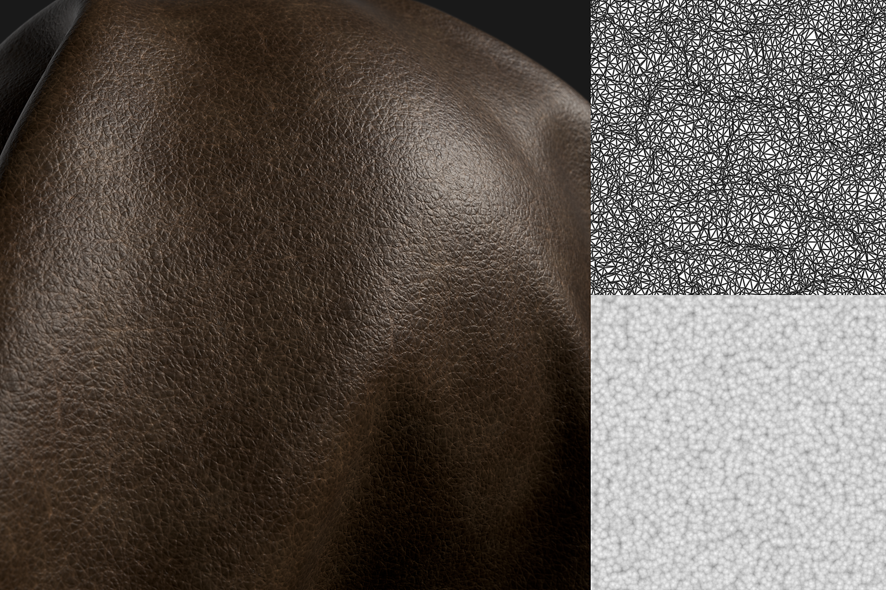
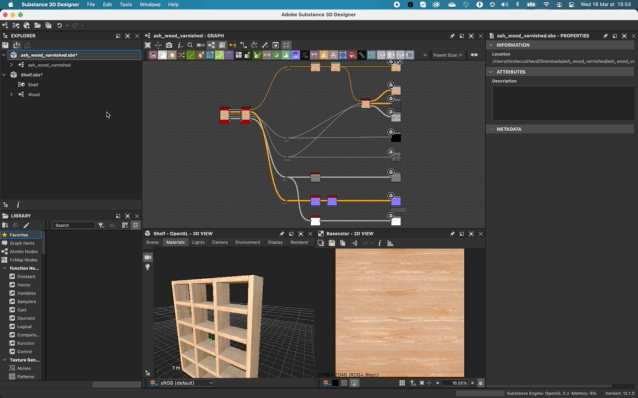
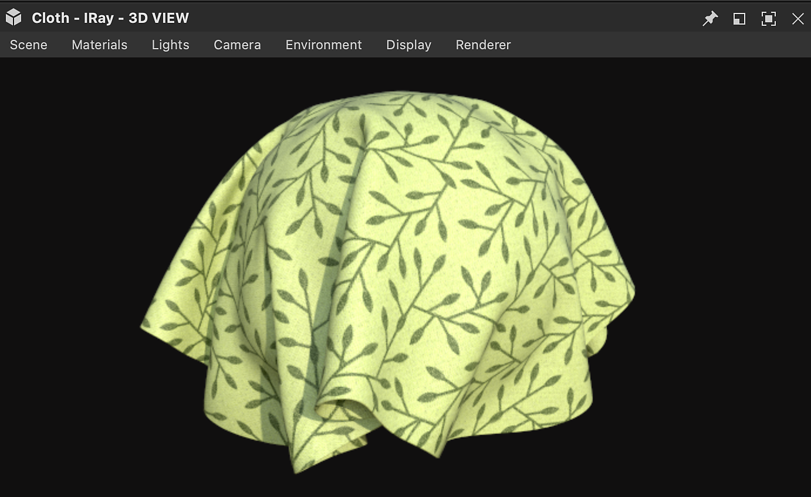

# Version 12.1

**Substance 3D Designer 12.1** bietet viele neue Nodes für Substance-Material-Graf, USD Dateiformatunterstützung und mehr Interoperabilität mit Stager.

Freigabedatum: *26. April 2022*

## Hauptmerkmal

### Neuer Inhalt für Substance Material Graf

Viele Nodes wurden in dieser Version hinzugefügt, Sie werden einige neue Muster finden, neue Rauschen, neue Filter, ...

In den unten verlinkten Knotenseiten finden Sie Beispiele für die Ausgabebreite, die durch diese leistungsstarken neuen Knoten erreicht wird!

* **Neue Muster**

  * Wir haben einen neuen Knoten <b>Kachelzufall 2</b> hinzugefügt, um benachbarte Kacheln mit zufälligen Größen und Verhältnissen zu generieren. Dies ist sehr nützlich, um schnell vollständig unregelmäßige Raster mit geneigten, abgerundeten Ecken und Abschrägungen zu erstellen.

    {width="640px"}
  * Neues <b>Triangle Grid</b>-Muster zum Generieren eines Rasters aus Dreiecken. Wir verwenden es im folgenden Material, um die Lederkörnung einfach und perfekt zu simulieren. Dieser Generator stellt eine Fläche von Scheitelpunkten im 3D-Raum dar und kann verwendet werden, um eine Vielzahl von polygonalen Stilen zu erstellen.

    {width="640px"}
* **Neue Rauschen**

  * Um Ihnen mehr Abwechslung zu bieten, eine Reihe von <b>15 neuen Schmutz Maps</b> (Beton, Lecks, Splashes Dirty, ...) wurde der Bibliothek hinzugefügt.

    {width="640px"}
  * Sie finden auch viele <b>neue 2D- und 3D-Rauschen</b>, wie Voronoi (2D und 3D), Voronoi Fractal (2D und 3D), 3D Ridge Fractal und ein Update der aktuellen 3D-Perlin-Rauschen (Hinzufügen von Kachelung- und Absolutoptionen).\
    Diese Rauschen sind alle im 3D-Raum abgebildet und bieten mehrere Stile, die eine größere Vielfalt und Kontrolle ermöglichen. So hast du die Qual der Wahl, um die perfekte Landkarte für dein Material zu erstellen, wie das Meer und die Materialien der Science-Fiction-Panels unten.

    {width="640px"}

    {width="640px"}
  * Eine Auflistung von <b>3D-Textur-Knoten</b> (Positionieren, SDF, Offset) und <b>3D-Renderknoten </b> (Fläche oder Volumen) zum Erstellen und Rendern von 3D-Texturen, die ein Atlas der Slices eines 3D-Modells sind.

    {width="640px"}

* **Neue Filter**

  * Mit dem Knoten <b>Automatisches Freistellen</b> können Sie eine Form in der *Mitte* des Bildes platzieren, ohne dass die Größe geändert wird, oder die Form an den Platz anpassen. So kann zum Beispiel die Form beliebig verändert werden, während Position und Größe nach dem Verstreuen einheitlich sind.

    {width="640px"}
  * Mit dem Knoten &quot;<b> Extend Shape</b>&quot; können Sie einen Abschnitt einer Form über eine benutzerdefinierte Richtung und Entfernung gedehnt.

    {width="640px"}
  * Und mit dem Knoten <b>Nicht-gleichförmige Drehung</b> können Sie eine Eingabe entsprechend einer angegebenen Karte drehen.

    {width="640px"}
* **Und außerdem...1**

  * Easing-Funktionen (Funktions-Graf), die sehr nützlich sind, um einen Wert nichtlinear anzusteuern.
  * Diese Version enthält außerdem eine neue, präzisere Version des Knotens &quot;<b>Quantize</b>&quot; sowie einen brandneuen Dienstprogrammfilter &quot;<b>Summed Area Table</b>&quot;.

### Verbesserung der Interoperabilität

* **USD Support** Zusätzlich zur

  und

  -Dateiformate konvertieren, können Sie jetzt USD Dateien (

  ,

  ,

  ), um sie als Ressourcen für Ihre Substance-Modellgrafiken zu verwenden, zum Baking oder in der 3D-Ansicht, um Ihr Substance-Material zu präsentieren. Sie können dieses Format auch verwenden, um Ihr Substance-Modelldiagramm oder den Inhalt der 3D-Ansicht zu exportieren.
* <b>An Stager senden\
  </b>Sie können Ihr Substance-Material jetzt mit einem Klick an Stager senden, wie dies bereits mit Sampler und Painter möglich war. Dank dieser Funktion müssen Sie nicht mehr als SBSAR veröffentlichen und einzelne Dateien laden (Stager-Version 1.2.0 mit dem neuen Material-Manager erforderlich).

  

### Sonstiges

* Wenn Sie an Stoffen arbeiten, können Sie jetzt einen speziellen Mesh in der 3D-Ansicht anzeigen, um besser sehen zu können, wie Ihr Material auf einer drapierten Form gerendert wird. Öffnen Sie das Menü &quot;<b>Szene</b>&quot; im Bedienfeld &quot;3D-Ansicht&quot;, und wählen Sie die Option &quot;<b>Cloth</b>&quot; aus, um dieses Modell anzuzeigen.

  {width="640px"}

* Wir haben außerdem einige neue Knoten für das Szenen-Management für Substance-Modellgrafiken hinzugefügt. Mithilfe dieser Knoten können Sie die Szene umbenennen, überordnen, fusionieren oder erweitern, um die Hierarchie der Szene zu organisieren. Es gibt auch einen neuen Knoten, der den Drehpunkt für ein oder mehrere Elemente einer Szene festlegt.

* Bei der Arbeit an Projekten in Designer können Warnungen und Fehlermeldungen auftreten, die Sie über ein Problem im Projekt informieren. In dieser Version <b>verbessern wir das Fehlermanagementsystem</b>, um alle Fehler und Warnungen im Explorer anzuzeigen: Alles ist an einer Stelle aufgelistet, sodass es einfacher ist, zu überprüfen, ob Ihr Projekt Probleme enthält.

  {width="640px"}

## Versionshinweise

### 12.1.0

*(veröffentlicht am 19. April 2022)*

<b>Hinzugefügt:</b>

* [Main] Neue Inhalte für Material-Graf
* [Main] Materialien an Stager senden
* [Main] Unterstützung von USD
* [Main] Verbessern der Fehlerberichterstattung in der Benutzeroberfläche
* [Main] Szenen-Management-Knoten für Modelldiagramme
* [Inhalt] Weitere Optionen zu 3D-Perlin-Rauschen hinzufügen (Kachelung, Absolut...)
* [Inhalt] Neuer Fraktalknoten &quot;3D-Ridge Noise&quot;
* [Inhalt] Neuer Knoten &quot;3D-Texturversatz&quot;
* [Inhalt] Neuer Knoten 3D-Texturposition
* [Inhalt] Neuer Knoten 3D-Struktur rendern Oberfläche
* [Inhalt] Neuer Knoten &quot;3D-Textur-Rendervolumen&quot;
* [Inhalt] Neuer 3D-Textur-Vorzeichenbehaftetes Abstandsfeld-Knoten
* [Inhalt] Neuer Knoten für automatisches Freistellen
* [Inhalt] Neue Beschleunigungsfunktionen
* [Inhalt] Neue Extend Shape-Knoten
* [Content] Neue Schmutz Maps
* [Inhalt] Neuer Knoten für ungleichmäßige Drehung
* [Inhalt] Neuer Tabellenfilter für summierte Bereiche
* [Inhalt] Neuer Kachel-Zufallsgenerator 2
* [Inhalt] Neuer Triangle Grid-Mustergenerator
* [Inhalt] Neue Version des Knotens &quot;Graustufen quantisieren&quot;
* [Inhalt] Neue Voronoi- und Voronoi-Fraktalrauschen (2D/3D)
* Schwellenwert [Inhalt]: Vergleichsmodus &quot;Unterer&quot; und &quot;Unterer und gleicher&quot; hinzufügen
* [Inhalt]&#x200B;[3D-Ansicht] Fügen Sie den ausgelieferten Ressourcen eine Gitteranpassung für die Anzeige von Stoffen hinzu.
* [Substance-Modelle] Neuer Knoten &quot;Gruppeninstanzen erweitern&quot;
* [Substance-Modelle] Neuer Fuse-Knoten
* [Substance-Modelle] Neuer Knoten Umbenennen
* [Substance-Modelle] Neuer übergeordneter Knoten
* [Substance-Modelle] Neuer Set Pivot-Knoten
* [Substance-Modelle] Update auf SDK 1.6.0
* [ThirdParty] Upgrade Qt (und QtForPython) auf 5.15.8
* [Drittanbieter] Upgrade von Python auf 3.9.9
* [Drittanbieter] Upgrade von OpenSSL auf 1.1.1m
* [UI] Verbessern des Verhaltens des Knotenmenüs bei Fehlklick
* [UI] Öffnen Sie Untergraph auf derselben Registerkarte, auch wenn sie angeheftet sind
* [UI] Schaltfläche &quot;Nadel entfernen&quot; in der Titelleiste des Bedienfelds &quot;Explorer&quot;
* [UI] Speichern Sie die Option &quot;Nicht mehr anzeigen&quot; auf dem Begrüßungsbildschirm in allen Versionen
* [3D-Ansicht] Zeigt den Raster im Viewport an, wenn der Helfer &quot;Achse&quot; aktiviert ist.
* [Automatisierung] Bereitstellen des Absbaker-Befehlszeilentools mit Designer
* [Farbmanagement] Implementieren eines neuen GPU-Backends für Adobe ACE
* [Cooker] Fügen Sie eine Option hinzu, um ein Paket ohne Zeitstempel zu kochen
* [Graf] Hinzufügen von Abzeichen im FxMap-Graf
* [Library] Neuen Filter für Easings-Funktionen hinzufügen
* [Player] USD
* [Eigenschaften] Hinzufügen eines Warnfehlers für den Parameter &quot;PKG-Ressourcenpfad&quot; eines Bitmap-Knotens, wenn die Ressource nicht gefunden wird
* [Substance Engine] Upgrade auf 8.4.1
* [Yebis] Warnen Sie den Benutzer, dass Yebis-Post-Effekte in der nächsten Version entfernt werden.
* [Dokumentation] Neue Seite &quot;Warnungen und Fehler&quot;
* [Dokumentation] Neue Seite mit Beschreibungen der Vererbung in Substance-Grafen
* [Dokumentation] Abschnitt &quot;Iray&quot; aktualisieren
* [Dokumentation] Abschnitt &quot;MDL-Diagramme&quot; aktualisieren

<b>Fest:</b>

* [UI] Beschneidungsprobleme in den QuickInfos für Vorlagen im neuen Graf-Fenster
* [UI] Schwer lesbarer weißer Text in Knoten bei Verwendung des Dunkelmodus in macOS
* [UI] Layoutproblem in einigen Dialogfeldern
* [UI] Beim Erstellen eines Substance-Funktions-Grafen im Explorer wird eine Warnmeldung angezeigt, die abgeschnitten ist.
* [UX] Der Farbwähler bewegt sich bei jeder neuen Öffnung nach unten
* [UX] Das Fenster des Verlaufseditors bewegt sich bei jedem Start nach oben
* [UX] Diagrammeigenschaften werden für geladene Pakete nicht automatisch angezeigt
* [Inhalt] Flood Fill Mapper: Falsche Eingabeauswahl in einem bestimmten Fall
* Flood Fill [Inhalt]: Anschnittbereich in Schaltflächen für boolesche Parameter
* [Inhalt] Falscher Bereich für den Parameter &quot;Erster Lichtwinkel&quot; des Knotens &quot;Mehrere Winkel&quot; bis &quot;Normal&quot;
* [Substance-Modelle] Eigenschaften des Knotens zeigen Bezeichner anstelle der Bezeichnung an
* [Substance-Modelle]&#x200B;[3D-Ansicht] Aktualisierungsproblem beim erneuten Öffnen eines Projekts
* [Substance-Modelle]&#x200B;[3Dview] Aktualisierungsproblem bei Verwendung der Drahtgitter-Vorschau
* [Parameter] Absturz beim Löschen von Diagrammeingaben in schneller Abfolge in einem bestimmten Fall
* [Parameter] Absturz beim Zurücksetzen eines Instanzparameters während der Bearbeitung seiner Referenzbeschreibung
* [Bitmap] UDIM-Erkennung wird nicht für Bitmap-Dateien ausgelöst, die im Diagramm abgelegt wurden
* [Graph] Bitmap-/SVG-Knoten werden nicht ungültig, wenn die Ressource nach dem Laden des Pakets auf der Festplatte geändert wird
* [GraphRender] Speicherleck, wenn die Substance-Diagrammauswertung abgebrochen wird
* [Localization] Die Zeichenfolge &quot;Alle Maps für diese Ressource erneut erstellen&quot; wird nicht lokalisiert angezeigt.
* [MDL] Verfügbarer Parameter initialisiert auf 0, wenn der Eingang mit einem nicht verbundenen Punktknoten verbunden ist
* [Voreinstellungen] QuickInfos werden auch dann angezeigt, wenn sich der Cursor in einem leeren Bereich befindet
* [Eigenschaften] Durch Rückgängigmachen einer Änderung des Farbraumwerts wird der Standardwert in einem bestimmten Fall festgelegt
* [Text] Der Schriftartwechsel kann nicht rückgängig gemacht werden, um eine fehlende Schriftartenressource zu erhalten
