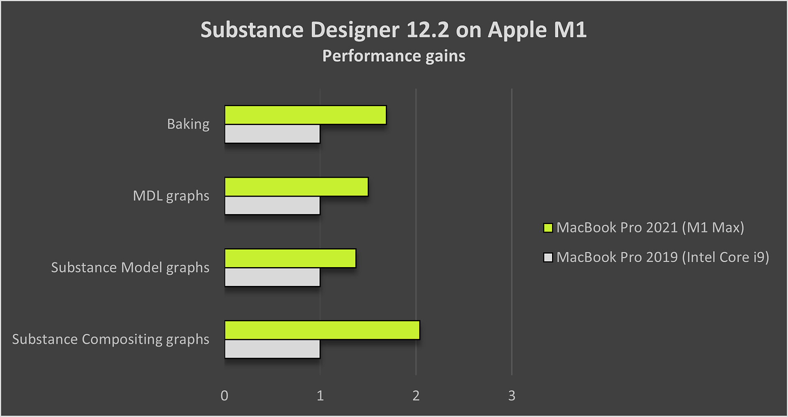

# Version 12.2

<b>Substance 3D Designer 12.2</b> bietet native Unterstützung für Apple Silicon-Computer (M1), einige Verbesserungen für Substance-Modellgrafiken und andere kleine Updates. Auf dieser Seite werden alle Details zu dieser neuen Version beschrieben.

Freigabedatum: *19. Juli 2022*

## Wichtigste Funktionen

### Native Unterstützung für Apple-Chips (M1)

Die Version 12.2 von Designer ist die erste mit der vollen nativen Unterstützung neuer Apple-Computer auf Basis des M1-Chips. Obwohl Designer früher technisch auf Apple Silicon-Geräten ausgeführt werden konnte, wird die native Unterstützung Ihnen ein schnelleres und effizienteres Erlebnis bieten. Wie Sie in der Abbildung unten sehen können, ist die Berechnung mit dieser neuen Version auf diesen Computern *bis zu zweimal schneller*.

{width="600px"}

### Verbesserungen für Substance-Modelldiagramme

* <b>QuickInfos zu Knoten\
  </b>Es ist nicht immer möglich zu erklären, was ein Knoten nur mit einem Symbol und einem Titel macht. Aus diesem Grund haben wir jetzt eine QuickInfo mit einer *vollständigen Beschreibung des Knotens*, wenn Sie sich in der Bibliothek oder in der Graphansicht befinden. Es hilft Ihnen, den Knoten zu finden, den Sie suchen, oder besser zu verstehen, was seine Funktionen sind. 

* <b>Tastaturbefehle für die Knotenerstellung\
  </b>Um die Erstellung Ihrer am häufigsten verwendeten Graf zu beschleunigen, können Sie jetzt Ihre eigenen Verknüpfungen in den Voreinstellungen definieren, wie auch für die anderen Knotentypen.

* <b>Knoten im Kontextmenü des Knotens in der Vorschau anzeigen\
  </b>In unserer neuesten Version haben wir die Möglichkeit hinzugefügt, mithilfe eines Tastaturknotens (*UMSCHALT + Klick* auf einen Tastaturbefehl) eine Vorschau eines Knotens in der 3D-Ansicht anzuzeigen. Diese Funktion ist jetzt auch im *Knoten-Kontextmenü* verfügbar, um sie besser auffindbar zu machen.

  {width="600px"}
* <b>Suche basierend auf Knotenkompatibilität\
  </b>Wenn Sie im Knotenmenü nach einem Knoten suchen (durch Drücken von *Leertaste* in der Graphansicht), werden die Knoten jetzt korrekt gefiltert, um nur die anzuzeigen, die *mit dem aktuell ausgewählten* im Graf kompatibel sind. So können Sie den gesuchten Knoten schnell finden.

### Sonstiges

* <b>Verbesserungen an den 2D-Ansichten</b>\
  Wo es in früheren Versionen möglich war, die Ausgaben des Grafen in der 3D-Ansicht über das *Kontextmenü* des Substance-Grafen anzuzeigen, war es nicht möglich, eine Graphausgabe in der 2D-Ansicht anzuzeigen. Diese Option wurde nun zu diesem Menü hinzugefügt, mit einem Untermenü, in dem alle Graphausgaben aufgelistet sind, die in der 2D-Ansicht angezeigt werden sollen.\
  Die Schaltfläche &quot;2D-Ansichten anzeigen&quot; in der Datasymbolleiste wurde ebenfalls mit einem Abwärtspfeil und einer QuickInfo aktualisiert, um das Verhalten zu verdeutlichen.\
  Und schließlich wurde die Option &quot;Automatische Anzeige von Diagrammausgaben beim Laden eines Diagramms&quot; in den Voreinstellungen *in zwei separate Einstellungen* aufgeteilt - für die 2D-Ansicht bzw. die 3D-Ansicht -, damit Sie steuern können, welche Ansicht beim Laden eines Diagramms geöffnet und automatisch ausgefüllt werden soll.

* <b>CLO-Vorlage</b>\
  Um die Interoperabilität mit der CLO-Software zu verbessern, haben wir eine *neue dedizierte Vorlage* hinzugefügt. Es fügt automatisch alle *Metadaten* zu Ihrem Diagramm hinzu, die erforderlich sind, um Ihr Material ordnungsgemäß in CLO zu importieren.

  {width="600px"}

* Anforderungen für die <b>VFX-Referenzplattform</b>\
  Jedes Jahr veröffentlicht die VFX Reference Platform eine Liste von Tools und Bibliotheksversionen, die in jeder Software für die VFX-Branche verwendet werden können, um Inkompatibilitäten zwischen Software zu minimieren. Wie gewöhnlich *aktualisieren wir alle unsere Abhängigkeiten*, um alle diese Empfehlungen zu respektieren.

## Versionshinweise

### 12.2.0

*(veröffentlicht am 19. Juli 2022)*

<b>Hinzugefügt:</b>

* [Apple] Unterstützung für natives Apple-Chip (M1) (nur Creative Cloud-Version)
* [Substance-Modelldiagramm] Anzeigen von Knoten-QuickInfos in der Diagrammansicht
* [Substance-Modelldiagramm] Anzeigen von Knoten-QuickInfos in Library
* [Substance-Modelldiagramm] Hinzufügen eines Kontextmenüeintrags zu Vorschauknoten
* [Substance-Modelldiagramm] Benutzer kann Verknüpfungen für Knotenerstellung erstellen
* [UI] Hinzufügen der Option &quot;Ausgabe in 2D-Ansicht anzeigen&quot; im Kontextmenü des Substance-Diagramms
* [UI] Teilen Sie die Einstellung &quot;Automatische Anzeige der Ausgaben&quot; in spezifische Einstellungen für 2D-Ansicht/3D-Ansicht auf.
* [UI] Hinzufügen eines Dropdown-Pfeils und einer QuickInfo zur Schaltfläche &quot;Ausgabe anzeigen&quot; in der Symbolleiste der 2D-Ansicht
* [UI] Elemente im Bedienfeld &quot;Informationen&quot; des Explorers umformulieren und neu ordnen
* [Farbmanagement] Fügen Sie &quot;Linear Adobe RGB (1998)&quot; und &quot;Adobe RGB (1998)&quot; hinzu, um Farbräume für Adobe ACE zu exportieren
* [Farbmanagement] Hinzufügen des &quot;Linear Adobe RGB (1998)&quot;-Arbeitsfarbraums für Adobe ACE
* [Farbmanagement] Unterstützung für OCIO ICC-Displays hinzufügen
* [Farbmanagement] Adobe RGB-Arbeitsfarbraum in ACE-Voreinstellungen ausblenden
* [Farbmanagement] Verbessern der Qualität von gebackenen 3D-LUTs im ACE-Modus
* [Farbmanagement] Verwenden Sie das neue GPU-Backend im 3D-Viewer
* [Lokalisierung] Vollständige Aktualisierung der koreanischen Sprache
* [Engine] Update auf Version 8.6.0
* [Graph] Weisen Sie einen Standarddiagrammbezeichner zu, wenn diese Eigenschaft leer gelassen wird
* [Bibliothek] Deaktivieren von QuickInfo-Hyperlinks für Nicht-Instanzknoten
* [NewProject] Standardauflösung aktualisieren
* [Vorlagen] CLO-Vorlage hinzufügen
* [API] Stellen Sie die defaultParentSize-Eigenschaft für SDSBSCompGraph-Objekte bereit.
* [Abhängigkeiten] Aktualisieren Sie Alembic auf Version 1.8.3
* [Abhängigkeiten] Aktualisieren von AXF auf Version 1.9.0
* [Abhängigkeiten] Update Boost auf Version 1.76
* [Abhängigkeiten] Aktualisieren Sie FBX auf Version 2020.2.1
* [Abhängigkeiten] Aktualisieren von IRay auf Version 2021.1.0
* [Abhängigkeiten] Update OpenColorIO auf Version 2.1.1
* [Abhängigkeiten] Update OpenEXR auf Version 3.1.5
* [Abhängigkeiten] Update TBB auf Version 2020.3
* [Abhängigkeiten] Aktualisieren Sie USD auf Version 0.22.3
* [Entfernen] Deaktivieren der Post-Effects-Funktion (Yebis)
* [Entfernen] Entfernen des Befehls &quot;Rendering in Artstation speichern&quot; aus dem Menü &quot;3D-Ansicht&quot;

<b>Fest:</b>

* [Substance-Modelle] Der für den angezeigten Parameter festgelegte Hartbereich wird beim Aufheben der Belichtung gespeichert
* [Substance-Modelle] Bezeichner ist auf Konstantknoten nicht benutzerfreundlich
* [Substance-Modelle] Verbessern der Suche basierend auf Knotenkompatibilität
* [UI] Die Reihenfolge des Untermenüs &quot;Neu&quot; ist für Ordnerressourcen falsch
* [UI] Die Standardgröße des Hauptfensters ist sehr klein
* [UI] Symbolleisten sind nicht von der Option &quot;Layout zurücksetzen&quot; betroffen
* [UI] Sichtbares Transparenzraster auf dem Schriftenressourcensymbol im Explorer
* [Cooker] Substance-Graphen, die im MDL-Graph instanziiert werden, werden immer vollständig wiederhergestellt.
* [Graph] Absturz beim Einfügen eines Knotens, der aus einem Diagramm mit leerem Bezeichner kopiert wurde
* [MDL] Absturz beim Schließen eines bestimmten MDL-Diagramms
* [Leistung] Anwendung reagiert nicht, wenn sehr große Pakete geladen werden
* [Ressourcen] 3D-Szenenressource kann in einem bestimmten Fall importiert werden
