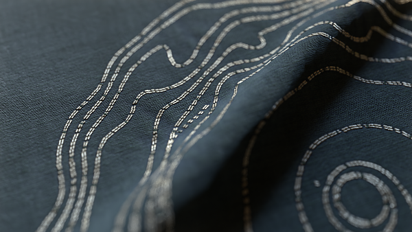

# Version 13.0

Diese Version 13.0.0 von Substance 3D Designer bringt viel Liebe zu Materialkünstlern mit einer riesigen Anzahl neuer Knoten, dem Substance Engine 9.0, das zum ersten Mal Schleifen einführt und eine großartige Ergänzung der Grafik darstellt: den Portalknoten an. Und um mehr Benutzern gefallen zu können, stellen wir einen brandneuen Startbildschirm vor und bieten zusätzliche Sprachen an.

Wie bereits in der Vorgängerversion erwähnt, unterstützt diese Version keine Substance-Modellgrafiken mehr: Das bedeutet, dass Sie solche Diagramme nicht mehr in Designer öffnen, bearbeiten oder exportieren können. Alle Gründe, warum wir diese Entscheidung getroffen haben, finden Sie in diesem [Beitrag](https://community.adobe.com/t5/substance-3d-designer-discussions/substance-model-graphs-end-of-life/td-p/13693731) in unserem Community-Forum.

*Freigabedatum: 6. Juni 2023*

*Bildmaterial von [Celine Dameron](https://www.artstation.com/cline)*

## Neuer Inhalt

Diese Version 13.0 bringt eine Menge neuer Inhalte. Sie finden hauptsächlich zwei neue Sammlungen von Knoten: Spline-Werkzeuge und Pfadwerkzeuge.

* [Spline-Werkzeuge](../../compositing-graphs/nodes-reference-for-com/node-library/spline-paths-tools/spline-tools/spline-tools.md) sind eine Knotensammlung zum Generieren und Anpassen von Splines sowie zum Zuordnen, Verteilen oder Verformen von Bildern.
* [Pfadwerkzeuge](../../compositing-graphs/nodes-reference-for-com/node-library/spline-paths-tools/path-tools/path-tools.md) sind eine weitere Gruppe von Knoten, die in Form einer Liste von Segmenten Konturen aus einer Maske extrahiert und dann bearbeitet und verbessert werden.

All diese Nodes bieten eine Menge Möglichkeiten und sie werden sicherlich eine Menge kreativer Anwendungen haben. Lesen Sie den Abschnitt über [das Arbeiten mit Pfaden und Spline-Werkzeugen](../../compositing-graphs/nodes-reference-for-com/node-library/spline-paths-tools/working-with-path-and-spl/working-with-path-and-spline-tools.md), um sich einen Überblick über die wichtigen Konzepte zu verschaffen, die Sie verstehen müssen, um sich mit diesem Toolset vertraut zu machen.

*Bildmaterial von [Louise Melin](https://www.artstation.com/troglodette)*

### Spline-Werkzeuge

Neue Knoten, die Splines gewidmet sind, können in vier Kategorien unterteilt werden:

#### Erstellen

Die erste Kategorie ist natürlich diejenige, die Splines erzeugt:

* [Spline Cubic](../../compositing-graphs/nodes-reference-for-com/node-library/spline-paths-tools/spline-tools/spline-cubic/spline-cubic.md): von zwei Punkten und zwei Tangenten;
* [Spline Poly Quadratic](../../compositing-graphs/nodes-reference-for-com/node-library/spline-paths-tools/spline-tools/spline-poly-quadratic/spline-poly-quadratic.md): aus einer Reihe von Punkten;
* [Spline Circle](../../compositing-graphs/nodes-reference-for-com/node-library/spline-paths-tools/spline-tools/spline-circle/spline-circle.md): Im Anschluss an eine Kreisform.

Sie können auch <b>Brücken </b> zwischen Splines erstellen, um einen vollständigen Satz von Splines zwischen [2 Splines](../../compositing-graphs/nodes-reference-for-com/node-library/spline-paths-tools/spline-tools/spline-bridge-2-splines/spline-bridge-2-splines.md) oder [N Splines](../../compositing-graphs/nodes-reference-for-com/node-library/spline-paths-tools/spline-tools/spline-bridge-list/spline-bridge-list.md) zu haben.

<table>
<tr style="border: 0;">
<td style="border: 0;" valign="top">

</td>
<td style="border: 0;" valign="top">

</td>
<td style="border: 0;" valign="top">

</td>
<td style="border: 0;" valign="top">

</td>
</tr>
</table>

#### zusammenbauen

In manchen Fällen müssen Sie mehrere Splines als ein einzelnes Element behandeln, sodass Sie Werkzeuge benötigen, um einen Satz von Splines zu verwalten. Mit der [Spline Merge-Liste](../../compositing-graphs/nodes-reference-for-com/node-library/spline-paths-tools/spline-tools/spline-merge-list/spline-merge-list.md) können Sie alle Splines in einem einzigen Spline zusammenführen, indem Sie die Extremitäten der Reihe nach verbinden. Mit dem [Spline Append](../../compositing-graphs/nodes-reference-for-com/node-library/spline-paths-tools/spline-tools/spline-append/spline-append.md)-Knoten können Sie eine Liste von Splines an eine andere Liste anfügen. Mithilfe des [Spline Select](../../compositing-graphs/nodes-reference-for-com/node-library/spline-paths-tools/spline-tools/spline-select/spline-select.md)-Knotens können Sie bestimmte Splines aus einer bestimmten Liste filtern und auswählen.

#### Ändern

Wir bieten auch Tools an, mit denen Sie Ihre Splines nachbearbeiten und optimieren können. Sie finden einen Knoten zum Anwenden einer [2D-Transformation](../../compositing-graphs/nodes-reference-for-com/node-library/spline-paths-tools/spline-tools/spline-2d-transform/spline-2d-transform.md), z. B. einer Drehung, einer Übersetzung, einer Skalierung und eines weiteren Knotens auf [Warp](../../compositing-graphs/nodes-reference-for-com/node-library/spline-paths-tools/spline-tools/spline-warp/spline-warp.md)<b>. </b>die Form und zwei weitere Knoten zum Ändern der [Thickness](../../compositing-graphs/nodes-reference-for-com/node-library/spline-paths-tools/spline-tools/spline-sample-thickness/spline-sample-thickness.md)<b> </b> oder das [Height](../../compositing-graphs/nodes-reference-for-com/node-library/spline-paths-tools/spline-tools/spline-sample-height/spline-sample-height.md) der Splines.

<table>
<tr style="border: 0;">
<td style="border: 0;" valign="top">

</td>
<td style="border: 0;" valign="top">

</td>
<td style="border: 0;" valign="top">

</td>
<td style="border: 0;" valign="top">

</td>
</tr>
</table>

#### Rendering

Die letzte Kategorie ist die, um die endgültige Form oder das Muster basierend auf Ihren Splines zu erstellen. Die erste Idee, die dir in den Sinn kommt, ist, eine bestimmte Form entlang des Splines zu wiederholen: Der Knoten [Streuung auf Spline](../../compositing-graphs/nodes-reference-for-com/node-library/spline-paths-tools/spline-tools/scatter-on-spline-color/scatter-on-spline-color.md) ermöglicht dies mit vielen Parametern, um die Verteilung (Drehung, Skalierung, Offset, Farben, Masken usw.) perfekt zu steuern.

Dank [Spline Fill](../../compositing-graphs/nodes-reference-for-com/node-library/spline-paths-tools/spline-tools/spline-fill/spline-fill.md)<b> </b>-Knoten, können Sie ganz einfach ein Muster aus einem geschlossenen Spline erstellen. Und wenn Sie Ihre Splines mit einem hohen Maß an Kontrolle und Präzision einer beliebigen Textur zuordnen möchten, ist der Knoten [Spline Mapper](../../compositing-graphs/nodes-reference-for-com/node-library/spline-paths-tools/spline-tools/spline-mapper-color/spline-mapper-color.md) für Sie erstellt!

<table>
<tr style="border: 0;">
<td style="border: 0;" valign="top">

</td>
<td style="border: 0;" valign="top">

</td>
<td style="border: 0;" valign="top">

</td>
<td style="border: 0;" valign="top">

</td>
</tr>
</table>

### Pfadwerkzeuge

Mit dem Knoten [Maske zu Pfaden](../../compositing-graphs/nodes-reference-for-com/node-library/spline-paths-tools/path-tools/mask-to-paths/mask-to-paths.md) können Sie den Rahmen eines Graustufenmusters in Form einer Liste von Segmenten extrahieren.

Sie können diese Pfade dann mit den Knoten [Pfad 2D transformieren](../../compositing-graphs/nodes-reference-for-com/node-library/spline-paths-tools/path-tools/path-2d-transform/path-2d-transform.md) oder [Pfad-Verkrümmung](../../compositing-graphs/nodes-reference-for-com/node-library/spline-paths-tools/path-tools/paths-warp/paths-warp.md) verarbeiten, um sie an Ihre Anforderungen anzupassen.  Dank des Knotens [Pfade zu Spline](../../compositing-graphs/nodes-reference-for-com/node-library/spline-paths-tools/path-tools/paths-to-spline/paths-to-spline.md) können Sie Ihren Pfad in eine Spline konvertieren und so alle Knoten nutzen, die Splines gewidmet sind, wie z. B. Streuungen.

<table>
<tr style="border: 0;">
<td style="border: 0;" valign="top">

</td>
<td style="border: 0;" valign="top">

</td>
<td style="border: 0;" valign="top">

</td>
<td style="border: 0;" valign="top">

</td>
</tr>
</table>

Um Ihnen dabei zu helfen, all diese neuen Knoten zu erlernen, haben wir zwei neue Tutorials veröffentlicht:

* [Einführung in Spline-Knoten](https://www.adobe.com/go/designer-tutorial-splines)
* [Einführung in Pfadknoten](https://www.adobe.com/go/designer-tutorial-paths)

## Neues Substance Engine Version 9

Alle oben aufgeführten neuen Knoten basieren auf der neuen Substance Engine-Version und nutzen die neue Hauptfunktion voll aus: <b>Schleifen</b>.

Schleifen sind nur für die Verwendung innerhalb von [Substance-Funktionsgraphen](../../function-graphs/function-graphs.md) vorgesehen, und Sie implementieren sie höchstwahrscheinlich in einem [Pixelprozessor](../../compositing-graphs/nodes-reference-for-com/atomic-nodes/pixel-processor/pixel-processor.md), einer [Fx-Map](../../compositing-graphs/nodes-reference-for-com/atomic-nodes/fx-map/fx-map.md) oder einem [Value Prozessor](../../compositing-graphs/nodes-reference-for-com/atomic-nodes/value-processor/value-processor.md). Loops ermöglicht es Ihnen natürlich, eine Funktion einfach viele Male zu wiederholen, bis eine Bedingung erfüllt ist. Es wird dir helfen, deine Diagramme aufzuhellen und an Genauigkeit zu gewinnen.

Dieses [Tutorial](https://www.youtube.com/watch?v=Ggoy8G90oDI) hilft Ihnen, mit Schleifen zu arbeiten.

Substance Engine 9 bietet außerdem die folgenden Verbesserungen:

* Neuer Farbflächenmodus im Verlaufseditor des [Verlaufsumsetzung](../../compositing-graphs/nodes-reference-for-com/atomic-nodes/gradient-map/gradient-map.md)-Knotens (d. h. überhaupt keine Interpolation)
* Atomic pow() node in Substance-Funktionsdiagrammen
* Hinzufügen von Optionen zum Eingliedern von Rahmen (Einspannen an Kanten, Wiederholen) in Sampler-Knoten
* Nächste Sampling in [Warp](../../compositing-graphs/nodes-reference-for-com/atomic-nodes/warp/warp.md) und [Directional Warp](../../compositing-graphs/nodes-reference-for-com/atomic-nodes/directional-warp/directional-warp.md) Knoten

## Portalknoten

Der Knoten [Portal](../../interface/the-graph-view/graph-items/graph-items.md) ist eine neue Erweiterung des Knotens [Dot](../../interface/the-graph-view/graph-items/graph-items.md) mit der Möglichkeit, Verbindungen in Ihrem Diagramm auszublenden.

Dank dieser Funktion können Sie die Lesbarkeit des Diagramms verbessern, indem Sie sehr lange Verbindungen ausblenden und von überall im Diagramm einen schnellen Zugriff auf wichtige Knoten haben.

Diese neue Funktion wird in diesem dedizierten [Tutorial](https://www.adobe.com/go/designer-tutorial-portals) ausführlich erläutert.

## Startbildschirm

Wenn Sie Designer starten, wissen Sie, dass Sie Zugriff auf einen brandneuen [Startbildschirm](../../interface/home-screen/home-screen.md) haben, wie den, den Sie in anderen Adobe-Produkten haben. Auf diesem Bildschirm können Sie folgende Aktionen ausführen:

* Erstellen Sie schnell ein neues Diagramm.
* Sehen Sie sich die Liste aller kürzlich in Designer geöffneten Dateien an, mit einigen Details wie der Größe, dem Datum, an dem sie zum letzten Mal geändert wurde, oder dem vollständigen Dateipfad.
* Eine Trainingsseite, auf der Sie einen Link zu Lernressourcen finden, z. B. Tutorials zur Einführung in neue Funktionen oder kurze Tipps;
* Direkte Links zum Bildschirm &quot;Neue Funktionen&quot;, zum Bildschirm &quot;Info&quot;, zur Substance 3D-Website, zum Support-Community-Forum usw.

## Neue Sprachen

Diese Version enthält drei zusätzliche Sprachen:

* Spanisch (Spanien)
* Italien;
* Portugiesisch (Brasilien)

Zur Erinnerung: Wenn Sie die Sprache in Designer ändern möchten, gehen Sie einfach zu [Voreinstellungen](../../interface/preferences-window/preferences-window.md). Die Liste aller verfügbaren Sprachen finden Sie im Abschnitt &quot;Allgemein&quot;.

## Versionshinweise

### 13.0.0

*(veröffentlicht am 6. Juni 2023)*

### Hinzugefügt

* [Graph] Portal-Knoten
* [Onboarding] Neuer Startbildschirm
* [Inhalt] Spline-Knoten (kubisch)
* [Inhalt] Spline-Knoten (Poly Quadratic)
* [Inhalt] Spline Circle-Knoten
* Knoten &quot;Punktliste&quot; [Inhalt]
* [Inhalt] Spline Bridge-Knoten (2 Splines)
* [Inhalt] Spline Bridge-Knoten (Liste)
* [Inhalt] Spline-Append-Knoten
* [Inhalt] Spline-Auswahlknoten
* [Inhalt] Knoten &quot;Spline Merge-Liste&quot;
* [Inhalt] 2D-Spline-Transformationsknoten
* [Inhalt] Spline-Warp-Knoten
* [Inhalt] Spline-Beispiel-Height-Knoten
* [Inhalt] Spline-Beispiel-Thickness
* [Inhalt] Spline-Renderknoten
* Streuung [Inhalt] im Spline-Farbknoten
* [Inhalt] Streuung auf dem Spline-Graustufenknoten
* [Inhalt] Spline Mapper-Farbknoten
* [Inhalt] Spline Mapper Graustufen-Knoten
* [Inhalt] Spline Bridge Mapper-Farbknoten
* [Inhalt] Spline Bridge Mapper Graustufen-Knoten
* [Inhalt] Spline-Flow-Mapper-Knoten
* Knoten &quot;UV-Mapper-Farbe&quot; [Inhalt]
* [Inhalt] Knoten &quot;UV Mapper Graustufen&quot;
* [Inhalt] Knoten &quot;Pfade zu Splines&quot;
* [Inhalt] Knoten &quot;Masken zu Pfaden&quot;
* [Content] Paths 2D Transform node
* [Inhalt] Knoten &quot;Pfade Polygon&quot;
* [Inhalt] Knoten &quot;Pfade in Vorschau anzeigen&quot;
* [Inhalt] Knoten &quot;Pfade verformen&quot;
* [Inhalt] Pfade Knoten auswählen
* [Inhalt] Knoten &quot;Pfade, Scheitelpunkt&quot;
* [Inhalt] Pfade Vertex Prozessor Einfacher Knoten
* [Inhalt] Knoten &quot;Quad Transform on Path&quot;
* [Inhalt] Raytraced Ambient-Verdeckung v2
* [Inhalt] Raytraced Bent Normal v2
* [Inhalt] Raytraced Shadows v2
* [Engine] Update auf Version 9
* [Engine] Schleifenknoten in Funktionsdiagrammen
* [Engine] Hinzufügen des Volltonmodus zum Verlauf
* [Engine] Atomic pow() node in Function Graph
* [Engine] Hinzufügen von Optionen zum Einschließen von Rändern (Klemmen an Kante/Wiederholen) im Knoten Sampler
* [Engine] Nächstliegendes Sampling im Knoten &quot;Verformen&quot; und &quot;Richtungsverkrümmung&quot;
* [Engine] Hinzufügen eines &quot;Punch-Through-Alpha&quot;-Modus zum Scharfzeichnungsfilter für Farbeingaben
* [Engine] FxMap: Halbkugelmorphlet
* [Engine] Atomic Get/Set-Vorgänge in Funktionsdiagrammen
* [Engine] Funktionen: genaue Funktion von log/log2/exp, 2pow verwenden - Vereinheitlichen Sie Funktionen zwischen Herd und Engine
* [Engine] Hinzufügen eines Parameters &quot;Intensitätsversatz&quot; zum Filter &quot;Richtungsverkrümmung&quot;
* [API] Unterstützung der Vorgabenverwaltung für Compositing-Graphen
* [Funktionen] Ändern des Eingabenamens für Funktionen atomare Knoten
* [Lokalisierung] Portugiesisch (Brasilien), Italienisch (Italien) und Spanisch (Spanien) hinzufügen
* [Lokalisierung] Respektregel &quot;Sprache (Land)&quot; in der Liste der Sprachen
* [Vorgaben] Deaktivieren der Bereiche &quot;Vorschau&quot; und &quot;Vorgaben&quot; in den Diagrammeigenschaften bei Verwendung der kontextbezogenen Bearbeitung
* [Substance-Modelldiagramm] Ende der Unterstützung für Substance-Modelldiagramme

### Fehlerbehebungen

* [3D-Ansicht] Anzeige langer Zeichenfolgen in der Szenenstatistik ist abgeschnitten (nur macOS)
* [API] Das Modul &quot;structure::structure&quot; ist weiterhin in der API-Referenz enthalten.
* [API] Punktknoten in MDL-Graphen haben keine Definition und keine Eigenschaften
* [API] Falsches Verhalten beim Festlegen des Parameters von Funktionsknoten
* [Content] 3D Voronoi und 3D Voronoi Fractal Nodes erzeugen eine Kochwarnung
* [Engine] Der Parameter &quot;Offset der Intensitätszuordnung&quot; hat keine Auswirkungen auf Graustufendaten in der SSE2-Engine
* [Explorer] Graph i/o kann gelöscht werden.
* [Graph] Bitmap wird ignoriert, wenn sie in Instanzen verwendet wird
* [Graph] Falsche Punktknotenposition beim Erstellen eines Knotens aus einem Knoten
* [Graph] Falscher Fokus im Dialogfeld &quot;Parameter verfügbar machen&quot; bei Verwendung der Eingabetaste
* [Graph] Falsches Ergebnis beim Histogrammscan mit Bitmap bei der Kontextbearbeitung
* [Lokalisierung] Beheben verschiedener Schnittprobleme
* [Parameter] Absturz beim Löschen eines Eingabeparameters
* [Publish] Grafiken in Ordnern werden in den Stammordner im veröffentlichten Paket verschoben
* [Resources] Absturz beim Aktualisieren einer geladenen Ressource auf dem Datenträger
* [VisibleIf] Beheben von Regressionen in der Bewertung der bedingten Sichtbarkeit
