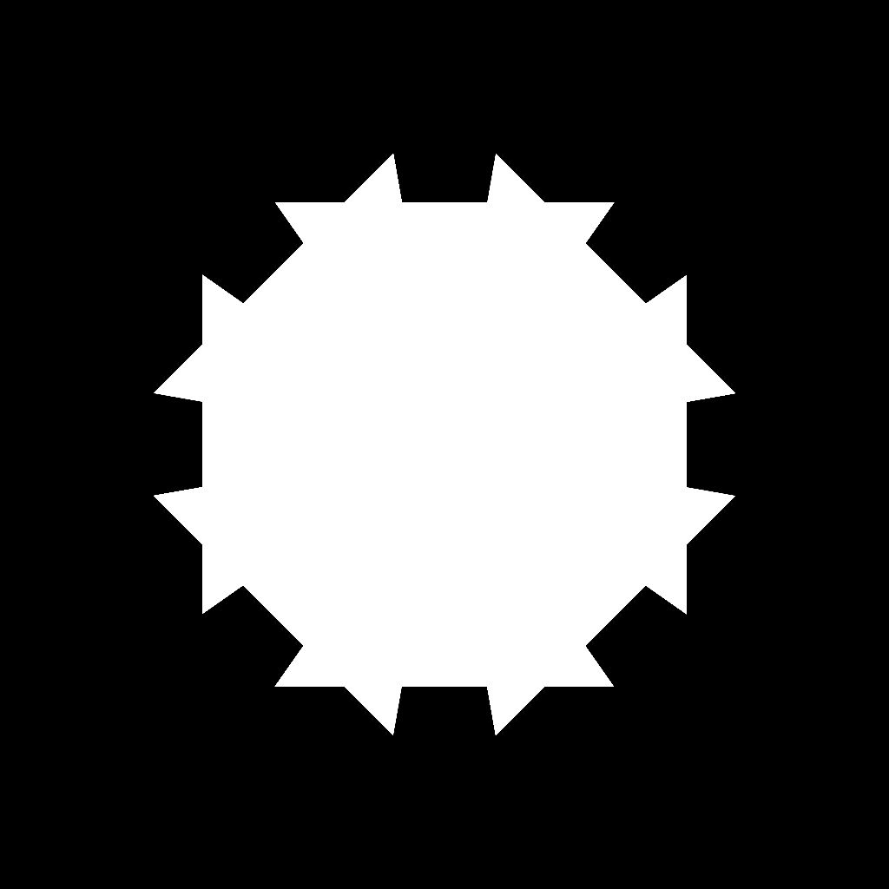

# Version 14.0

<b>Substance 3D Designer 14.0 </b> bietet verschiedene Verbesserungen der Lebensqualität (Diagrammnavigation, Leistung, ...) aber vor allem enthält es eine Menge neuer Knotenpunkte (Farbbearbeitung, Kuwahara-Filter, Histogramm-Tools, weiche Abschrägung, Richtungsabstand, ...). Weitere Informationen zu diesen Änderungen finden Sie unten.

*Freigabedatum: 30. Juli 2024*

## Neuer Inhalt

Diese Version 14.0 bringt viele neue Inhalte mit den unten aufgeführten neuen Knoten:

* <b>Knoten für Farbbearbeitung: </b>ein Knoten <b>(</b>[Farbe quantisieren](../../compositing-graphs/nodes-reference-for-com/node-library/filters/adjustments/quantize-color/quantize-color.md)<b>) </b>bis<b> </b>Reduzieren Sie die Anzahl der Farben in einem Bild und extrahieren Sie eine Palette daraus, eine Familie von Werkzeugknoten, um Ihre eigene Farbpalette zu erstellen ([Ansicht](../../compositing-graphs/nodes-reference-for-com/node-library/filters/adjustments/view-color-palette/view-color-palette.md) / [Erstellen](../../compositing-graphs/nodes-reference-for-com/node-library/filters/adjustments/create-color-palette-16/create-color-palette-16.md) / [Ändern](../../compositing-graphs/nodes-reference-for-com/node-library/filters/adjustments/modify-color-palette/modify-color-palette.md)<b> </b>Farbpalette) und eine, um sie mithilfe einer ID-Map auf ein anderes Bild anzuwenden ([Farbpalette anwenden](../../compositing-graphs/nodes-reference-for-com/node-library/filters/adjustments/apply-color-palette/apply-color-palette.md)). Sie finden auch den Knoten [ID to mask grayscale](../../compositing-graphs/nodes-reference-for-com/node-library/filters/adjustments/id-to-mask/id-to-mask.md), mit dem Sie Ihre ID-Zuordnung - berechnet durch Quantize color - in eine Graustufenmaske konvertieren können. Mit diesem vollständigen Satz von Knoten haben Sie alles, was Sie benötigen, um Stilisierungseffekte mit Farben zu erstellen.

{zoomable="yes"}

{zoomable="yes"}

* <b>Kuwahara-Filter</b>: Wenn du noch mehr mit der Stilisierung erreichen willst, kannst du mithilfe der [Anisotropischen Kuwahara-Farbe](../../compositing-graphs/nodes-reference-for-com/node-library/filters/effects/anisotropic-kuwahara/anisotropic-kuwahara.md) / [Graustufen](../../compositing-graphs/nodes-reference-for-com/node-library/filters/effects/anisotropic-kuwahara-gra/anisotropic-kuwahara-grayscale.md)-Filter einige malerische Effekte erzeugen. Im Detail wendet es eine anisotrope Richtungsunschärfe an, die den Details des Bildes entspricht. Das Ergebnis ist ein Bild, das so aussieht, als würde es in Richtung der darin enthaltenen Formen fließen.

Diese Knoten (Quantize color und Anisotropic Kuwahara) werden in [diesem Tutorial](https://www.adobe.com/go/designer-tutorial-quantize) erläutert. Es zeigt, wie man damit Materialien stilisiert und Farben effizienter und intuitiver handhabt!

Weitere leistungsstarke Knoten nehmen an der Party teil:

* [<b>Kurvenglättung</b>](../../compositing-graphs/nodes-reference-for-com/node-library/filters/effects/curvature-smooth/curvature-smooth.md): Diese neue Version unterstützt jetzt alle Kachelmodi korrekt, fügt zwei neue Ausgaben hinzu (Konvexität und Konkavität) und verbessert sowohl die Genauigkeit als auch die Leistung.
* <b>[Histogramm equalize](../../compositing-graphs/nodes-reference-for-com/node-library/filters/adjustments/histogram-equalize/histogram-equalize.md):</b> Dieser Knoten gleicht das Histogramm für ein Graustufenbild aus, indem Werte angepasst werden, um eine gleiche Verteilung zu erhalten. Dieser Knoten verfügt über zwei Begleit-Knoten: [Histogramm rendern](../../compositing-graphs/nodes-reference-for-com/node-library/filters/adjustments/histogram-render/histogram-render.md), um das Histogramm des Bildes auszugeben, und [Histogramm berechnen](../../compositing-graphs/nodes-reference-for-com/node-library/filters/adjustments/histogram-compute/histogram-compute.md)<b> </b>, um ein Histogramm als Pixelzeile zu kodieren.
* <b>[Weiche Abschrägung](../../compositing-graphs/nodes-reference-for-com/node-library/filters/effects/bevel-smooth/bevel-smooth.md):</b> Dank dieser Vorlage können Sie einen Verlauf oder eine Flächenfarbe von den Rändern einer Maske zeichnen (nach außen, nach innen oder beides). Der Knoten [Richtungsabstand](../../compositing-graphs/nodes-reference-for-com/node-library/filters/effects/directional-distance/directional-distance.md)<b> </b> zeichnet auch einen Verlauf, jedoch in eine bestimmte Richtung.
* <b>[Normal uncombine](../../compositing-graphs/nodes-reference-for-com/node-library/filters/normal-map/normal-uncombine/normal-uncombine.md):</b> Dieser Knoten ist das Gegenteil des [Normal combine](../../compositing-graphs/nodes-reference-for-com/node-library/filters/normal-map/normal-combine/normal-combine.md)-Knotens. Die Oberflächendetails, die durch einen Höhen-Map beschrieben werden, werden von einer Normalen-Map entfernt.

<table>
<tr style="border: 0;">
<td style="border: 0;" valign="top">

Krümmung glatt

<table>
  <tr>
    <td>
      
       <i>Vorher</i>
    </td>
    <td>
      
       <i>Nach</i>
    </td>
  </tr>
</table>

</td>
<td style="border: 0;" valign="top">

Histogramm entzerren

<table>
  <tr>
    <td>
      
       <i>Vorher</i>
    </td>
    <td>
      
       <i>Nach</i>
    </td>
  </tr>
</table>

</td>
</tr>
</table>

<table>
<tr style="border: 0;">
<td style="border: 0;" valign="top">

Weiche Abschrägung

<table>
  <tr>
    <td>
      
       <i>Vorher</i>
    </td>
    <td>
      
       <i>Nach</i>
    </td>
  </tr>
</table>

</td>
<td style="border: 0;" valign="top">

Normales Aufheben der Kombinationsfunktion

<table>
  <tr>
    <td>
      
       <i>Vorher</i>
    </td>
    <td>
      
       <i>Nach</i>
    </td>
  </tr>
</table>

</td>
</tr>
</table>

## Verbesserung der Lebensqualität

* <b>Die Leistung </b> und die Reaktionsfähigkeit <b></b> bei der Arbeit an großen Projekten wurden verbessert. Das Entfernen von Knoten kann beispielsweise bis zu 75 Mal schneller sein. Die [Zeit für das Kochen](../../glossary/glossary.md) wurde auch für Diagramme, die mehrmals auf dieselbe Bitmap verweisen, verringert.
* <b>Geerbte Parameter</b>: Wenn ein Parameter [geerbt](../../glossary/glossary.md) ist, wird jetzt der geerbte Wert angezeigt, sodass Sie den aktuell verwendeten Wert kennen, anstatt den Standardwert anzuzeigen. Weitere Informationen zur Vererbung in [dieser dedizierten Seite unserer Dokumentation](../../compositing-graphs/inheritance-compositing/inheritance-in-substance-compositing-graphs.md).
* Die <b>Unterstützung für Trackpad</b> auf MacOS wurde vollständig überarbeitet, um natürlicher zu sein und mit anderer Software in Einklang zu stehen. Das Verschieben von Knoten über die Grenzen der [Graph-Ansicht](../../interface/the-graph-view/the-graph-view.md) hinaus wurde ebenfalls überdacht, um auf allen Betriebssystemen reibungsloser und konsistenter zu sein.

* <b>2D-Ansicht: </b>Wenn die Kachelanzeige in der [2D-Ansicht](../../interface/2d-view/2d-view.md) aktiviert ist, können Sie jetzt Werte auch für Pixel abrufen, die sich nicht auf der ursprünglichen Kachel befinden: Es hilft sehr dabei, [Sampling](../../glossary/glossary.md) und Wertübergänge zwischen Kacheln zu überprüfen.

{width="320px" zoomable="yes"}

* <b>Verlaufsumsetzung</b>: Mit dem mittleren Mausklick verschieben Sie alle [Verlaufstasten](../../compositing-graphs/nodes-reference-for-com/atomic-nodes/gradient-map/gradient-map.md) nach links oder rechts (und bewahren so die Lücken zwischen allen Tasten auf).
* <b>Parameter</b>: um benutzerdefinierte Funktionen über Parameter einzuschleusen, können Sie jetzt das Widget &quot;Funktion bearbeiten&quot; verwenden. Es ist eine leistungsstarke Lösung zum Erstellen benutzerdefinierter Tools, bei denen Sie Parameter mithilfe eines [Substance-Funktionsdiagramms](../../function-graphs/the-function-graph/the-function-graph.md) steuern möchten.

<table>
<tr style="border: 0;">
<td style="border: 0;" valign="top">

{zoomable="yes"}

</td>
<td style="border: 0;" valign="top">

{zoomable="yes"} bearbeiten

</td>
</tr>
</table>

## API-Verbesserungen

Die Skript-API enthält vier neue Methoden:

* Methoden zum Abrufen und Festlegen des Diagrammtyps eines Substance-Compositing-Diagramms: myGraph.setGraphType(&quot;newType&quot;); myGraph.getGraphType()
* Methode zum Öffnen einer Paketressource in ihrem Editor (z. B. ein Substance-Diagramm in der Diagrammansicht): myUIManager.openResourceInEditor(myResource)
* Methode zum Auswählen einer Paketressource im Explorer (z. B. ein Substance-Diagramm): myUIManager.setExplorerSelection(myResource)
* Methode zum Framing eines bestimmten Knotens in der Diagrammansicht: myUIManager.focusGraphNode(myGraphViewID, myNode)

## VFX-Plattformanforderungen

Die [VFX Reference Platform](https://vfxplatform.com/) veröffentlicht jedes Jahr eine Liste von Tools und Bibliotheksversionen, die in jeder Software für die VFX-Branche verwendet werden können, um Inkompatibilitäten zwischen der Software zu minimieren. Wie gewöhnlich *aktualisieren wir alle unsere Abhängigkeiten*, um alle diese Empfehlungen zu respektieren.

Beachten Sie, dass diese Aktualisierungen zwei wichtige Folgen haben:

* <b>Die Linux-Anforderungen</b> haben sich geändert, und Designer benötigt jetzt RHEL Version 8 oder 9 (CentOS wird nicht mehr unterstützt). Alle Details finden Sie auf der Seite [Systemanforderungen](../../getting-started/system-requirements/system-requirements.md).
* <b>Plug-Ins für Designer müssen aktualisiert werden </b>, da einige Funktionen in Qt6 veraltet sind. Sie finden alle erforderlichen Informationen zum Aktualisieren Ihrer Plug-ins im [Community-Forum](https://community.adobe.com/t5/substance-3d-designer-discussions/plugins-required-updates-in-designer-14-0/td-p/14768559).

## Versionshinweise

### 14.0.0

*(veröffentlicht am 30. Juli 2024)*

### Hinzugefügt

* [Inhalt] Neuer anisotroper Kuwahara-Filter
* [Inhalt] Neuer Knoten &quot;Weiche Abschrägung&quot;
* [Inhalt] Neuer Knoten der Krümmung Smooth v2
* [Inhalt] Neuer Richtungsabstand
* [Inhalt] Neue Histogramm-Werkzeuge: Berechnen, Ausgleichen, Rendern
* [Inhalt] Neue ID für Maskenknoten
* [Inhalt] Neuer Knoten Normal Nicht kombinieren
* [Inhalt] Neue Palettenknoten: Erstellen, Anwenden, Ändern, Anzeigen
* [Inhalt] Neuer Knoten &quot;Farbe quantisieren&quot;
* [Inhalt] Nicht einheitliche Richtungsverzerrung: Festlegen des Standardwerts für die Intensitätszuordnung auf 1
* [Content] Hinzufügen des Suffixes &quot;Color&quot; oder &quot;Grayscale&quot; zu allen Knotenbeschriftungen, die diese Versionen aufweisen
* [Inhalt] Veraltetes &quot;White Rauschen&quot; nur &quot;White Rauschen Fast&quot; beibehalten
* [Inhalt] Veralteter Knoten &quot;Negate Fließkommazahl1&quot; im Substance-Funktions-Graf
* [Inhalt] Benennen Sie &quot;Farbe quantisieren&quot; in &quot;Farbe quantisieren (einfach)&quot; um.
* [2D-Ansichten] Zeigt Werte im Informationenbedienfeld für Pixel außerhalb des Bereichs 0-1 an.
* [Engine]&#x200B;[Text] Neues Kerning für einige Schriftarten
* [Graf] Verbessern Sie die Invalidierungszeit bei der Bearbeitung umfangreicher Untergraph mit der In-Kontext-Edition
* [Linker] Bitmaps in SBSASM nicht duplizieren
* [Parameters] Fügen Sie ein neues Funktions-Widget für alle Eingabeparameter-Typen hinzu.
* [Eigenschaften] Verbessern der Anzeige geerbter Parameter
* [UX] Verbesserte Trackpad-Unterstützung (nur Mac)
* [UX] Modernisierung des Schwenkens beim Erreichen des Graf-Rands bei der Auswahl
* [UX] Entfernen der Funktion &quot;High DPI deaktivieren&quot;
* [Branding] Neues Branding für Splash Screen und Fenster &quot;Info&quot;
* [Verlaufs-Map] Fügen Sie eine Möglichkeit hinzu, alle Tasten und eine Schleife zu verschieben
* [Library] Alle Standardfilter auf Satzschreibweise umstellen
* [API] Hinzufügen einer Methode zum Rahmen eines bestimmten Knotens im Graphansicht-Viewport
* [API] Add-Methode zum Öffnen einer Paketressource in ihrem Editor (z. B. ein Substance-Graf in der Graphansicht)
* [API] Add-Methode zum Auswählen einer Paketressource im Explorer (z. B. ein Substance-Graf)
* [API] Hinzufügen von Methoden zum Abrufen und Festlegen des Graf-Typs eines Substance-Compositing-Grafen
* [Drittanbieter] Empfehlungen für VFX-Plattformen 2023 befolgen
* [Drittanbieter] Empfehlungen für VFX-Plattformen 2024 befolgen
* [Drittanbieter] Update Boost auf 1.82.0 + USD auf 23.08
* [Drittanbieter] NGL-Aktualisierung auf 1.38
* [Drittanbieter] Update OpenColorIO auf 2.3.x
* [Drittanbieter] Update OpenExr auf 3.2.x
* [Drittanbieter] Update OpenSubdiv auf 3.6.x
* [Drittanbieter] Update Python auf 3.11.x
* [Drittanbieter] Update Qt auf 6.5.x
* [Drittanbieter] Aktualisieren Sie gcc auf 11.2.1
* [ThirdParty] Update glibc auf 2.28
* [ThirdParty] Update libstdc++ ABI auf C++11 one
* [Dokumentation] Neue Seite &quot;Glossar&quot;

### Fehlerbehebungen

* [Baker] Absturz beim Rückgängigmachen einer Szene, deren Dateiname geändert wurde
* [Baker] Absturz beim Speichern der Voreinstellung &quot;Baker&quot; in JSON-Datei
* [Inhalt] &quot;Streuung auf Spline&quot;: Alphaparameter für Eingabebild gelegt
* [Inhalt] &quot;Sampler Color anordnen&quot;: Expression &quot;missing visibleif&quot;
* [Inhalt] Anisotropes Rauschen: Negativer Wert für X/Y-Betrag führt zu falschem Ergebnis
* [Inhalt] Anisotropes Rauschen: Problem mit der Kachelung bei Verwendung des ungeraden Werts als X-Wert und ohne Smoothness
* [Inhalt] Funktion &quot;Normale Verteilung&quot;: falsch platzierte max() kann zu NaN führen
* [Inhalt] RTAO, Bent Normal und RT Shadows funktionieren auf einigen Plattformen nicht ordnungsgemäß.
* [Inhalt] Überblendung der Formaufteilung: OpenGL-Normalen-Map werden nicht korrekt überblendet
* [Inhalt] Unzulässiger Speicherplatz nach dem Präfix &quot;Multi&quot; in den Knotenbeschriftungen
* [Abhängigkeiten] Absturz beim Verschieben von Graf innerhalb oder zwischen Paketen
* [Engine] Genauigkeitsfehler in Verkrümmungsknoten, die sich auf die Steigung-Weichzeichnerknoten auswirken
* [Engine] SBSAR-Ebene in SD kann SBSAR mit SBSASM-Inhalt > 2 GB nicht lesen
* [Funktion Graf] Falsches Ergebnis für 0^n
* [Graf] Option &quot;Knotengröße anzeigen&quot; ist falsch beschriftet
* [Graf] Absturz beim Kopieren eines übergeordneten Kommentars in einen anderen Graf
* [Graf] Einfrieren beim Alt-Ziehen eines Punktknotens
* [Graf] Bei der Knotensuche können in einigen Fällen offensichtliche Übereinstimmungen fehlen.
* [Graf] Leistungsproblem beim Bearbeiten eines mehrmals instanziierten Funktions-Grafen mit geöffnetem Supergraph
* [Graf] Zu viele Ungültigkeiten beim Erstellen einer Ausgabe
* [Sicherheit] ICO analysiert Schreibfehler außerhalb des gültigen Bereichs
* [Sicherheit] Nicht verwendete Bildformate verwerfen
* [Parameter] Der Bitmap-PKG-Ressourcenpfad sollte nicht bearbeitbar sein.
* [Parameter] Probleme beheben, die damit zusammenhängen, dass der Parameter eines Wertprozessors gelegt/als Stapel gelegt wird
* [Parameter] Zeichenfolgenparameter werden ignoriert, wenn ein Stapel gelegt wird.
* [Eigenschaften] Leistungsproblem beim Bearbeiten eines mehrmals instanziierten Funktions-Grafen mit geöffneten Eigenschaften
* [SVG] Bearbeitungen an Formen werden nicht auf gerasterte Bilder angewendet
* [UI] Beheben einiger Fehler/Inkonsistenzen mit scrollbaren Widgets (nur Windows)
* [UI] Inkonsistente Reihenfolge der 3D-Szenendateiformate in Import-/Exportlisten
* [UI] Fensteraktionen werden in der Benutzeroberfläche dupliziert
* [Versionskontrolle] Das Skript &quot;perforce.py&quot; funktioniert nicht auf Python 3
