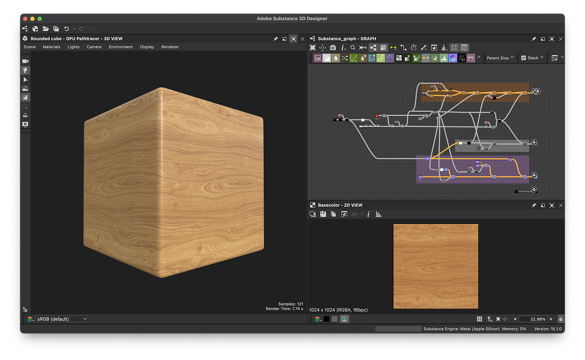

# Version 15.1

Substance Designer 15.1 bietet ein völlig überarbeitetes Knotenerstellungsfenster mit direktem Beispielzugriff, verbesserten Rauschen-Graf-Nodes für mehr kreative Möglichkeiten, organisierten Kategorien im Knotenmenü und vielem mehr.

*Freigabedatum: 11. Dezember 2025*

## Verbessern der Graf-Erstellung

In dieser Version wurde das [Graf-Erstellungsfenster](../../compositing-graphs/creating-compositing-gra/creating-a-substance-compositing-graph.md) <b>umfassend neu gestaltet</b>, um die erste Benutzererfahrung in Substance 3D Designer zu verbessern. Das Hauptziel dieser Aktualisierung besteht darin, den Vorlagenauswahlprozess zu optimieren, sodass Benutzer effizient die für ihre Anforderungen am besten geeignete Vorlage identifizieren können.

Miniaturansichten bieten sofortige <b>visuelle Verweise</b> für die beabsichtigten Material-Typen, während detaillierte QuickInfos alle relevanten Informationen enthalten. Für eine verbesserte Organisation werden Vorlagen jetzt in bestimmte <b>Kategorien</b> wie Materialien, Filter und Scanverarbeitung unterteilt.

Obwohl die Hauptbenutzeroberfläche aktualisiert wurde, haben Benutzer weiterhin Zugriff auf frühere Ansichten, einschließlich Listen-, Pakete- und Verzeichnisoptionen.

[Weitere Informationen](../../compositing-graphs/creating-compositing-gra/creating-a-substance-compositing-graph.md)

{zoomable="yes"}

## Eingebettete Beispiele

Mit dem Start unseres neu gestalteten Fensters zur Erstellung von Grafen haben wir eine Reihe von [<b>Beispiel-Materialien</b>](../../compositing-graphs/creating-compositing-gra/material-samples/material-samples.md) direkt in der Software hinzugefügt. Diese Verbesserung entspricht Ihrer Anforderung eines besseren Zugangs zu Lernressourcen.

{zoomable="yes"}

Um diesem Bedarf gerecht zu werden, haben wir Material-Muster wie Stoffe (einschließlich Leder und Satin), Holz, Metall, Kunststoff, Keramik und mehr aufgenommen. Anhand dieser Beispiele können Sie Ihre Projekte leicht beginnen und sich mit den wichtigsten Familienknoten vertraut machen, die in Substance 3D Designer verfügbar sind

Jeder Graf ist <b>mit Anmerkungen versehen</b>, sorgfältig organisiert und enthält eine Mindestanzahl von Knoten, damit er so leicht wie möglich zu verstehen ist.

Sie können auf die Samples in der Kategorie &quot;Material-Samples&quot; zugreifen, wenn Sie einen neuen Substance-Graf erstellen, oder direkt vom Startbildschirm aus über die praktische Schaltfläche &quot;Zu den Samples wechseln&quot;.

Neben diesen grundlegenden Materialien haben wir auch <b>erweiterte Beispiele</b> bereitgestellt, um zu demonstrieren, wie Sie <b>FX-map- und Pixelprozessor</b>-Funktionen effektiver verwenden können.

[Weitere Informationen](../../compositing-graphs/creating-compositing-gra/material-samples/material-samples.md)

{zoomable="yes"}

## Neue Rauschen

Rauschen spielen in den meisten Grafen eine wichtige Rolle. Aus diesem Grund haben wir uns auf einige wichtige Verbesserungen in dieser Version konzentriert, um ihre Funktionalität und Benutzerfreundlichkeit zu verbessern.

Mit diesem Update haben wir <b>eine bessere Unterstützung für Szenarien ohne Kachelung</b> eingeführt, um sicherzustellen, dass sich Rauschen-Muster ohne obligatorische Kachelung wie erwartet verhalten. Früher waren Noise Nodes entweder gezwungen, sich zu kacheln, oder führten zu falschen Ergebnissen, wenn die Kachelung deaktiviert wurde.

Die meisten Geräusche enthalten jetzt <b>neue Parameter</b>, sodass Benutzer mehr kreative Kontrolle haben. Mit diesen zusätzlichen Optionen können Grafikautoren das Aussehen und Verhalten von Störgeräuschen in ihren Workflows optimieren.

Die Bittiefe ist <b> nicht mehr fest mit 16 Bit verbunden</b>. Sie können jetzt die Einstellung für die Bittiefe bei einzelnen Knoteninstanzen überschreiben, sodass Sie bei Bedarf höhere Details und einen größeren dynamischen Bereich erzielen oder Ihre Diagramme auf Leistung optimieren können.

Die vollständige Liste der aktualisierten Geräusche finden Sie unten in den [Versionshinweisen](#release-notes).

Beispiele:   [Zellen 1](../../compositing-graphs/nodes-reference-for-com/node-library/texture-generators/noises/cells-1/cells-1.md) [Wolken 2](../../compositing-graphs/nodes-reference-for-com/node-library/texture-generators/noises/clouds-2/clouds-2.md) [Richtungskratzer](../../compositing-graphs/nodes-reference-for-com/node-library/texture-generators/noises/directional-scratches/directional-scratches.md) [Feuchtigkeitsrauschen 1](../../compositing-graphs/nodes-reference-for-com/node-library/texture-generators/noises/moisture-noise/moisture-noise.md)

{zoomable="yes"}

## Hierarchie im Knotenmenü

Um die Suche nach bestimmten Knoten in der umfangreichen Bibliothek zu erleichtern, haben wir Kategorien im Menü &quot;Knoten&quot; eingeführt.

Die große Anzahl verfügbarer Knoten kann die schnelle Suche nach dem gewünschten Knoten erschweren. Um diesen Prozess zu optimieren, wurde ein neues [<b>Group</b>-Attribut](../../compositing-graphs/graph-parameters/graph-parameters.md) auf Diagrammebene implementiert. Wenn dieses Attribut definiert ist, wird es zum Organisieren und Sortieren der Suchergebnisse verwendet.

<table>
<tr style="border: 0;">
<td style="border: 0;" valign="top">

{zoomable="yes"}

</td>
<td style="border: 0;" valign="top">

{zoomable="yes"}

</td>
</tr>
</table>

## Standardausgabe

Wenn ein Knoten mehrere [Ausgaben](../../compositing-graphs/nodes-reference-for-com/atomic-nodes/output/output.md) hat, können nicht alle gleichzeitig in der 2D-Ansicht oder als Miniaturansicht des Knotens angezeigt werden. Die vorherrschende Richtlinie in solchen Fällen ist die Verwendung des ersten verbundenen Pins oder, wenn keiner angeschlossen ist, des ersten Ausgangs standardmäßig.

Dieser Ansatz führt jedoch möglicherweise nicht immer zu optimalen Ergebnissen. In einigen Spline-Knoten stellt beispielsweise der erste verbundene Pin häufig Spline-Koordinatendaten dar, die für Vorschauzwecke nicht geeignet sind.

Um dies zu beheben, wurde ein Standardausgabeattribut eingeführt. Mit dieser Funktion kann der Diagrammverfasser <b> angeben, welche Ausgabe standardmäßig angezeigt werden soll</b>. Dadurch wird die Intuition der Knotennutzung verbessert und ein besseres Verständnis des erstellten Diagramms ermöglicht.

Spielen Sie mit dem Bild unten, um den Unterschied vor und nach der Standardausgabedefinition zu sehen.

[Weitere Informationen](../../compositing-graphs/nodes-reference-for-com/atomic-nodes/output/output.md)

<table>
  <tr>
    <td>
      
       <i>Vorher</i>
    </td>
    <td>
      
       <i>Nach</i>
    </td>
  </tr>
</table>

## Knoten &quot;Ist definiert&quot;

Beim Arbeiten mit Funktions-Grafen müssen Sie möglicherweise feststellen, ob eine [Variable](../../function-graphs/nodes-reference-for-fun/atomic-function-nodes/get-nodes/get-nodes.md) im Graf vorhanden ist.

Wenn Sie z. B. das Fehlen einer Variablen erkennen, können Sie einen Fallback-Wert angeben, um sicherzustellen, dass sich die Funktion wie erwartet verhält, ohne dass jede Eingabe explizit festgelegt werden muss. Aus diesem Grund haben wir den Knoten &quot;[&#39;Is defined&quot; &quot;](../../function-graphs/nodes-reference-for-fun/atomic-function-nodes/get-nodes/get-nodes.md)&quot; hinzugefügt.

[Weitere Informationen](../../function-graphs/nodes-reference-for-fun/atomic-function-nodes/get-nodes/get-nodes.md)

{zoomable="yes"} definiert

## Versionshinweise

### 15.1.0

*(veröffentlicht am 11. Dezember 2025)*

### Hinzugefügt

* [NewGraph] Überarbeitung des neuen Graf-Fensters
* [NewGraph] Beispiele für Materialien und erweiterte Beispiele hinzufügen
* [NewGraph] Hinzufügen eines neuen Attributs für Graf für die Vorlagendaten (Kategorie und Untertitel)
* [NewGraph] Option &quot;Ausgabeformat entfernen&quot;
* [Inhalt] Hashfunktionen hinzufügen
* [Content] Hinzufügen von Tonabbildungen zu functions.sbs
* [Inhalt] Anisotropes Rauschen v2: Standardausgabeformat hinzufügen, Störung hinzufügen
* [Inhalt] Anwenden von Groß- und Kleinschreibung auf Knoten- und Parameterbeschriftungen
* [Inhalt] BnW-Punkte 1 v2: Hinzufügen des Standardausgabeformats, keine Unterstützung für Kachelungen
* [Inhalt] BnW-Punkte 2 v2: Hinzufügen des Standardausgabeformats, keine Unterstützung für Kachelungen
* [Inhalt] BnW-Punkte 3 v2: Hinzufügen des Standardausgabeformats, keine Unterstützung für Kachelungen
* [Inhalt] Zellen 1,2,3,4 v2: Hinzufügen von Standardausgabeformaten, keine Unterstützung für Kachelungen, Unordnungsoptionen
* [Inhalt] Clouds 1 v2: Hinzufügen des Standardausgabeformats, keine Unterstützung für Kachelungen
* [Inhalt] Clouds 2 v2: Hinzufügen des Standardausgabeformats, keine Unterstützung für Kachelungen
* [Inhalt] Clouds 3 v2: Hinzufügen des Standardausgabeformats, keine Unterstützung für Kachelungen
* [Inhalt] Farbe für Maske v2
* [Inhalt] Richtungsrauschen 1 v2: Hinzufügen des Standardausgabeformats, keine Unterstützung für Kachelungen
* [Inhalt] Richtungsrauschen 2 v2: Hinzufügen des Standardausgabeformats, keine Unterstützung für Kachelungen
* [Inhalt] Richtungsrauschen 3 v2: Hinzufügen des Standardausgabeformats, keine Unterstützung für Kachelungen
* [Inhalt] Richtungsrauschen 4 v2: Hinzufügen des Standardausgabeformats, keine Unterstützung für Kachelungen
* [Inhalt] Richtungsabhängige Kratzer v2: Hinzufügen des Standardausgabeformats, keine Unterstützung für Kachelungen
* [Inhalt] Dirt 1 v2: Hinzufügen des Standardausgabeformats, keine Unterstützung für Kachelungen
* [Inhalt] Dirt 2 v2: Hinzufügen des Standardausgabeformats, keine Unterstützung für Kachelungen
* [Inhalt] Dirt 3 v2: Hinzufügen des Standardausgabeformats, keine Unterstützung für Kachelungen
* [Inhalt] Dirt 4 v2: Hinzufügen des Standardausgabeformats, keine Unterstützung für Kachelungen
* [Inhalt] Dirt 5 v2: Hinzufügen des Standardausgabeformats, keine Unterstützung für Kachelungen
* [Inhalt] Dirt-Verlauf v2: Standardausgabeformat hinzufügen, neue Unordnungsoptionen
* [Content] Fraktalsumme Base v2: Standardausgabeformat hinzufügen, Störung, keine Unterstützung für Kachelung
* [Inhalt] Fraktalsumme 1,2,3,4 v2: Standardausgabeformat hinzufügen
* [Inhalt] Gaußscher Rauschen v2: Hinzufügen des Standardausgabeformats, keine Unterstützung für Kachelungen
* [Inhalt] Gaußsche Flecken 1&amp;2 v2: Hinzufügen des Standardausgabeformats, keine Unterstützung für Kachelungen
* [Inhalt] Messy Fasern 1,2,3 v2: Hinzufügen von Standardausgabeformaten, keine Unterstützung für Kachelungen, Unordnungsoptionen
* [Inhalt] Feuchtigkeits-Rauschen v2: Hinzufügen des Standardausgabeformats, keine Unterstützung für Kachelungen
* [Inhalt] Neuer Knoten &quot;Moisture Rauschen 2&quot;
* [Inhalt] Rauschen: Aktualisieren, um das Standardausgabeformat hinzuzufügen
* [Inhalt] Perlin Rauschen v2: Hinzufügen des Standardausgabeformats, keine Unterstützung für Kachelungen
* [Inhalt] Formzuordnung: Filtermethode hinzufügen
* [Content] UV-Mapper: Filtermethode hinzufügen
* [Inhalt] Wellenform 1 v2: Verwenden des Standardausgabeformats + neue Optionen
* [Inhalt] White Rauschen v2: Standardausgabeformat verwenden, Verteilungsoptionen hinzufügen
* [Baker] zeigt nur die UVs des ausgewählten Meshs an.
* [Baker] Fügen Sie eine Option hinzu, um die Methode zum Abgleichen der Geometrie nach dem Namen auszuwählen.
* [Baker] Wählen Sie beim Löschen eines Bakers den nächstgelegenen Baker aus.
* [Baker] UDIM: eine Liste der zu Baking führend UV-Kacheln definieren
* [Baker] Baking SDK auf 3.15.4 aktualisieren
* [3D-Ansicht/SceneBrowser] Vermeiden Sie die Auswahl einer UsdPrimitive, wenn Sie einen Rechtsklick darauf machen
* [ColorManagement] Support ACE 2.0
* [Compositing-Graf] Erlauben Sie, einen Ausgabeknoten als &quot;Standardausgabe&quot; festzulegen.
* [Cooker] Warnung bei nicht verbundenen Eingängen von Funktionsinstanzen entfernen¬†
* [Functions] Add isDefined-Operator
* [Graf] Gruppieren Sie die Elemente nach dem Attribut &quot;Gruppe&quot; im Knotenmenü.
* [Graf] Verbessern der Wiedergabe von Miniaturen

### Fehlerbehebungen

* [3D-Ansicht] L16 Graustufen-Textur wird mit einem roten Farbton angezeigt, wenn sie an die Umgebung oder die baseColor angeschlossen ist
* [3D-Ansicht] Das Ändern der Material-Bindung einer Szene ohne Material erstellt ein neues &quot;Standard&quot;-Material.
* [3D-Ansicht] Berechnete Normale sind für bestimmte OBJ Mesh nicht korrekt
* [3D-Ansicht] Benutzerdefinierte Umgebung von SBSSCN ist beim Laden in Pathtracer nicht sichtbar
* [3D-Ansicht] Fehler in der Konsole beim Drehen einer deaktivierten Umgebung
* [3D-Ansicht] Specular level wird nicht korrekt angewendet
* [3D-Ansicht] Specular edge color funktioniert bei Verwendung von Eclair rasterizer nicht
* [3D-Ansicht] Vom Benutzer hinzugefügtes Material wird nicht auf Standard-Szenen angewendet
* [3D-Ansicht]&#x200B;[Baker] Die Farbe des Materials ist zu dunkel, wenn sie einmal überschrieben wurde oder wenn ein &quot;Color&quot;-Baker verwendet wird
* [3D-Ansicht]&#x200B;[Baker] Keine Material-Farbe aus FBX Datei
* [Baker] Material-Farben in FBX werden nicht korrekt erkannt
* [Baker] Die Option &quot;recompute\_Tangenten&quot; ist in Exporten von JSON-Vorgaben immer &quot;false&quot;.
* [Baker] CLI: Absturz, wenn derselbe Baker nacheinander durch die JSON-Datei ausgeführt wird
* [Baker] Das Aktualisieren des Parameters &quot;Farbgenerator&quot; funktioniert nicht für &quot;Graustufen&quot;
* [Inhalt] Zu Pfaden maskieren: Fehler bei nicht quadratischen Verhältnissen
* [Inhalt] PBR-Rendering-/Symbolrenderer: Falsche Specular-Lappenfunktion
* [Inhalt] Pfade zum Spline: Legen Sie die Ausgabegröße standardmäßig auf &quot;Relativ zum übergeordneten Element&quot; fest.
* [Inhalt] Punktliste: Punkte sind nicht in der richtigen Reihenfolge, wenn die Textur der Daten nicht quadratisch ist
* [Inhalt] Spline-Mapper: 1px Leitungsstörung in zufälligen Fällen
* [Inhalt] Spline-Mapper: gedehnt UVs in einigen Fällen, wenn die Thickness 0 ist
* [Graf] Absturz beim Löschen der Ausgabe eines Funktions-Untergraphen
* [Graf] Der Farbtyp des Eingabeknotens kann in schreibgeschützten Paketen geändert werden.
* [Graf] Die primäre Eingabe kann in schreibgeschützten Paketen geändert werden.
* [Eigenschaften] Die Farbe des Farbvorschau-Widgets stimmt nicht mit dem sRGB-Schaltflächenstatus überein
* [Szene] Eine OBJ Datei, die größer als 2 GB ist, kann nicht geladen werden.
* [UI] Die Dockingstatus von Console und Dependency Manager werden nach einem Neustart nicht wiederhergestellt

### BEKANNTE FRAGEN

* [Baker] Absturz beim Baking mit bestimmten NVIDIA-Treibern
* [3D-Ansicht] OpenGL: Einige importierte Szenen werden möglicherweise nicht gerendert.
* [3D-Ansicht] Pathtracer: langsame Leistung beim Aktualisieren von Texturen mit aktivierter Tesselierung/aktiviertem Versatz
* [3D-Ansicht] Einige Color-Material-Eigenschaften werden beim Überschreiben nicht ordnungsgemäß farbverwaltet.
* [3D-Ansicht] Szenen mit animierten Grundformen werden nicht ordnungsgemäß unterstützt.
* [3D-Ansicht] Mesh mit mehreren UDims werden noch nicht unterstützt.
* [3D-Ansicht] Mesh mit mehreren UVs wird nicht ja unterstützt und kann zu ungültigem Material-Rendering führen
* [3D-Ansicht] Pathtracer wird auf AMD-Grafikkarten nicht unterstützt
