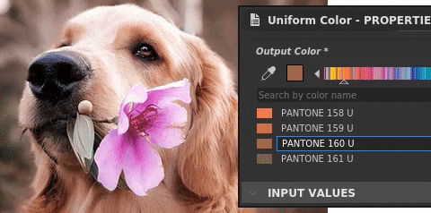

# Version 2021.1 (11.1)

**Substance Designer 2021.1** bietet eine Reihe neuer Funktionen mit Unterstützung von Pantone-Farben, die Möglichkeit, einen Graf in einem Knoten zu deaktivieren, sowie den Export von tessellierten Mesh und verschiedene Verbesserungen der Lebensqualität.

Freigabedatum: *28. Januar 2021*

## Wichtigste Funktionen

### Unterstützung für neue Pantone-Farben

Diese Version bietet zusätzliche Unterstützung für Pantone-Volltonfarben. Pantone ist für seine Farbpalette bekannt, die in den verschiedensten Branchen wie Grafik-Design, Mode-Design, Fertigung und vielen anderen verwendet wird. Mit dieser neuen Funktion ist es jetzt viel einfacher, die Farbe eines Materials an seinen tatsächlichen Wert anzupassen. Weitere Informationen finden Sie auf der dedizierten [Dokumentationsseite &#x200B;](../../color-management/spot-colors-pantone/spot-colors-pantone.md).

>[!NOTE]
>
> Um diese neuen Pantone-Farben verwenden zu können, muss die Farbmanagementeinstellung in den Anwendungsvoreinstellungen auf **Adobe ACE** festgelegt werden.

* **Auswählen zwischen RGB- und Pantone-Farben**\
  Der Farbwähler hat jetzt die Möglichkeit auszuwählen, in welchem Modus eine Farbe bearbeitet werden kann. Standardmäßig ist die Option auf RGB festgelegt, es ist jedoch ebenso möglich, zu einem Pantone-Buch (einer Farbbibliothek) zu wechseln. Standardmäßig sind mehrere Bücher enthalten.

  

  Sobald sich der Farbwählermodus geändert hat, werden die verfügbaren Farben durch das ausgewählte Buch definiert.

  

* **Nach Farben im aktuellen Buch suchen**\
  Über das Textfeld oben in der Liste kann nach bestimmten Farben im gesamten Pantone-Buch gesucht werden. Es wird nicht in die anderen Bücher schauen, also denken Sie daran, zwischen ihnen zu wechseln, wenn Sie nach etwas suchen.

  

* **Farben auswählen und finden**\
  Mit dem Farbwähler können Sie eine beliebige Farbe auf dem Bildschirm auswählen und die nächstliegende Farbe im aktuellen Buch ermitteln.

  

### Neue Deaktivierung von Knoten in einem Graf

In dieser Version wird die Möglichkeit hinzugefügt, einen Knoten zu deaktivieren, sodass er in einem Graf durchlaufen wird. Dies ist hilfreich, wenn Sie ein Material vergleichen und iterieren möchten, um beispielsweise zu sehen, welche Effekte ein bestimmter Knoten zum Endergebnis hinzufügt.

Um einen Knoten zu deaktivieren, klicken Sie einfach mit der rechten Maustaste darauf und wählen Sie **Auswahl deaktivieren** aus oder drücken Sie den Tastaturbefehl **Umschalt+D**. Nicht alle Knoten können deaktiviert werden, es hängt von mehreren Kriterien ab. Weitere Informationen finden Sie im dedizierten Abschnitt auf der folgenden [Dokumentationsseite](../../interface/the-graph-view/the-graph-view.md).

### Neues Export-Tesseliertes Mesh aus dem Viewport

Das tesselierte Gitter in der 3D-Ansicht kann jetzt in mehreren Dateiformaten exportiert werden.

Verwenden Sie dazu einfach die Szenenaktion **Datei > Exportieren** in der **3D-Ansicht**. Weitere Informationen finden Sie auf der dedizierten [Dokumentationsseite &#x200B;](../../interface/3d-view/3d-view.md).

{width="700px"}

### Allgemeine Verbesserungen

In dieser Version wurden einige kleine, aber hilfreiche Verbesserungen und neue Funktionen hinzugefügt, um die tägliche Arbeit zu erleichtern:

* **Automatische Speicherbudgetzuweisung für das Modul**\
  Die Ram- und Vram-Verwaltung der Anwendung wurde verbessert und passt sich nun besser an den verfügbaren Systemspeicher an. GPUs mit vielen Vram-Grafikkarten können jetzt ihren integrierten Speicher noch besser nutzen.

* **Die 3D-Ansicht unterstützt jetzt die neue Semantik &quot;physicalSize&quot;.**\
  Benutzerdefinierte Shader können jetzt die Physische Größe eines Materials berücksichtigen, um ihr Verhalten anzupassen. Weitere Informationen finden Sie in den mit der Anwendung bereitgestellten Shadern.

* **Neue Einstellungen zum Ausschließen von Inhalt aus der Bibliothek**\
  Die Bibliothek kann jetzt bestimmte Dateierweiterungen oder bestimmte Namensmuster (mit Unterstützung von Platzhaltern) ausschließen. Dadurch können unerwünschte Inhalte im Fenster [Bibliothek](../../interface/the-library/the-library.md) ignoriert werden.

* **Ordner beim Exportieren von Bitmaps erstellen**\
  Beim Exportieren von Bitmaps aus einem Diagramm können Sie jetzt Schrägstriche angeben, um Ordner und Unterordner zu erstellen, wenn diese nicht vorhanden sind. Dies hilft, die Bitmaps pro Diagramm in einem eigenen Ordner zu organisieren, z. B. mit: **Projekt/$(Diagramm)/$(Bezeichner)**.

* **SBSRender unterstützt jetzt Adobe ACE- und ICC-Profile**\
  Der SBSRender-Prozess (Teil des Automation Toolkits) kann jetzt Substance-Ausgaben mit angemessenem Farbmanagement rendern, wenn die Adobe ACE-Engine verwendet wird.

&#x200B;>> 

Bildnachweis: [Hund mit Blume](https://unsplash.com/photos/2s6ORaJY6gI) und [Hund mit Brille](https://unsplash.com/photos/siNDDi9RpVY) von &#42;&#42;Unsplash&#42;&#42;.

## Tutorials

Im Folgenden finden Sie unsere Videotutorials zu den neuen Funktionen:

## Versionshinweise

### 2021.1.0

*(veröffentlicht am 28. Januar 2021)*

**Hinzugefügt:**

* [Volltonfarben] Unterstützung von Pantone-Farben in Designer
* [Graf] Deaktivieren von Knoten
* [3D-Ansicht] Exportieren von tessellierten Meshs aus dem Viewport
* [Internationalisierung] Japanische Version aktualisieren
* [3D-Ansicht] Optimieren Sie die Speicherauslastung, wenn kein Iray verwendet wird
* [Python-API] Fügen Sie die Methode SDResource.delete() hinzu, um eine SDResource zu löschen.
* [Python-API] Unterstützung für Volltonfarben zur Python-API hinzufügen
* [Python-API] Neuer Rückruf, der ausgelöst wird, wenn ein Paket geschlossen wird
* [2D-Ansicht] Konvertieren der Pinseldatenbank aus SQLite in das Json-Format
* [2D-Ansicht] Verbessern der Renderleistung und -zuverlässigkeit (CPU-Berechnung)
* [Library] Option &quot;Muster ausschließen&quot; in den Projekteinstellungen hinzufügen
* [Library] Benennen Sie &quot;Muster ausschließen&quot; in &quot;Dateierweiterungen ausschließen&quot; in den Projekteinstellungen um.
* [UX] &quot;?&quot; entfernen in Fenstertitelleisten auf Windows
* [UX] Bewegen Sie den Tastaturbefehl von Strg+E zu &quot;Referenz öffnen&quot;, wenn die kontextbezogene Bearbeitung deaktiviert ist.
* [Baker] Vorschaucache löschen, wenn ein Baker in der Baking-Liste gelöscht wird
* [Leistung] Verbessern des Image-Cache-Budgets für Hardware mit GPU mit gemeinsam genutztem Speicher
* [Voreinstellungen] Anpassen des Werts &quot;GPU-Cache-Grenze&quot; an den verfügbaren Speicherpool
* [Eigenschaften] Physische Größe-Attribut auf Knoteninstanz anzeigen
* [Scripting] Externes Skripterstellungssystem als veraltet markieren
* [Freigeben] Entfernen der Funktionen &quot;Auf Substance share exportieren&quot;

**Hinzugefügt:**

* [Content] Inkonsistente E/A-Reihenfolge auf Material-Nodes
* [Inhalt] Primäre Eingabe auf Warp-Knoten ist inkonsistent
* [Inhalt] Beheben Sie Cooker-Warnungen vom Knoten &quot;Radial-Weichzeichner&quot;.
* [Exportieren] Batch-Export mit CPU-Engine verwendet VRAM zur Bestimmung des Speicherbudgets
* [Exportieren] Exportieren in einen Pfad, der nicht vorhanden ist, erstellt die Ordner
* [Export] Das Arbeitsspeicherbudget ist zu niedrig, wenn Batch-Export verwendet wird
* [2D-Ansicht] Artefakte/Banding beim Kopieren von HDR-Bildern in die Zwischenablage
* [2D-Ansicht] Exportieren von Bildern aus Ressourcen exportiert immer 8 Bit
* [3D-Ansicht] Irak: Ändern des Normalwerts mit dem Editor gibt ein seltsames Ergebnis
* [3D-Ansicht] Irak: Das Deaktivieren des normalen Kanals führt nicht zum richtigen Ergebnis
* [Library] Das Filtern nach URL funktioniert nicht richtig
* [Library] Ressourcen, die einem aus der Bibliothek ausgeschlossenen Muster entsprechen, können nicht manuell importiert werden.
* [Baker] Das Umbenennen eines Bäckers hat keine Auswirkungen auf seinen Eintrag in der 2D-Ansicht-Vorschauliste
* [Explorer] Verlust der Synchronisierung zwischen Explorer und Diagrammdaten
* [Funktionsdiagramm] Absturz beim Festlegen des Funktionsknotens mit nicht übereinstimmendem Ausgabetyp als Ausgabe
* [MDL] SBS-Instanzknoten haben keine Vorschau, Ausgabe 0 und lösen keine Diagrammberechnung aus
* [Python-API] Die Eigenschaft &quot;editor&quot; des Eingabeparameters kann nicht geändert werden
* [Python] Das Zurücksetzen des Layouts setzt von Python erstellte Docks nicht korrekt zurück
* [Ressourcen] 32-Bit-PSD-Dokument kann nicht verknüpft/importiert werden.
