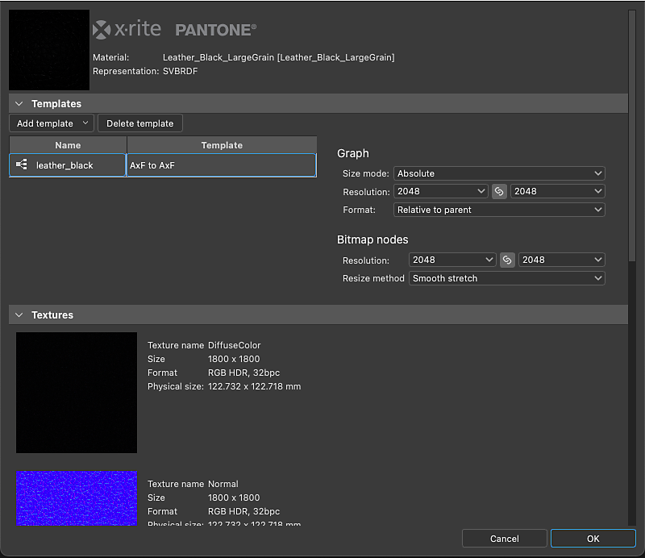
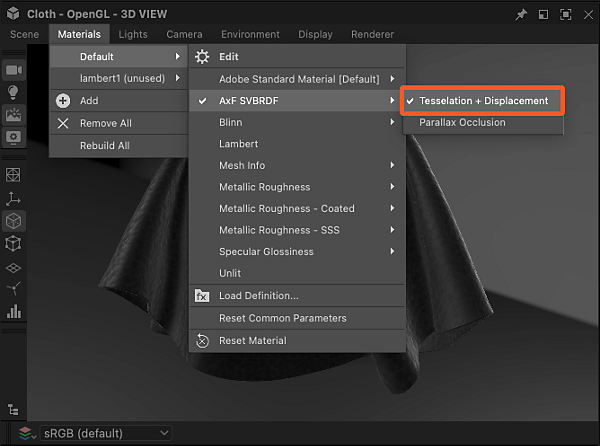

# AxF-Dateien (Appearance eXchange Format)

<table>
<tr style="border: 0;">
<td width="25.00%" style="border: 0;" valign="top">

</td>
<td width="100.00%" style="border: 0;" valign="top">

Substance 3D Designer unterstützt das Erscheinungsbild von [X-Rite im eXchange-Format.](https://www.xrite.com/axf) Die Ersteller des Formats beschreiben es wie folgt:

&quot;AxF-Dateien werden verwendet, um komplexe Materialeigenschaften im gesamten digitalen Design-Workflow zu erfassen, zu speichern, zu bearbeiten und zu kommunizieren. AxF bietet eine Standardmethode zur Speicherung und gemeinsamen Nutzung aller relevanten Daten zum Aussehen - Farbe, Textur, Glanz, Brechung, Lichtdurchlässigkeit, Spezialeffekte (Funkeln) und Reflexionseigenschaften - über Product Lifecycle Management (PLM), Computer-Aided Design (CAD) und hochmoderne Rendering-Anwendungen hinweg.&quot;

</td>
</tr>
</table>

AxF-Dateien enthalten eine Reihe von Texturen, die von der TAC7-Scanner-Hardware von X-Rite extrahiert wurden, zusammen mit Metadaten, die zusätzliche Eigenschaften des Materials beschreiben. Das bedeutet, dass ein AxF mehr ist als nur Texturdaten: es besitzt auch Eigenschaften der Schattierung.

AxF-Dateien werden *nicht* als Paket [Ressource](../../resources/resources.md) importiert. Der [Importprozess](#import) umfasst vielmehr das Extrahieren von Texturen und Metadaten aus der AxF-Datei und deren anschließende Verwendung zum Vorbereiten von Diagrammen, die aus [dedizierten Vorlagen](#graph-templates) erstellt wurden.

Die verfügbaren Vorlagen richten sich an zwei AxF-Workflows:

* <b>Konvertieren</b> eines SVBRDF-Materials in einer AxF-Datei in ein PBR-Material;
* <b>Bearbeiten</b> eines SVBRDF-Materials an Ort und Stelle und [Exportieren](#export) in eine vorhandene AxF-Datei als neue Ebene.

>[!NOTE]
>
> Unterstützte Materialmodell
> 
> Nur Materialien, die ein <b>SVBRDF</b>-Modell (räumlich variierendes BRDF) verwenden, dürfen *vollständig* geladen und in Designer bearbeitet werden.
> 
> Materialien, die das Modell <b>EP-SVBRDF</b> (Energy Preserve SVBRDF) verwenden, können geladen werden. Es können jedoch nur die im Modell SVBRDF vorhandenen Features bearbeitet und visualisiert werden. Exklusive Funktionen von EP-SVBRDF werden nicht unterstützt.
> 
> Andere Modelle werden nicht unterstützt.

## Importieren von AxF-Dateien

Der Arbeitsablauf für den Import von AxF-Dateien kann mit einer der beiden folgenden Methoden gestartet werden:

+++Startbildschirm

Klicken Sie auf <b>AxF importieren...Schaltfläche </b> im linken Abschnitt des [Startbildschirms](../../interface/home-screen/home-screen.md).

{width="600px"}

+++

+++Explorer

Klicken Sie im [Explorer](../../interface/the-explorer-window/the-explorer-window.md) auf RMB für ein Paket, und navigieren Sie im Kontextmenü des Pakets zu <b>Importieren > AxF</b>.

{width="600px"} starten

+++

### Importdialogfeld

Im Dialogfeld &quot;<b>AxF import</b>&quot; können Sie die Daten überprüfen, die aus der ausgewählten AxF-Datei geladen wurden, und die Diagrammvorlagen einrichten, die für die beabsichtigten Bearbeitungen oder Konvertierungen erforderlich sind.

Es umfasst vier Bereiche:

Der <b>Header</b> zeigt den Namen des in der AxF-Datei erkannten Materials sowie dessen Darstellung (derzeit immer SVBRDF) an. Die in die Datei eingebettete Vorschau-Miniaturansicht wird ebenfalls angezeigt.

Im Abschnitt <b>Vorlagen</b> können Sie die Vorlage [Substance graph](../../compositing-graphs/substance-compositing-graphs.md) einrichten, um mit der Arbeit an dem Material zu beginnen. Weitere Informationen zu diesen Vorlagen und deren Einrichtung finden Sie im Abschnitt [Graph templates](#graph-templates) weiter unten.

<b>Texturen</b> listet alle Texturen auf, die aus der AxF-Datei extrahiert wurden, die an dem erkannten Material beteiligt ist. Für jede Textur werden Name, native Auflösung, Datenformat und Physische Größe angezeigt.

<b>Metadaten</b> und <b>Eigenschaften</b> listen Daten auf, die aus dem Material in der AxF-Datei extrahiert wurden. Diese haben Auswirkungen auf die Konfiguration einiger Substance-Diagrammvorlageneigenschaften (siehe Abschnitt [Diagrammvorlagen](#graph-templates) weiter unten).

### Ergebnis

Nach dem Klicken auf die Schaltfläche <b>OK</b> wird ein Paket im [Explorer](../../interface/the-explorer-window/the-explorer-window.md) erstellt. Das Paket umfasst die folgenden Ressourcen:

<table>
<tr style="border: 0;">
<td style="border: 0;" valign="top">

In einem Ordner &quot;<b>Resources</b>&quot; befindet sich ein Unterordner &quot;*&quot; mit den Unterordnern &quot;*&quot; für jedes aus der AxF-Datei importierte Material.

Jeder Unterordner enthält einen anderen Unterordner, der die *Texturen* enthält, die aus der AxF-Datei für dieses Material extrahiert wurden. Dieser letzte Unterordner ist nach dem Material *Darstellung* benannt, das von den Texturen verwendet wird (derzeit nur <b>SVBRDF</b>).

Ein Diagramm für jede Vorlage, die im Abschnitt <b>Vorlagen</b> des Importdialogs eingerichtet wurde.\
Im Fall von [Substance-Graphen](../../compositing-graphs/substance-compositing-graphs.md) sind diese mit den Texturen und Daten vorkonfiguriert, die aus der AxF-Datei extrahiert wurden, sowie mit den ausgewählten Vorlageneinstellungen (siehe Abschnitt &quot;Diagrammvorlagen&quot; unten).

</td>
<td style="border: 0;" valign="top">

</td>
</tr>
</table>

## Diagrammvorlagen

<table>
<tr style="border: 0;">
<td style="border: 0;" valign="top">

Es gibt Diagrammvorlagen, die AxF-Workflows für [Substance-Diagramme](../../compositing-graphs/substance-compositing-graphs.md) gewidmet sind.

Klicken Sie auf die Schaltfläche <b>Vorlage hinzufügen</b> und wählen Sie im Dropdownmenü den gewünschten Diagrammtyp aus.

</td>
<td style="border: 0;" valign="top">

</td>
</tr>
</table>

### Vorlagen für Substance-Graphen

<table>
<tr style="border: 0;">
<td style="border: 0;" valign="top">

Es stehen zwei Arten von Substance-Diagrammvorlagen zur Verfügung:

<b>AxF to Metallic Roughness</b> und <b>AxF to Specular Glossiness</b> sind *Konvertierungs*-Vorlagen, mit denen Sie AxF-Materialien Standardmodellen von PBR zuordnen können.\
Diese können dann mit den standardmäßigen 3D-Ansichtshadern verwendet und mit anderen PBR-Materialien kombiniert werden, die in Designer [Sampler](https://www.adobe.com/de/products/substance3d-sampler.html) produziert oder von unserer [3D Assets](https://substance3d.adobe.com/assets/)-Bibliothek bezogen wurden.

<b>AxF zu AxF</b> ist eine *passthrough*-Vorlage, mit der Sie AxF-Materialien bearbeiten und diese Änderungen als neue Ebenen in vorhandenen AxF-Dateien exportieren können. Weitere Informationen finden Sie unter Exportieren von AxF-Dateien weiter unten.

</td>
<td style="border: 0;" valign="top">

</td>
</tr>
</table>

<table>
<tr style="border: 0;">
<td style="border: 0;" valign="top">

Für alle in der Liste <b>Vorlagen</b> hinzugefügten Substance-Diagrammvorlagen werden die folgenden zusätzlichen Vorgänge ausgeführt:

Für jeden [<b>Input</b>](../../compositing-graphs/nodes-reference-for-com/atomic-nodes/input/input.md)-Knoten, dessen *Verwendung* mit dem *Bezeichner* einer aus der AxF-Datei extrahierten Textur übereinstimmt, wird dieser Eingabeknoten durch einen [Bitmap](../../compositing-graphs/nodes-reference-for-com/atomic-nodes/bitmap/bitmap.md)-Knoten ersetzt, der auf diese Textur verweist.

Die <b>Auflösung</b>-Eigenschaft des Diagramms (d. h. die Ausgabegröße) wird automatisch auf die Potenz von zwei gleich oder höher der Auflösung der *größten* extrahierten Textur gesetzt.

Die [Bitmap](../../compositing-graphs/nodes-reference-for-com/atomic-nodes/bitmap/bitmap.md)-Knoteneigenschaft <b>Auflösung</b> (d. h. die Ausgabegröße) wird automatisch so festgelegt, dass sie den Werten des Diagramms entspricht, nachdem der vorherige Vorgang angewendet wurde.

Die <b>Physische Größe</b>-Eigenschaft des Diagramms ist auf die Physische Größe der *ersten* extrahierten Textur festgelegt.

Die *Standardwerte* der Parameter des Diagramms sind so festgelegt, dass sie mit den Daten in der AxF-Datei übereinstimmen.

Die *Metadaten*, die aus dem Material in der AxF-Datei extrahiert wurden, werden in die <b>Description</b>-Eigenschaft des Diagramms kopiert.

>[!IMPORTANT]
>
> Die Standardwerte der Parameter des Diagramms sollten nach dieser Erstkonfiguration nicht mehr geändert werden.
> 
> Sie geben Eigenschaften der Schattierung an, die für die korrekte Interpretation der Texturwerte unerlässlich sind.
> 
> Daher führt das Ändern dieser Einstellungen zu einem falschen Rendering, wenn das Material in der [3D-Ansicht](../../interface/3d-view/3d-view.md) angezeigt wird.

</td>
<td style="border: 0;" valign="top">

</td>
</tr>
</table>

## Exportieren von AxF-Dateien

Vorhandene AxF-Dateien können direkt von Designer aus bearbeitet werden. Ihre Ressourcen werden mithilfe der [Ausgaben](../../compositing-graphs/nodes-reference-for-com/atomic-nodes/output/output.md) eines [Substance-Diagramms](../../compositing-graphs/substance-compositing-graphs.md) aktualisiert.

Durch die Möglichkeit, Diagrammausgaben in AxF-Dateien zu exportieren, kann ein typischer AxF-Arbeitsablauf in Designer wie folgt aussehen:

1. AxF-Datei importieren
1. Verwenden der Substance-Grafikvorlage &quot;AxF zu AxF&quot;
1. Die extrahierten Texturen mit den in Substance-Graphen verfügbaren Funktionen und Knoten bearbeiten
1. Exportieren Sie die Diagrammausgaben in dieselbe AxF-Datei

Die Eigenschaft <b>Physische Größe</b> des Diagramms wird verwendet, um das Attribut <b>Physische Größe</b> der aktualisierten Texturen in der bearbeiteten AxF-Datei festzulegen.

>[!NOTE]
>
> Die Änderungen an den Ressourcen in der Datei werden als *neue Ebene* hinzugefügt. Das bedeutet, dass jeder Export, der von Designer in dieselbe AxF-Datei ausgeführt wird, die Größe dieser Datei vergrößert.

<table>
<tr style="border: 0;">
<td width="33.33%" style="border: 0;" valign="top">

### Exportdialogfeld

Das Exportdialogfeld <b>AxF</b> ist im Dialogfeld <b>Exportausgaben</b> als dedizierte Registerkarte verfügbar.

Öffnen Sie in der Symbolleiste [Diagrammansicht](../../interface/the-graph-view/the-graph-view.md) das Menü  <b>Extras</b>, und wählen Sie die <b>Exportausgaben aus...</b>, um das Dialogfeld anzuzeigen, und wählen Sie dann die Registerkarte <b>AxF</b> aus.

</td>
<td width="100.00%" style="border: 0;" valign="top">

</td>
</tr>
</table>

Das Dialogfeld umfasst drei Hauptabschnitte:

Mit dem Eingabefeld <b>Datei</b> können Sie die AxF-Zieldatei auswählen, die bearbeitet werden soll. Diese Datei wird geladen und überprüft, wenn sie gültig ist, werden ihre Daten verwendet, um die unten stehenden &#39;AxF resource&#39;-Spalten auszufüllen.

<b>Zugeordnete Ausgaben</b> listet die Diagrammausgaben in der Spalte &quot;Ausgabe&quot; auf und stimmt ihre *Verwendung* mit einer AxF-Ressource in der Zieldatei überein, die denselben *Bezeichner* verwendet. Wenn Probleme erkannt werden, werden sie als Warnung (gelb) oder Fehler (ref) in der Spalte Hinweise angezeigt.

<b>Nicht zugeordnete Ausgaben</b> listet Diagrammausgaben und AxF-Ressourcen in der Zieldatei auf, die nicht zugeordnet werden konnten. Diese Ausgaben werden ignoriert und diese AxF-Ressourcen bleiben unverändert.

>[!NOTE]
>
> Für eine Diagrammausgabe muss die <b>Group</b>-Eigenschaft auf &#39;AxF&#39; festgelegt sein, damit sie in diesem Dialogfeld aufgelistet wird.

Klicken Sie auf <b>Export </b> starten, um die AxF-Zieldatei mit der neuen Ebene zu bearbeiten, die die Änderungen in den zugeordneten Ausgaben enthält.

Das Ergebnis wird als Meldung neben der Fortschrittsleiste in der Statusleiste des Dialogfelds angezeigt.

>[!TIP]
>
> Bei jedem Export wird eine neue Ebene in der Zieldatei erstellt. Achten Sie daher auf absichtliche, zielgerichtete Exporte, um die Größe und Komplexität der Datei zu verwalten.

### Zuordnen von Ausgaben zu AxF-Ressourcen

Beim Export in eine vorhandene AxF-Datei werden die Ressourcen mithilfe der Diagrammausgaben aktualisiert. Designer stimmt den Ressourcenbezeichner mit den [Ausgabeknoten](../../compositing-graphs/nodes-reference-for-com/atomic-nodes/output/output.md) überein, die denselben Bezeichner wie eine <b>Verwendung</b> aufweisen.

Außerdem muss die <b>Group</b>-Eigenschaft der Ausgabe ** auf &#39;AxF&#39; festgelegt sein, damit sie im AxF-Exportdialogfeld aufgeführt wird (siehe oben).

Ressourcen können Texturen (z. B. Bitmaps) oder Uniformen (z. B. Werte) mit einer bestimmten Anzahl von Kanälen sein. Es ist zwingend erforderlich, dass die Diagrammausgabe genau mit dieser Anzahl von Kanälen übereinstimmt. Wenn dies nicht der Fall ist, wird während des Exports ein Fehler für diese Ressource ausgelöst und die Ressource bleibt unverändert.

Die Anzahl der Kanäle wird je nach dem Datentyp, der dem Ausgabeknoten bereitgestellt wird, unterschiedlich angegeben:

* <b>Bitmap (Textur):</b> Die Eigenschaft [Komponenten](../../compositing-graphs/nodes-reference-for-com/atomic-nodes/output/output.md) wird verwendet, um die Anzahl der Kanäle anzugeben, wobei R ein Kanal, RG zwei Kanäle usw. ist. Mit dieser Eigenschaft wird Designer mitgeteilt, welche RGBA-Kanäle der Farbbitmap in die Ressource codiert werden sollen.
* <b>Wert (einheitlich):</b> Die Anzahl der Komponenten des Vektorwerts wird verwendet, um die Anzahl der Kanäle anzugeben, wobei [Float](../../function-graphs/nodes-reference-for-fun/atomic-function-nodes/constant-nodes/constant-nodes.md) ein Kanal, [Float2](../../function-graphs/nodes-reference-for-fun/atomic-function-nodes/constant-nodes/constant-nodes.md) zwei Kanäle usw. ist.

>[!IMPORTANT]
>
> In der <b>AxF zu AxF</b>-Substance-Diagrammvorlage ist der [Ausgabeknoten](../../compositing-graphs/nodes-reference-for-com/atomic-nodes/output/output.md) für den <b>Specular-Lobe</b>-Beitrag standardmäßig für einen *Einzelkanal* konfiguriert (d. h., die Komponenteneigenschaft ist auf &#39;R&#39; festgelegt).\
> Wenn die importierte AxF-Datei mehr als einen Kanal in ihrer Specular-Lobe-Ressource verwendet, legen Sie die <b>Components</b>-Eigenschaft der Ausgabe entsprechend fest.
> 
> Legen Sie z. B. für eine Specular-Lobe-Ressource mit zwei Kanälen (Rot für Specular-Raueit und Grün für Specular-Anisotropie) die Components-Eigenschaft auf &#39;RG&#39; fest.

## Anzeigen von AxF-Dateien in der 3D-Ansicht

Die Methode zum Rendern von AxF SVBRDF-Materialien in der [3D-Ansicht](../../interface/3d-view/3d-view.md) hängt vom [Importsetup](#import) ab.

+++In PBR konvertieren

Wenn Sie ein SVBRDF-Material in einer AxF-Datei in ein Standard-PBR-Material konvertieren möchten, umfasst Ihre Importeinrichtung wahrscheinlich eine [Substance-Graph-Konvertierungsvorlage](#graph-templates).

In diesem Fall sollten Sie den **OpenGL-Renderer** in der 3D-Ansicht verwenden und die <code>AxF SVBRF auswählen</code> Shader.\
Anschließend können Sie das Substance-Diagramm, das Sie im Importdialogfeld eingerichtet haben, per Drag-and-Drop mit dem Shader verbinden.

+++

+++An Originalposition bearbeiten

Wenn Sie *Bearbeitungen* an einer vorhandenen AxF-Datei vornehmen möchten, befolgen Sie die folgenden Anweisungen, um das SVBRDF-Material entsprechend dem ausgewählten Renderer zu visualisieren:

Ein eigener GLSLFX-Shader ist verfügbar, um Materialien mithilfe einer SVBRDF-Darstellung aus einer AxF-Datei zu visualisieren: <b>AxF SVBRDF</b>.

Der Shader ist im Menü <b>Materialien</b> verfügbar: Öffnen Sie das Untermenü für das Material der Szene (&quot;Standard&quot; ist standardmäßig aktiviert), und wählen Sie unter dem Eintrag <b>AxF SVBRDF</b> eine Technik aus.

Verwenden Sie die Option <b>Bearbeiten</b> im selben Untermenü, um die Eigenschaften des Shaders im Dock [Eigenschaften](../../interface/properties/properties.md) anzuzeigen.\
Insbesondere können Sie mit der <b>Kachelung</b>-Eigenschaft die Kachelung von Texturen im Modell anpassen, sodass Sie das Material in einer geeigneten Skala darstellen können.

Klicken Sie nach Auswahl des Shaders im Diagramm auf RMB in leerem Raum und wählen Sie die Option <b>Ausgaben in 3D-Ansicht anzeigen</b>, um die Ausgaben in der [3D-Ansicht anzeigen](../../interface/3d-view/3d-view.md) zu visualisieren.

{width="600px"}

Dieser Shader ist derzeit *in Bearbeitung* und einige Funktionen werden noch nicht unterstützt. Daher kann es zwar einen Überblick über die Eigenschaften der Materialien geben, sollte aber nicht für Feinanpassungen verwendet werden.

Verwenden Sie die Option <b>Bearbeiten</b> im selben Untermenü, um die Eigenschaften des Shaders im Dock [Eigenschaften](../../interface/properties/properties.md) anzuzeigen.\
Insbesondere können Sie mit der <b>Kachelung</b>-Eigenschaft die Kachelung von Texturen im Modell anpassen, sodass Sie das Material in einer geeigneten Skala darstellen können.

Klicken Sie nach Auswahl des Shaders im Diagramm auf RMB in leerem Raum und wählen Sie die Option <b>Ausgaben in 3D-Ansicht anzeigen</b>, um die Ausgaben in der [3D-Ansicht anzeigen](../../interface/3d-view/3d-view.md) zu visualisieren.

<i>Hinweis:</i> Ignorieren Sie den Teil des Videos vom Wechsel zum Iray-Renderer bis zum Ende, da der Iray-Renderer und die MDL-Unterstützung in Version 16.0.0 <i>aus Designer entfernt</i> wurden.

+++

### Unterstützte Modellvarianten

Die in der 3D-Ansicht verwendeten Shader unterstützen die folgenden Varianten für Specular-, Fresnel- und Clear-Coat-Transmissionsmodelle:

<table>
<tr style="border: 0;">
<td style="border: 0;" valign="top">
<b>Specular-Varianten</b>

* Ward / Geisler-Moroder 2010
* GGX / Walter2007
* GGX / Ross 2005

</td>
<td style="border: 0;" valign="top">
<b>Fresnel-Varianten</b>

* Schlick 1994
* Schlick 1994 Farbig
* Einfacher Fresnel

</td>
<td style="border: 0;" valign="top">
<b>Überzugsvarianten löschen</b>

* Refraktives Dirac *(nur OpenGL)*
* Refraktives Dirac/Keine Komprimierung für einen festen Winkel *(nur OpenGL)*
* nichtrefraktives Dirac
* Nicht-refraktives Dirac/DSPBR 2020x
* GGX

</td>
</tr>
</table>
