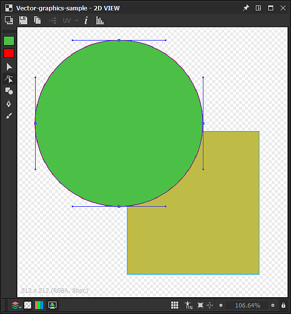

# Werkzeuge zur Vektorbearbeitung.

Auf dieser Seite werden die Bearbeitungswerkzeuge beschrieben, die im Bedienfeld [2D View](https://docs.substance3d.com/display/SDDOC/2D+view) für kompatible Vektorgrafiken verfügbar sind.

## Überblick

<table>
<tr style="border: 0;">
<td style="border: 0;" valign="top">

Das Bedienfeld [2D View](https://docs.substance3d.com/display/SDDOC/2D+view) bietet einfache Vektorbearbeitungswerkzeuge, mit denen Sie Vektorgrafiken *manuell* direkt in [Substance 3D Designer](https://www.adobe.com/products/substance3d-designer.html) erstellen oder bearbeiten können. Diese Tools sind besonders nützlich, um beispielsweise schnell *Masken* oder *Muster* zu erstellen.

Die Werkzeuge unterstützen die Stifteingabe. Um die Vorteile von Stiftanzeigen zu nutzen, können Sie das Bedienfeld [2D-Ansicht](https://docs.substance3d.com/display/SDDOC/2D+view) [abdocken](https://docs.substance3d.com/display/SDDOC/Customizing+your+workspace) und es dann in eine beliebige Konfiguration platzieren und skalieren, die für das Malen angenehmer ist.

Bearbeitungen können *einzeln rückgängig gemacht werden*, und alle anderen Funktionen des Bedienfelds &quot;2D-Ansicht&quot; sind weiterhin *verfügbar*, während Sie das Vektorbild bearbeiten, z. B. das Bedienfeld [Histogramm](https://docs.substance3d.com/display/SDDOC/2D+view#id-2Dview-Histogram), die [Musteranzeige](https://docs.substance3d.com/display/SDDOC/2D+view#id-2Dview-Viewport) und das [Hintergrundbild](https://docs.substance3d.com/display/SDDOC/2D+view#id-2Dview-Backgroundimage).

</td>
<td style="border: 0;" valign="top">

{width="512px"}

</td>
</tr>
</table>

>[!TIP]
>
> **Nur Windows**
> 
> Tablet-Benutzer sollten die auf der folgenden Seite beschriebenen Einstellungen anwenden, um ein möglichst zuverlässiges Erlebnis in Designer zu erzielen: [Konfigurieren von Stiften und Tablets](https://docs.substance3d.com/display/SPDOC/Configuring+Pens+and+Tablets)

>[!IMPORTANT]
>
> Sie können *nur* auf *8-Bit* [Vektorgrafikressourcen](../../../resources/vector-graphics-svg-res/vector-graphics-svg-resource.md) malen, die [neu oder importiert](https://docs.substance3d.com/display/SDDOC/Importing%2C+Linking+and+New+Resources) sind.

{width="512px"}

## Aktivieren der Vektorbearbeitungswerkzeuge

Die Vektorbearbeitungswerkzeuge werden im Bedienfeld [2D-Ansicht](https://docs.substance3d.com/display/SDDOC/2D+view) automatisch aktiviert, wenn die folgenden Kriterien für ein Vektorgrafikbild erfüllt sind:

* Das Vektorgrafikbild ist eine [neue oder importierte ](https://docs.substance3d.com/display/SDDOC/Importing%2C+Linking+and+New+Resources)-Ressource.
* Die Bitmap wird im Bereich [2D-Ansicht](https://docs.substance3d.com/display/SDDOC/2D+view) angezeigt.

*Neue* Vektorgrafikbilder können auf folgende Weise erstellt werden:

* Klicken Sie im Bereich [Explorer](https://docs.substance3d.com/display/SDDOC/The+Explorer+Window) auf RMB in einem *SBS-Paket* oder einem *Ordner* in einem Paket, um das Kontextmenü zu öffnen. Öffnen Sie dann das Untermenü **Neu** und wählen Sie die Option **SVG** aus.
* Erstellen Sie in einem [Diagramm](https://docs.substance3d.com/display/SDDOC/The+Graph+view) einen [SVG-Knoten](../../../compositing-graphs/nodes-reference-for-com/atomic-nodes/svg/svg.md), und wählen Sie die **Von neuer Ressource...Option** im Kontextmenü

Das Fenster **Neue Vektordaten** wird geöffnet, in dem Sie die *Name*- und *Auflösung* der neuen Vektorgrafikressource festlegen können.

>[!TIP]
>
> Für die beste Leistung mit den Vektorbearbeitungswerkzeugen empfehlen wir die Verwendung von Vektorgrafikbildern mit Auflösungen, die *Potenzen von zwei* sind - z. B. 128, 256, 512, 1024, ...

### Exportieren von Vektorgrafiken aus anderen Programmen

Designer *only* unterstützt Vektorgrafiken im Dateiformat **SVG**.

Stellen Sie für optimale Kompatibilität und Zuverlässigkeit in Designer und den zugehörigen Bearbeitungstools sicher, dass alle Objekte in *Konturen* konvertiert und in *separate* Objekte mit *Flächenfarben* aufgeteilt wurden, sodass *keine der folgenden Elemente erhalten bleibt*:

* **Text**
* **Farbverläufe**
* **Muster** (sowohl für Flächen als auch für Konturlinien)
* **Formatvorlagen**

**Adobe Illustrator**-Benutzer können auf das angehängte Image für die empfohlenen SVG *Exporteinstellungen verweisen.*

+++Exportoptionen für Adobe Illustrator

+++

>[!NOTE]
>
> Weitere Informationen zu SVG-Einschränkungen, Exportieren von anderer Software und SVG-Eigenschaften in Designer finden Sie im Abschnitt [Ressource für Vektorgrafiken (SVG)](../../../resources/vector-graphics-svg-res/vector-graphics-svg-resource.md).

## Werkzeuge

Die Malwerkzeuge und -optionen sind in *Symbolleisten* im Bedienfeld [2D-Ansicht](https://docs.substance3d.com/display/SDDOC/2D+view) angeordnet. Diese Symbolleisten können auf *eine beliebige Seite* des Bedienfelds oder als *schwebende Symbolleiste* verschoben werden, indem Sie auf ihrem *Handle* auf **LMB** klicken und diese gedrückt halten - angezeigt als dreifache Linie - und dann **LMB** an der gewünschten Position freigeben.

Wenn die Vektorbearbeitungswerkzeuge aktiviert sind, werden zwei Symbolleisten angezeigt:

* **Werkzeugauswahl** **Symbolleiste**: &quot;*&quot; ermöglicht die Auswahl eines Tools* sowie der *Füll-/Konturfarben* und wird standardmäßig auf der *linken* Seite des Bedienfelds &quot;2D-Ansicht&quot; platziert.
* **Symbolleiste für Werkzeugoptionen**: ermöglicht Ihnen das Festlegen der *Optionen* für das *aktuell ausgewählte Tool* und wird standardmäßig auf der *Oberseite* des Bedienfelds &quot;2D-Ansicht&quot; platziert.

Tastaturbefehle ermöglichen einen schnellen Zugriff auf Werkzeuge und sind unterhalb zwischen Klammern nach dem Werkzeug-/Funktionsnamen gekennzeichnet:

+++Farbauswahl
Mit der  **Farbauswahl** *Miniaturansichten* können Sie eine *Flächenfarbe* und eine *Konturfarbe* für Vektorformen definieren. Sie können den **Farbeditor** für jede dieser Farben wie folgt öffnen:

* **Füllfarbe:** Klicken Sie auf die Miniaturansicht der *Füllfarbe* (oben), oder doppelklicken Sie auf LMB auf der Arbeitsfläche.

* **Gliederungsfarbe:** Klicken Sie auf die *Gliederung*-Farbminiatur (unten) oder *halten Sie Strg* gedrückt und doppelklicken Sie auf &quot;LMB&quot; auf der Arbeitsfläche

Die festgelegten Farben werden dann auf die *aktuell ausgewählten Formen* angewendet.

Wenn die aktuelle *Konturfarbe* *Schwarz* ist - d. h. Luminanz 0 oder RGB (0, 0, 0) -, wird sie *nicht* auf die ausgewählten Formen angewendet, bis Sie *auf die Miniaturansicht der Konturfarbe klicken*.

+++

+++Transformation
{width="512px"}

Das -Werkzeug <b>Transformation</b> (<b>V</b>) kann Formen auswählen, die dann in einem Transformations-Gizmo enthalten sind. Mit diesem Gizmo können Sie die folgenden Aktionen ausführen:

<b>Verschieben</b>: Klicken Sie auf das LMB *innerhalb des Gizmos* und halten Sie es gedrückt.

<b>Skalierung</b>: Klicken Sie auf einen der *quadratischen Handles* entlang des Gizmos und halten Sie die LMB-Taste gedrückt, um das Objekt horizontal, vertikal oder in beiden Richtungen zu *skalieren*. Standardmäßig erfolgt die Skalierung relativ zum Handle auf der *gegenüberliegenden* Seite des Gizmos. Sie können die <b>Alt</b>-Taste gedrückt halten, um die Skalierung relativ zur *Mitte* des Gizmos durchzuführen, und die <b>Umschalttaste</b>-Taste gedrückt halten, um *die Gizmoobreite/-Height* Seitenverhältnis *zu sperren.*

<b>Drehen: </b>Klicken Sie auf LMB neben einem der *quadratischen Handles* entlang des Gizmos, *außerhalb* des Gizmos, und halten Sie die Maustaste gedrückt.

+++

+++Knoten
{width="512px"}

Mit dem  <b>Knoten</b>-Werkzeug (<b>A</b>) können Sie einzelne Scheitelpunkte (d. h. Knoten) der ausgewählten Form auswählen und ihre Position und Handles bearbeiten sowie Scheitelpunkte hinzufügen und entfernen. Nachdem eine Form ausgewählt wurde, können die folgenden Aktionen ausgeführt werden:

<b>Scheitelpunkt hinzufügen:</b> Strg+LMB auf der Formenkontur

<b>Eckpunkt entfernen</b>: Strg+LMB am Scheitelpunkt

<b>Scheitelpunkt verschieben</b>: LMB am Scheitelpunkt halten

<b>Eckpunkthandles verschieben</b>: LMB am Handle halten

<b>Scheitelpunkt-Handle unabhängig bewegen</b>: Halten Sie Alt+LMB am Griff. Beachten Sie, dass Handles nach diesem Punkt *nicht verknüpft* sind, bis sie *zurückgesetzt* sind.

<b>Handles zurücksetzen</b>: Klicken Sie auf dem Scheitelpunkt auf Alt+LMB. Die Handles werden auf die *Scheitelpunktposition* zurückgesetzt.

<b>Zurücksetzscheitelpunkthandles verschieben</b>: Halten Sie Alt+LMB auf dem Scheitelpunkt. *Verknüpfte* Handles werden angezeigt.

+++

+++Form
{width="512px"}

Das -Werkzeug <b>Formen</b> (<b>M</b>) bietet einen Satz von primitiven Formen unter Verwendung der aktuellen *Füllfarbe*, die aus erstellt und bearbeitet werden kann:

* <b>Rechteck;</b>

* <b>Ellipse;</b>

* <b>Abgerundetes Rechteck:</b> Die abgerundeten Winkel haben einen gesperrten Radius;

* <b>Polygon:</b> Erstellt ein Oktogon.

Um eine Grundform zu zeichnen, halten Sie <b>LMB</b> an einer beliebigen Stelle auf der Arbeitsfläche von einer der *Ecken*. Halten Sie <b>Alt+LMB</b> gedrückt, um die Form aus ihrer *Mitte* zu zeichnen.

+++

+++Füllhalter
{width="512px"}

Mit dem  <b>Zeichenstift</b>-Werkzeug (<b>P</b>) können Sie eine neue benutzerdefinierte Form mit der aktuellen *Füllfarbe* zeichnen. Es stehen zwei Modi zur Verfügung:

Im Modus <b>Pfad </b> wird die Form *um jeweils einen Scheitelpunkt* gezeichnet. Die folgenden Steuerelemente sind verfügbar:

<b> geraden in/geraden aus </b> Eckpunkt hinzufügen: Klicken Sie auf LMB

<b>Kurve ein/aus</b> Scheitelpunkt (*ausgerichtet* Tangenten) hinzufügen: LMB gedrückt halten und ziehen

<b>Kurve ein/aus </b>Scheitelpunkt (*nicht ausgerichtet* Tangenten) hinzufügen\*: LMB halten und ziehen, dann Alt+LMB halten

<b>Kurve ein/gerade aus</b> Scheitelpunkt\*hinzufügen: Wie Scheitelpunkt der Kurve/Kurve (nicht ausgerichtete Tangenten), aber die Out-Linie muss* auf dem neuen Scheitelpunkt platziert werden*

<b>gerade in/curve out</b> Scheitelpunkt\* hinzufügen: Alt+LMB gedrückt halten und ziehen

<b>Form </b> auf *nächstem* Scheitelpunkt schließen: Strg gedrückt halten

<b>Form </b> auf *aktuellem* Scheitelpunkt schließen: Drücken Sie die Eingabetaste oder klicken Sie auf LMB am *ersten Scheitelpunkt* der aktuellen Form.

Im <b>Freihandmodus </b> können Sie Formen direkt zeichnen, indem Sie den Stift mit gedrückter LMB-Taste über die Arbeitsfläche ziehen.

Scheitelpunkte werden *automatisch* entlang der Kontur platziert, sodass der resultierende Pfad der Kontur so genau wie möglich entspricht. Die Form wird *automatisch geschlossen*, wenn die Kontur endet, und verbindet den ersten Scheitelpunkt mit dem letzten in der Kontur.

+++

+++Extrudieren
{width="512px"}

Das  **Extrudieren**-Werkzeug (E) *fügt eine Form mit einem* festgelegten Durchmesser *zusammen, die entlang eines Pfades mit dem ausgewählten* Zeichnungsmodus *gezeichnet wird, und wendet das Ergebnis auf der Arbeitsfläche nach dem in der Optionssymbolleiste festgelegten* Zusammenführungsmodus *an.*

Die folgenden *Zeichenmodi* sind verfügbar:

 **Freiform**: zieht die Form *direkt, indem der Zeichenstift* bei gedrückter LMB-Taste über die Arbeitsfläche gezogen wird. Die Form wird am Ende der Kontur zusammengesetzt.

 **Polygon**: zeichnet die Form *ein Gesicht nach dem anderen*, indem Sie auf LMB klicken, um einen Winkel hinzuzufügen. Die Form wird hinzugefügt, wenn Sie die Eingabetaste drücken.

Die gezeichnete Form kann mit folgenden Parametern gesteuert werden:

<b>Größe</b>: Steuert den Durchmesser der radialen Form, die an der Cursorposition gezeichnet wird.

<b>Smoothness</b>: Steuert den Umfang, in dem die gezeichnete Form *geglättet und vereinfacht* werden soll, wenn sie am Ende des Strichs addiert wird.

Wenn die Zeichnung abgeschlossen ist, wird die Form hinzugefügt und mit der aktuell ausgewählten Form zusammengeführt. Verwenden Sie hierfür einen der folgenden verfügbaren *Zusammenführungsmodi*:

 **Keine Zusammenführung**: Die Form wird *auf* der ausgewählten Form als *separates Objekt* gezeichnet.

 **Union**: Die Form wurde *der ausgewählten Form hinzugefügt*.

 **Subtraktion**: Die Form ist *Ausschnitt* der ausgewählten Form.

 **Schnittmenge**: Nur die *überlappenden* Teile der neuen und der ausgewählten Form bleiben erhalten.

+++

## Formvorgänge

{width="512px"}

Zusätzlich zu den oben aufgeführten Tools können eine Reihe von Vorgängen für *ausgewählte Formen* mithilfe des Kontextmenüs durchgeführt werden, das beim Klicken auf RMB verfügbar ist. Diese Vorgänge verfügen fast alle über einen Tastaturbefehl (in Klammern unten) und sind in die folgenden Kategorien unterteilt:

+++Hinzufügen und Entfernen von Formen
<b>Auswahl kopieren</b> (Strg+C): *Ausgewählte Formen in die Zwischenablage kopieren*

<b>Auswahl ausschneiden</b> (Strg+X): *Ausgewählte Formen in die Zwischenablage kopieren* und *Formen entfernen*

<b>Einfügen</b> (Strg+V): Erstellen Sie die kopierte Form, die sich derzeit in der Zwischenablage an der *Cursorposition befindet*.

<b>An Originalposition einfügen</b> (Strg+Umschalt+V): Erstellen Sie die kopierte Form, die sich derzeit in der Zwischenablage befindet, am Speicherort der *kopierten Form*.

<b>Auswahl löschen</b> (Entf): *Ausgewählte Formen entfernen*

+++

+++Anordnen von Formen
Formen werden in einem *Stapel* angeordnet, der die *Reihenfolge* der Formen auf der Arbeitsfläche festlegt - d. h., die sich darüber befindet. Standardmäßig werden *neue Formen auf* der Arbeitsfläche erstellt. Mit den folgenden Steuerelementen können Sie diese Anordnung ändern:

<b>Nach vorne bringen</b> (Startseite): *hebt* die ausgewählten Formen an die *Spitze* des Formenstapels an

<b>Vorwärts</b> (PgUp): *erhöht* die ausgewählten Formen um *eine Ebene* im Formenstapel

<b>Rückwärts senden</b> (PgDown): *senkt* die ausgewählten Formen im Formenstapel um *eine Ebene* nach unten

<b>In den Hintergrund senden</b> (Ende): *senkt* die ausgewählten Formen auf den *unteren* des Formenstapels

+++

+++An neues SVG-Bild senden
Sie können Formen im aktuellen Image verwenden, um eine *neue [SVG-Ressource](../../../resources/vector-graphics-svg-res/vector-graphics-svg-resource.md)* im aktuellen [SBS-Paket](../../../getting-started/overview/overview.md) zu erstellen. Zu diesem Zweck stehen folgende Maßnahmen zur Verfügung:

<b>Auswahl auf neue SVG kopieren</b>: Erstellt eine neue SVG-Ressource und kopiert die ausgewählten Formen *an der Position* in diesem neuen Bild.

<b>Auswahl auf neue SVG schneiden</b>: Erstellt eine neue SVG-Ressource, kopiert die ausgewählten Formen *an Ort und Stelle* in diesem neuen Bild und *entfernt* aus dem *aktuellen Bild*.

+++
