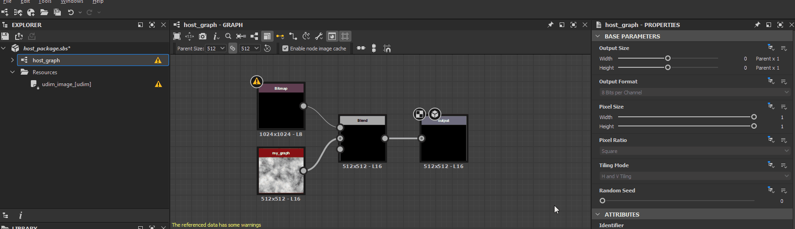
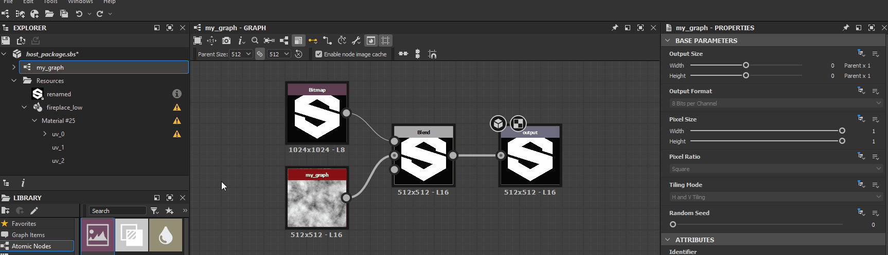

# Warnungen von Abhängigkeiten

Auf dieser Seite werden Warnungen und Fehlermeldungen aufgelistet, die durch Abhängigkeiten in Substance 3D Designer ausgelöst werden können, und es werden für jeden dieser Bereiche allgemeine Schritte zur Fehlerbehebung angezeigt.

Abhängigkeiten sind *andere Dateien*, auf die von einer Substance 3D-Datei (SBS) verwiesen wird. Sie enthalten [Ressourcen](../../resources/resources.md) und andere Substance 3D-Dateien, auf die von [Grapheninstanz](../../compositing-graphs/creating-compositing-gra/graph-instances-sub-gra/graph-instances-sub-graphs.md)-Knoten verwiesen wird.

##  Ungültiges abhängiges Paket

Ein Abhängigkeitspaket kann nicht geladen werden, da es fehlt, beschädigt ist oder mit der verwendeten Designer-Version nicht kompatibel ist.

<b> Lösung</b>

Es gibt im Wesentlichen zwei Möglichkeiten, dieses Problem zu beheben:

1. <b>Die Abhängigkeit erfolgreich laden</b>

   Überprüfen Sie, ob das Abhängigkeitspaket an dem in der Warnmeldung angegebenen Speicherort vorhanden ist. Wenn dies nicht der Fall ist, suchen Sie die Datei und legen Sie sie an diesem Speicherort ab oder erstellen Sie sie an diesem Speicherort neu. Wenn die Datei vorhanden ist, *versuchen Sie, sie* in Designer zu laden, und achten Sie auf Warnungen oder Fehler im Zusammenhang mit diesem Paket. Diese spezifischen Probleme finden Sie in den Schritten zur Fehlerbehebung und beheben Sie sie entsprechend.

   Laden Sie dann das Hostpaket neu, indem Sie im Bereich [Explorer](../../interface/the-explorer-window/the-explorer-window.md) auf RMB klicken und im Kontextmenü die Option <b>Neu laden</b> auswählen.

   
1. <b>Die Abhängigkeit im Paket verschieben</b>

   Sie können die Abhängigkeit mit dem [Abhängigkeitsmanager](../../interface/dependency-manager/dependency-manager.md) verschieben. Klicken Sie im Bedienfeld [Explorer](../../interface/the-explorer-window/the-explorer-window.md) auf RMB im Hostpaket, und wählen Sie im Kontextmenü die Option <b>Abhängigkeits-Manager</b> aus.

   Suchen Sie die fehlende Abhängigkeit in der Liste des Abhängigkeitsmanagers, klicken Sie auf RMB, und wählen Sie <b>Versetzen...</b>-Option. Suchen Sie das Abhängigkeitspaket mithilfe des Dialogfelds &quot;Dateibrowser&quot; und klicken Sie auf <b>Öffnen</b>.

   Laden Sie dann das Hostpaket neu, indem Sie im Bereich [Explorer](../../interface/the-explorer-window/the-explorer-window.md) auf RMB klicken und im Kontextmenü die Option <b>Neu laden</b> auswählen.

   

##  Überprüfen Sie, ob der Alias *&#39;X&#39;* in Ihrem Projekt definiert ist.

Eine der Abhängigkeiten oder Ressourcen des Pakets wird von einem Speicherort geladen, der [aliased](../../interface/preferences-window/project-settings/project-settings.md) in den Daten der Substance 3D-Datei (SBS) unter dem Alias ist, der in der Warnung gemeldet wurde, obwohl dieser Alias in den aktuellen [Projektdateien](../../interface/preferences-window/project-settings/project-settings.md) nicht definiert ist.

<b> Lösung</b>

Mindestens eine der [Projektdateien](../../interface/preferences-window/project-settings/project-settings.md) sollte den Alias definieren, der in der Warnung gemeldet wird.

##  Es wurde keine Datei gefunden, die dieser Ressource entspricht.

Die Dateien, die der *UDIM-Vorlage* für eine [Bitmapressource](../../resources/bitmap-resource/bitmap-resource.md) entsprechen, wurden nicht gefunden.

<b> Lösung</b>

Wenn eine [Bitmapressource](../../resources/bitmap-resource/bitmap-resource.md) verknüpft ist und Designer eine *UDIM-Benennungstaxonomie* im Dateinamen erkennt - z. B. `0x1` in `my_texture_0x1.png` bietet an, es als *UDIM-Vorlage* zu verknüpfen, sodass [Bitmap](../../compositing-graphs/nodes-reference-for-com/atomic-nodes/bitmap/bitmap.md)-Knoten bei Verwendung eines UDIM-Workflows in Designer automatisch *zu anderen Bitmaps in einem UDIM-Satz wechseln können, der diese Taxonomie verwendet.* In diesem Fall verknüpft Designer die Bitmapressource auf eine *andere Weise*, wobei die UDIM-Nummerierungsvorlage berücksichtigt wird.

Es gibt im Wesentlichen zwei Möglichkeiten, dieses Problem zu beheben:

1. <b>Dateien wiederherstellen</b>

   Wechseln Sie zum vom <b>Dateipfad</b>-Attribut der Ressource angegebenen Speicherort und überprüfen Sie, ob Dateien vorhanden sind, die der Vorlage folgen. Ist dies nicht der Fall, können Sie sie wiederherstellen oder neu erstellen.

   
1. <b>Dateien verschieben</b>

   Wenn die Dateien verschoben oder umbenannt wurden, verlagern Sie sie, indem Sie auf RMB im Ressourcenelement im Bereich [Explorer](../../interface/the-explorer-window/the-explorer-window.md) klicken und die Option <b>Relocate</b> auswählen, um diese Ressource mit der *ersten Datei in einem Satz* von UDIM-Bildern desselben Typs zu verknüpfen.

   

##  Verknüpfte Datei nicht gefunden

Die Datei, auf die von einer verknüpften Ressource verwiesen wird, ist nicht an dem Speicherort vorhanden, der durch das <b>Dateipfad</b>-Attribut angegeben wird.

<b> Lösung</b>

Es gibt im Wesentlichen zwei Möglichkeiten, dieses Problem zu beheben:

1. <b>Datei wiederherstellen</b>

   Wechseln Sie zum vom <b>Dateipfad</b>-Attribut der Ressource angegebenen Speicherort und überprüfen Sie, ob die Datei vorhanden ist. Wenn dies nicht der Fall ist, können Sie es wiederherstellen oder neu erstellen.

   
1. <b>Datei verschieben</b>

   Wenn die Datei verschoben oder umbenannt wurde, verlagern Sie sie, indem Sie auf RMB im Ressourcenelement im Bereich [Explorer](../../interface/the-explorer-window/the-explorer-window.md) klicken und die Option <b>Relocate</b> auswählen, um diese Ressource mit einer anderen Datei desselben Typs zu verknüpfen.

   

##  Farbraum nicht gefunden

Eine [Bitmapressource](../../resources/bitmap-resource/bitmap-resource.md) verweist auf einen Farbraum, der in der aktuellen [Farbmanagement](../../color-management/color-management.md)-Umgebung nicht gefunden werden kann. Dies kann ein ICC-Profil oder ein Farbraum in einer OCIO-Konfiguration sein.

<b> Lösung</b>

Die Liste der Optionen für das Farbraumattribut wird automatisch mit dem verfügbaren gültigen Farbraum ausgefüllt. Ändern Sie den Farbraumwert für diese Ressource in einen beliebigen anderen Eintrag in der Liste.

Alternativ können Sie diesen Farbraum der aktuellen [Farbmanagement](../../color-management/color-management.md)-Umgebung hinzufügen und Designer neu starten. Dies kann ein ICC-Profil oder ein Farbraum in einer OCIO-Konfiguration sein.

>[!NOTE]
>
> Diese Warnung wird nur ausgelöst, wenn ein anderer Farbmanagementmodus als **Legacy** verwendet wird (ähnlich dem Deaktivieren des Farbmanagements). Sie können das Farbmanagement im Abschnitt **Farbmanagement** der [Projekteinstellungen](../../interface/preferences-window/project-settings/project-settings.md) aktivieren.

##  Referenzressource nicht gefunden

Das Diagramm, das der UV-Kachel einer [3D-Szenenressource &#x200B;](../3d-scene-resource/3d-scene-resource.md) zugewiesen ist, kann nicht an dem in der Warnung angegebenen Speicherort gefunden werden.

<b> Lösung</b>

Es gibt im Wesentlichen zwei Möglichkeiten, dieses Problem zu beheben:

1. <b>Diagramm wiederherstellen</b>

   Überprüfen Sie den Inhalt des Pakets im Bedienfeld &quot;[Explorer](../../interface/the-explorer-window/the-explorer-window.md)&quot; auf das in der Liste &quot;<b>UV-Kacheln</b>&quot; angegebene Diagramm. Wenn sie nicht vorhanden ist, stellen Sie sie wieder her oder erstellen Sie sie neu.

   
1. <b>Einen anderen Graphen auswählen</b>

   Weisen Sie der UV-Kachel ein anderes Diagramm in der Verpackung zu.

   

##  UV-Kacheln werden mehrmals zugewiesen

Eine UV-Kachel für eine [3D-Szenenressource](../3d-scene-resource/3d-scene-resource.md) ist mehr als einmal einem [Substance-Diagramm](../../compositing-graphs/substance-compositing-graphs.md) zugeordnet.

<b> Lösung</b>

Stellen Sie sicher, dass für jeden UV-Satz einer 3D-Gitterressource kein UDIM-Index *mehr als einmal* in der Liste <b>UV-Kacheln</b> vorhanden ist.

##  Ungültige UV-Kacheln

Eine für eine [3D-Szenenressource &#x200B;](../3d-scene-resource/3d-scene-resource.md) aufgeführte UV-Kachel ist im Gitter nicht definiert oder beschädigt.

<b> Lösung</b>

Stellen Sie für jeden UV-Satz einer 3D-Netzressource sicher, dass alle Elemente in der Liste <b>UV-Kacheln</b> auf UDIMs verweisen, die *in der verknüpften Ressource vorhanden sind*.

>[!NOTE]
>
> Diese Warnung kann nicht über die Benutzeroberfläche ausgelöst werden, da in *only* die in der verknüpften Ressource erkannten UDIMs aufgelistet werden. Nur das Ändern der Daten in der Substance 3D-Datei (SBS) *direkt* kann dazu führen, dass diese Warnung ausgelöst wird.

