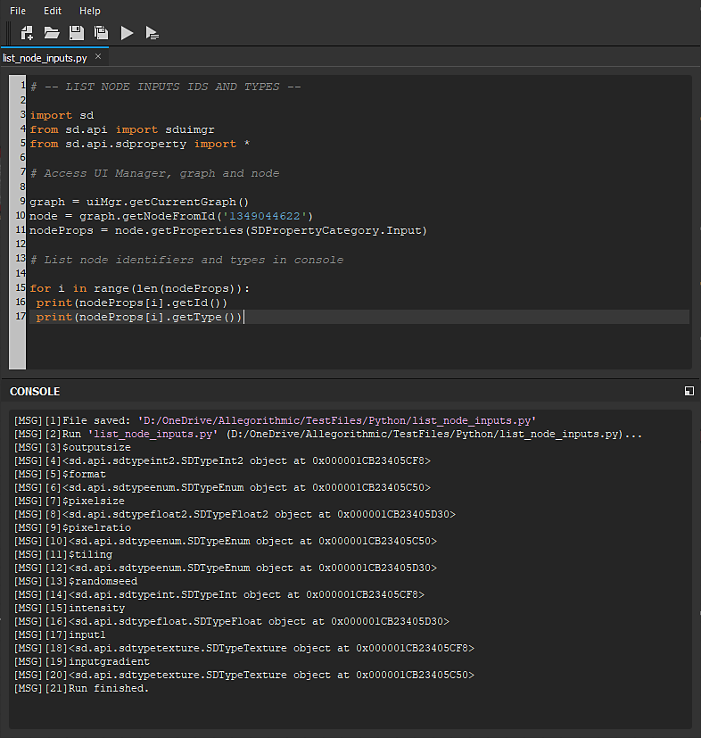

# Python-Editor

Substance 3D Designer verfügt über einen **Skripteditor**, mit dem Benutzer **Python-Code** direkt in Designer testen und die **Konsolenausgabe** abrufen können.

Der Editor verfügt über die Funktion &quot;**Suchen und ersetzen**&quot;, auf die in &quot;*Bearbeiten > Suchen...*-Element in der Editormenüleiste oder durch Drücken von *Strg+F*.

Im Sinne der **Testing** **Zwecke** des Python-Editors können Benutzer entweder den gesamten Code testen, indem sie die Schaltfläche &quot;*Ausführen*&quot; in der Editor-Symbolleiste drücken (oder *F5* drücken), oder die **aktuelle Auswahl nur**, indem sie die Schaltfläche &quot;*Auswahl ausführen*&quot; drücken (oder indem sie &quot;*Strg+Eingabe*&quot; drücken).

