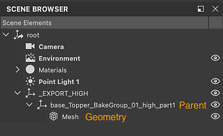

# Probleme beim Baking

Auf dieser Seite werden technische Probleme im Zusammenhang mit [dem Baking von Texturen](../../bakers/bakers.md) in Substance 3D Designer aufgelistet. Für jedes Problem werden Fehlerbehebungsschritte angeboten.

## Auf dieser Seite

&quot;Mit Namen abgleichen&quot; funktioniert nicht

## &quot;Mit Namen abgleichen&quot; funktioniert nicht

<table>
<tr style="border: 0;">
<td style="border: 0;" valign="top">

<b> Problem</b>

Wenn die Option &quot;Abgleich&quot; auf &quot;Nach Mesh-Name&quot; festgelegt ist, scheint die Zuordnung nicht oder nicht konsistent auf alle Szenenobjekt angewendet zu werden.

<b> Empfohlene Schritte</b>

In den Designer-Versionen 14.1 und niedriger wurden Objekte mit niedrigem und hohem Poly mit dem Namen ihrer *übergeordneten* Objekte abgeglichen - in den meisten Fällen transformieren ihr übergeordnetes Objekt.

Seit Designer 15.0 wird der Name der *Geometrie*-Objekte direkt verwendet.

</td>
<td style="border: 0;" valign="top">

{zoomable="yes"}

</td>
</tr>
</table>

Es gibt zwei Pfade, die Sie verwenden können, um die erwartete Übereinstimmung zu erzielen:

* Passen Sie den Namen der Geometrieobjekte an, um passende Namen anzuwenden.
* Stellen Sie das Verhalten oder frühere Designer-Versionen wieder her, indem Sie die Option [&#39;Name Filtermethode&#39;](../../interface/preferences-window/project-settings/project-settings.md) in den Projekteinstellungen anpassen:
  1. Gehen Sie zu Bearbeiten > Voreinstellungen > Projekte .
  1. Die letzte Projektdatei in der Liste auswählen
  1. Wählen Sie unter der Liste der Projektdateien die Registerkarte &quot;Baker&quot; aus.
  1. Legen Sie die Filtermethode &quot;Name&quot; auf &quot;Übergeordneter Name (veraltet)&quot; fest.
