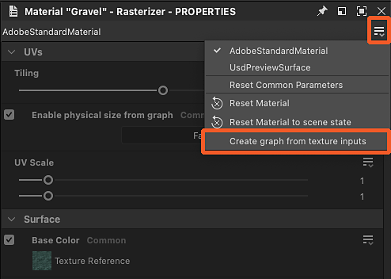

# Extrahieren von Materialwerten und Texturen

Die Materialeigenschaften können extrahiert und in Substance-Graphen verwendet werden.

<table>
<tr style="border: 0;">
<td style="border: 0;" valign="top">

## Neues Diagramm aus Texturen

</td>
<td style="border: 0;" valign="top">

### Textur extrahieren.

</td>
<td style="border: 0;" valign="top">

### Wert extrahieren

</td>
</tr>
</table>

## Neues Diagramm aus Texturen

Die Aktion &quot;Graph aus Textureingaben erstellen&quot; erstellt ein neues Substance-Graph mit allen Texturen, die von einem Material verwendet werden.

Mit dieser Aktion können Sie u. a. Folgendes tun:

* Ein Substance-Diagramm, das nach dem Material benannt ist, wird an der ausgewählten Position erstellt.
* Für jede vom Material verwendete Textur wird eine [Bitmapressource](../../resources/bitmap-resource/bitmap-resource.md) erstellt und in einem nach dem Material benannten Ordner unter einem Ordner &quot;Resources&quot; abgelegt.
* Im Diagramm werden [Bitmap](../../compositing-graphs/nodes-reference-for-com/atomic-nodes/bitmap/bitmap.md) Knoten für jede dieser Bitmap-Ressourcen erstellt und automatisch mit [Output](../../compositing-graphs/nodes-reference-for-com/atomic-nodes/output/output.md) Knoten verbunden, die nach den Materialeigenschaften mithilfe von Texturen konfiguriert wurden.
* Wenn jeder Kanal mit derselben Textur verwendet wird, um unterschiedliche Materialeigenschaften zu steuern (die Technik wird als [Kanalknoten](../../glossary/glossary.md) bezeichnet), werden automatisch [Graustufen-Packing](../../compositing-graphs/nodes-reference-for-com/atomic-nodes/grayscale-conversion/grayscale-conversion.md) hinzugefügt, um die entsprechenden Kanäle auszuwählen.
* Das Diagramm wird automatisch mit dem Material verbunden und sein Erscheinungsbild sollte sich erst ändern, wenn Sie Änderungen am Diagramm vornehmen.

<table>
<tr style="border: 0;">
<td style="border: 0;" valign="top">

{zoomable="yes"}

*Aktion im Ansichtsport der 3D-Ansicht*

</td>
<td style="border: 0;" valign="top">

{zoomable="yes"}

*Aktion im Materialmenü*

</td>
<td style="border: 0;" valign="top">

{zoomable="yes"}

*Aktion im Eigenschaftendock*

</td>
</tr>
</table>

{zoomable="yes"}

*Ergebnis der Diagrammerstellung aus Materialtexturen*

+++Demonstration
{zoomable="yes"}

+++

>[!TIP]
>
> Sie können schnell und direkt im Ansichtsfenster der 3D-Ansicht auf die Aktion zugreifen, indem Sie den Cursor auf das Objekt setzen und <b>Umschalt+LMB</b> drücken, um es auszuwählen. und dann auf RMB klicken, um auf ein Kontextmenü zuzugreifen, das die Aktion hostet.

>[!NOTE]
>
> Für Formate mit *eingebetteten Texturen* (z. B.: USDZ), müssen die Texturen extrahiert und auf die Festplatte kopiert werden. Dies führt zu einem zusätzlichen Schritt, in dem Sie den Speicherort auswählen, an dem die Texturen extrahiert werden sollen.

## Textur extrahieren.

Mit der Aktion &quot;Textur in Diagramm extrahieren&quot; wird in einem vorhandenen Diagramm ein neuer Bitmap-Knoten für eine Textur erstellt, die von einem Material verwendet wird.

Mit dieser Aktion können Sie u. a. Folgendes tun:

* Eine [Bitmapressource](../../resources/bitmap-resource/bitmap-resource.md) wird für die vom Material verwendete Textur erstellt und in einem nach dem Material benannten Ordner unter einem Ordner &quot;Resources&quot; abgelegt.
* Im ausgewählten Diagramm wird ein [Bitmap](../../compositing-graphs/nodes-reference-for-com/atomic-nodes/bitmap/bitmap.md)-Knoten für diese Bitmapressource erstellt und automatisch mit einem [Output](../../compositing-graphs/nodes-reference-for-com/atomic-nodes/output/output.md)-Knoten verbunden, der nach der Materialeigenschaft konfiguriert ist und diese Texturen verwendet.

Wenn eine für die Materialeigenschaft &quot;*&quot; konfigurierte Ausgabe bereits vorhanden ist* im Diagramm, werden *keine Knoten erstellt* und nur die Bitmapressourcenerstellung ausgeführt.

Beispiel: Wenn eine Textur für die Eigenschaft &quot;Grundfarbe&quot; in ein Diagramm extrahiert wird, das bereits einen Ausgabeknoten hostet, der für &quot;Grundfarbe&quot; konfiguriert ist, werden im Diagramm keine Knoten erstellt.

<table>
<tr style="border: 0;">
<td style="border: 0;" valign="top">

{zoomable="yes"}

Aktion für Materialeigenschaft im Eigenschaften-Dock

</td>
<td style="border: 0;" valign="top">

{zoomable="yes"}

Dialogfeld &quot;Zieldiagramm auswählen&quot;

</td>
<td style="border: 0;" valign="top">

</td>
</tr>
</table>

{zoomable="yes"}

Ergebnis der Texturextraktion

+++Demonstration
{zoomable="yes"}

+++

Die Aktion &quot;Textur als Ressource extrahieren&quot; erstellt nur eine Bitmapressource für die vom Material verwendete Textur und platziert sie in einem Ordner, der nach dem Material benannt ist, und zwar in einem Ordner &quot;Ressourcen&quot;.

>[!NOTE]
>
> Für Formate mit *eingebetteten Texturen* (z. B.: USDZ), muss die Textur extrahiert und auf die Festplatte kopiert werden. Dies führt zu einem zusätzlichen Schritt, in dem Sie die Stelle auswählen, an der die Textur extrahiert werden soll.

## Wert extrahieren

Die Aktion &quot;Wert in Diagramm extrahieren&quot; erstellt einen neuen [Wertprozessor](../../compositing-graphs/nodes-reference-for-com/atomic-nodes/value-processor/value-processor.md)-Knoten in einem vorhandenen Diagramm für einen Materialeigenschaftswert.

Mit dieser Aktion können Sie u. a. Folgendes tun:

* Im ausgewählten Diagramm wird ein Knoten vom Typ [Wertprozessor](../../compositing-graphs/nodes-reference-for-com/atomic-nodes/value-processor/value-processor.md) für diesen Eigenschaftswert erstellt und automatisch mit einem Knoten vom Typ [Ausgabe](../../compositing-graphs/nodes-reference-for-com/atomic-nodes/output/output.md) verbunden, der nach dieser Materialeigenschaft konfiguriert ist.
* Im Funktionsdiagramm [Substance des Werteprozessorknotens &#x200B;](../../function-graphs/function-graphs.md) wird ein [Konstantenknoten](../../function-graphs/nodes-reference-for-fun/atomic-function-nodes/constant-nodes/constant-nodes.md), der dem Werttyp entspricht, erstellt und auf den extrahierten Wert als Ausgabe des Diagramms festgelegt.

Wenn eine für die Materialeigenschaft *konfigurierte Ausgabe bereits vorhanden ist* im Diagramm, werden *keine Knoten erstellt*.

Beispiel: Wenn Sie einen Wert für die Eigenschaft &quot;Anisotropie-Ebene&quot; in ein Diagramm extrahieren, das bereits einen Ausgabeknoten hostet, der für &quot;Anisotropie-Ebene&quot; konfiguriert ist, werden im Diagramm keine Knoten erstellt.

<table>
<tr style="border: 0;">
<td style="border: 0;" valign="top">

{zoomable="yes"}

Aktion für Materialeigenschaft im Eigenschaften-Dock

</td>
<td style="border: 0;" valign="top">

{zoomable="yes"}

Dialogfeld &quot;Zieldiagramm auswählen&quot;

</td>
<td style="border: 0;" valign="top">

{zoomable="yes"}

Konstanter Knoten in der Funktion des Werteprozessorknotens

</td>
</tr>
</table>

{zoomable="yes"}

Ergebnis der Wertschöpfung

+++Demonstration
{zoomable="yes"}

+++
