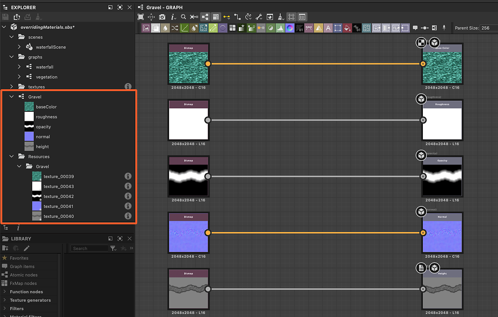
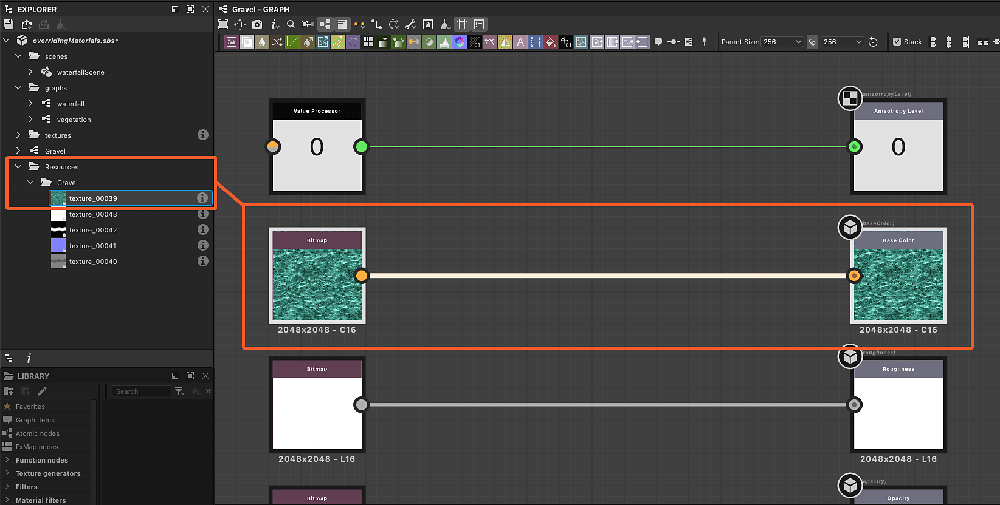

# Extrahieren von Werten und Texturen aus Materialien

Die Eigenschaften von Materialien können extrahiert werden, um in Substance-Grafen verwendet zu werden.

<table>
<tr style="border: 0;">
<td style="border: 0;" valign="top">

## Neuer Graf aus Texturen

</td>
<td style="border: 0;" valign="top">

### Textur extrahieren

</td>
<td style="border: 0;" valign="top">

### Wert extrahieren

</td>
</tr>
</table>

## Neuer Graf aus Texturen

Die Aktion &quot;Graf aus Textur-Eingaben erstellen&quot; erstellt einen neuen Substance-Graf mit allen von einem Material verwendeten Texturen

Mit dieser Aktion können Sie u. a. Folgendes tun:

* Ein nach dem Material benannter Substance-Graf wird am ausgewählten Speicherort erstellt.
* Eine [Bitmapressource](../../resources/bitmap-resource/bitmap-resource.md) wird für jede vom Material verwendete Textur erstellt und in einem nach dem Material benannten Ordner unter dem Ordner &quot;Resources&quot; abgelegt.
* Im Graf werden [Bitmap](../../compositing-graphs/nodes-reference-for-com/atomic-nodes/bitmap/bitmap.md)-Knoten für jede dieser Bitmap-Ressourcen erstellt und automatisch mit [Output](../../compositing-graphs/nodes-reference-for-com/atomic-nodes/output/output.md)-Knoten verbunden, die nach den Material-Eigenschaften mithilfe von Texturen konfiguriert wurden.
* Wenn jeder Kanal derselben Textur verwendet wird, um unterschiedliche Kanaleigenschaften zu steuern (die Technik wird als [Kanalknoten](../../glossary/glossary.md) bezeichnet), werden [Material für Graustufenkonvertierung](../../compositing-graphs/nodes-reference-for-com/atomic-nodes/grayscale-conversion/grayscale-conversion.md) Packing automatisch hinzugefügt, um die entsprechenden Kanäle auszuwählen.
* Der Graf wird automatisch mit dem Material verbunden und sein Erscheinungsbild sollte sich erst ändern, wenn Sie Änderungen am Graf vornehmen.

<table>
<tr style="border: 0;">
<td style="border: 0;" valign="top">

{zoomable="yes"}

*Aktion im 3D-Ansicht-Viewport*

</td>
<td style="border: 0;" valign="top">

{zoomable="yes"}

*Aktion im Menü &quot;Material&quot;*

</td>
<td style="border: 0;" valign="top">

{zoomable="yes"}

*Aktion im Eigenschaftendock*

</td>
</tr>
</table>

{zoomable="yes"}

*Ergebnis der Erstellung von Grafen aus Material-Texturen*

+++Demonstration
{zoomable="yes"}

+++

>[!TIP]
>
> Sie können schnell und direkt im 3D-Ansicht-Viewport auf die Aktion zugreifen, indem Sie den Cursor auf das Objekt setzen und <b>Umschalt+LMB</b> drücken, um es auszuwählen. und dann auf RMB klicken, um auf ein Kontextmenü zuzugreifen, das die Aktion hostet.

>[!NOTE]
>
> Für Formate mit *eingebetteten Texturen* (z. B.: USDZ), müssen die Texturen extrahiert und auf die Festplatte kopiert werden. Dies führt zu einem zusätzlichen Schritt bei der Auswahl des Speicherorts, an den die Texturen extrahiert werden sollen.

## Textur extrahieren

Mit der Aktion &quot;Textur in Graf extrahieren&quot; wird in einem bestehenden Graf für eine von einem Material verwendete Textur ein neuer Bitmapknoten erstellt.

Mit dieser Aktion können Sie u. a. Folgendes tun:

* Eine [Bitmapressource](../../resources/bitmap-resource/bitmap-resource.md) wird für die vom Material verwendete Textur erstellt und in einem nach dem Material benannten Ordner unter dem Ordner &quot;Resources&quot; abgelegt.
* Im markierten Graf wird ein [Bitmap](../../compositing-graphs/nodes-reference-for-com/atomic-nodes/bitmap/bitmap.md)-Knoten für diese Bitmapressource erstellt und automatisch mit einem [Output](../../compositing-graphs/nodes-reference-for-com/atomic-nodes/output/output.md)-Knoten verbunden, der nach der Material-Eigenschaft mithilfe dieser Texturen konfiguriert wurde.

Wenn eine für die Knoteneigenschaft &quot;*&quot; konfigurierte Ausgabe bereits vorhanden ist* im Graf, werden *keine Material erstellt* und nur die Bitmapressourcenerstellung ausgeführt.

Beispiel: Wenn eine Textur für die Eigenschaft &quot;Grundfarbe&quot; an einen Graf extrahiert wird, der bereits einen Ausgabeknoten hostet, der für &quot;Grundfarbe&quot; konfiguriert ist, werden keine Knoten im Graf erstellt.

<table>
<tr style="border: 0;">
<td style="border: 0;" valign="top">

{zoomable="yes"}

Aktion für die Eigenschaft &quot;Material&quot; im Eigenschaften-Dock

</td>
<td style="border: 0;" valign="top">

{zoomable="yes"}

Dialogfeld &quot;Ziel-Graf auswählen&quot;

</td>
<td style="border: 0;" valign="top">

</td>
</tr>
</table>

{zoomable="yes"}

Ergebnis der Extraktion der Textur

+++Demonstration
{zoomable="yes"}

+++

Mit der Aktion &quot;Textur als Ressource extrahieren&quot; wird nur eine Bitmapressource für die vom Material verwendete Textur erstellt und in einem nach dem Material benannten Ordner unter dem Ordner &quot;Ressourcen&quot; abgelegt.

>[!NOTE]
>
> Für Formate mit *eingebetteten Texturen* (z. B.: USDZ), muss die Textur extrahiert und auf die Festplatte kopiert werden. Dies führt zu einem zusätzlichen Schritt bei der Auswahl des Speicherorts, an den die Textur extrahiert werden soll.

## Wert extrahieren

Die Aktion &quot;Wert in Graf extrahieren&quot; erstellt einen neuen Knoten vom Typ &quot;[Wertprozessor](../../compositing-graphs/nodes-reference-for-com/atomic-nodes/value-processor/value-processor.md)&quot; in einem bestehenden Graf für einen Material-Eigenschaftswert.

Mit dieser Aktion können Sie u. a. Folgendes tun:

* Im markierten Graf wird ein Knoten vom Typ [Wertprozessor](../../compositing-graphs/nodes-reference-for-com/atomic-nodes/value-processor/value-processor.md) für diesen Eigenschaftswert erstellt und automatisch mit einem Knoten vom Typ [Ausgabe](../../compositing-graphs/nodes-reference-for-com/atomic-nodes/output/output.md) verbunden, der nach dieser Eigenschaft des Materials konfiguriert ist.
* Im [Substance-Funktionsknoten des Wertprozessor-Grafen &#x200B;](../../function-graphs/function-graphs.md) wird ein [Konstantenknoten](../../function-graphs/nodes-reference-for-fun/atomic-function-nodes/constant-nodes/constant-nodes.md) erstellt, der dem Werttyp entspricht, der auf den extrahierten Wert festgelegt ist, der als Ausgabe des Grafen festgelegt ist.

Wenn eine für die Materialeigenschaft *konfigurierte Ausgabe bereits vorhanden ist* im Diagramm, werden *keine Knoten erstellt*.

Beispiel: Wenn Sie einen Wert für die Eigenschaft &quot;Anisotropie-Ebene&quot; in ein Diagramm extrahieren, das bereits einen Ausgabeknoten hostet, der für &quot;Anisotropie-Ebene&quot; konfiguriert ist, werden im Diagramm keine Knoten erstellt.

<table>
<tr style="border: 0;">
<td style="border: 0;" valign="top">

{zoomable="yes"}

Aktion für Materialeigenschaft im Eigenschaften-Dock

</td>
<td style="border: 0;" valign="top">

{zoomable="yes"}

Dialogfeld &quot;Zieldiagramm auswählen&quot;

</td>
<td style="border: 0;" valign="top">

{zoomable="yes"}

Konstanter Knoten in der Funktion des Werteprozessorknotens

</td>
</tr>
</table>

{zoomable="yes"}

Ergebnis der Wertschöpfung

+++Demonstration
{zoomable="yes"}

+++
