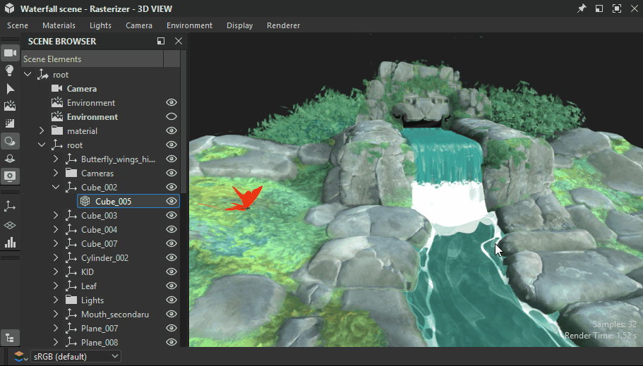

# Außerkraftsetzte Szenenmaterialien

Wenn Sie mit 3D-Szenen mit vorhandenen Materialien arbeiten, müssen Sie diese Materialien überschreiben, um sie durch Ihre eigenen zu ersetzen.

Ihr Material kann von Grund auf neu erstellt werden oder eine angepasste Version des Materials einer Szene, die [in ein Substance-Diagramm extrahiert wurde](../../working-with-3d-scenes/extracting-materials-val/extracting-materials-values-and-textures.md).

{zoomable="yes"}

<table>
<tr style="border: 0;">
<td style="border: 0;" valign="top">

## Szenenmaterial überschreiben

</td>
<td style="border: 0;" valign="top">

### Auf Szenenzustand zurücksetzen

</td>
<td style="border: 0;" valign="top">

### Verbundenes Material

</td>
</tr>
</table>

## Szenenmaterial überschreiben

Jedes Material, das in einer Szene verwendet wird, kann mit Ihrer eigenen Version überschrieben werden, d. h. mit einem neuen Material oder einer bearbeiteten Version des vorhandenen Materials.

Die Aktion &quot;Material überschreiben&quot; kann an zwei Stellen gefunden werden:

* Öffnen Sie das Menü &quot;Materialien&quot; und gehen Sie zum Untermenü des gewünschten Materials
* Drücken Sie Umschalt+LMB auf einem Szenenobjekt, um es auszuwählen, und klicken Sie dann auf RMB, um das Kontextmenü zu öffnen

<table>
<tr style="border: 0;">
<td style="border: 0;" valign="top">

{zoomable="yes"}

*Aktion im Ansichtsport der 3D-Ansicht*

</td>
<td style="border: 0;" valign="top">

{zoomable="yes"}

*Aktion im Materialmenü*

</td>
</tr>
</table>

Im Kontext von Designer, das USD für die interne Szenenbeschreibung verwendet, bedeutet &quot;Überschreiben&quot;, dass *eine Kopie* des Materials erstellt wird, die dem Original so genau wie möglich entspricht, und dass die *Materialbindung* der Gitter der Szene von dem Original in die Kopie geändert wird.

>[!NOTE]
>
> Die Kopien werden in der Szene in einem Ordner &quot;<b>Material</b>&quot; (&quot;Umfang&quot; in USD) unter dem Stamm erstellt und verwenden denselben Bezeichner wie das Original sowie ein numerisches Suffix (z. B.: &quot;rostedMetal\_0&quot;)

Das bedeutet zwei wichtige Dinge:

1. Das Originalmaterial wird nie verändert.
1. Alle in Designer vorgenommenen Änderungen werden auf die Kopie angewendet.

Sie können jede Modifikation jederzeit über dieselbe Aktion &quot;Material überschreiben&quot; aktivieren bzw. deaktivieren, wenn Sie das Material der ursprünglichen Szene wiederherstellen oder eine schnelle Vorher-/Nachher-Prüfung durchführen möchten

Da die Kopie so erstellt wird, dass sie mit dem Original übereinstimmt, sollte das Überschreiben eines Materials sein Aussehen in den meisten Fällen nicht ändern (siehe Hinweis unten), bis Sie ein Substance-Diagramm damit verbinden oder seine Eigenschaften bearbeiten.

>[!NOTE]
>
> Wenn ein irreguläres Format angewendet wird, berechnet Designer die Tangenten und Binormalen der betroffenen Meshes. Dies kann einige Zeit dauern und das Aussehen dieser Meshes ändern, insbesondere wenn diese Meshes keine definierte Normalskala und -neigung aufweisen oder andere verwenden.

>[!IMPORTANT]
>
> Die <b>AdobeStandardMaterial</b>-Schattierung wird im gesamten Substance 3D-Ökosystem unterstützt, ist jedoch kein Industriestandard und *kann daher möglicherweise nicht von Drittanbieteranwendungen wie Blender* unterstützt werden.
> 
> Für die optimale Interoperabilität außerhalb von Substance 3D-Anwendungen wird derzeit empfohlen, das <b>UsdPreviewSurface</b>-Schattierung-Modell zu verwenden, selbst wenn dieses Modell deutlich weniger Material-Eigenschaften und -Effekte unterstützt.

## Auf Szenenzustand zurücksetzen

Wenn Sie den Anfangsstatus eines Materials wiederherstellen, es aber überschrieben lassen und trotzdem bearbeiten können, können Sie jede Material-Kopie auf die ursprünglichen Werte zurücksetzen.

Wenn ein Eigenschaftswert eines Materials geändert oder eine Textur von einem Graf darauf angewendet wurde, wird die Eigenschaft auf ihren ursprünglichen Wert oder ihre ursprüngliche Textur zurückgesetzt.

Ein Material kann vollständig oder pro Eigenschaft zurückgesetzt werden.

Verwenden Sie die Aktion &quot;Material auf Status der Szene zurücksetzen&quot; im Untermenü des Materials oder im Kontextmenü eines Meshs, um das Material vollständig zurückzusetzen.

Die Aktion kann an drei Stellen durchgeführt werden:

* Öffnen Sie das Menü &quot;Materialien&quot; und gehen Sie zum Untermenü des gewünschten Materials
* Drücken Sie Umschalt+LMB auf einem Szenenobjekt, um es auszuwählen, und klicken Sie dann auf RMB, um das Kontextmenü zu öffnen
* Das Hamburger-Menü oben in den Eigenschaften des Materials

<table>
<tr style="border: 0;">
<td style="border: 0;" valign="top">

{zoomable="yes"}

*Aktion im Ansichtsport der 3D-Ansicht*

</td>
<td style="border: 0;" valign="top">

{zoomable="yes"}

*Aktion im Materialmenü*

</td>
<td style="border: 0;" valign="top">

{zoomable="yes"}

*Aktion in den Eigenschaften des Materials*

</td>
</tr>
</table>

<table>
<tr style="border: 0;">
<td style="border: 0;" valign="top">

Die Aktion ist auch in den Elementeigenschaften *pro Eigenschaft* verfügbar, falls Sie nur einige Material eines Materials zurücksetzen möchten.

Öffnen Sie das Hamburgermenü der Eigenschaft &quot;Material&quot;, um die Aktion &quot;Auf Standardzustand der Szene zurücksetzen&quot; zu öffnen.

</td>
<td style="border: 0;" valign="top">

{zoomable="yes"}

</td>
</tr>
</table>

## Verbundenes Material

Erneut: Designer ändert das Material einer Szene nicht direkt. In der Szene wird eine Kopie erstellt, an die die Mesh statt an das Original gebunden werden.

Auf der anderen Seite verfügt Designer über eine *eigene* separate Liste von Materialien im Menü &quot;Materialien&quot;, die standardmäßig mit der Liste der Material der Szene übereinstimmt. Sie können dieser Liste jederzeit neue Materialien hinzufügen.

Dies ist ein *anderer* Datensatz, der nur in Designer erstellt und verwaltet wird. Diese Material sind dann *mit den Kopien* verbunden, die die ursprünglichen Material der Szene überschreiben.

{zoomable="yes"}

Sie können jedes der im Menü &quot;Materialien&quot; aufgelisteten Materialien mit den von Designer in der Szene erstellten Kopien verbinden: Klicken Sie im Szene-Browser auf RMB und wählen Sie das Untermenü &quot;Material verbinden&quot;.

Das Untermenü listet alle Material in der Szene sowie alle Material auf, die Sie möglicherweise manuell über das Menü &quot;Material&quot; erstellt haben.

{zoomable="yes"}
