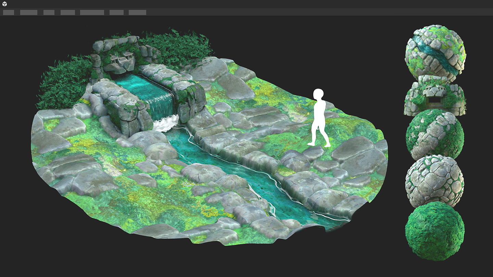

# Arbeiten mit 3D-Szenen

{zoomable="yes"}

Mit Designer können Sie [3D-Szenen](../glossary/glossary.md) laden, um Materialien im Kontext zu bearbeiten. Eine Liste der unterstützten Dateiformate für 3D-Szenen finden Sie hier, einschließlich einer Liste der unterstützten Funktionen für jedes Format. <b>&lt;Link erforderlich></b>

Beim Arbeiten im Kontext wird [&#128279;](../working-with-3d-scenes/overriding-scene-mat/overriding-scene-materials.md)eines der [Materialien](../glossary/glossary.md) der Szene überschrieben, um es durch ein in Designer erstelltes Material zu ersetzen.\
Sie können mit einer beliebigen Grafikvorlage aus Designer beginnen oder [Werte und Strukturen](../working-with-3d-scenes/extracting-materials-val/extracting-materials-values-and-textures.md) aus dem Substance-Material der 3D-Szene extrahieren.

Wenn Sie mit der 3D-Szene fertig sind, können Sie die 3D-Szene [in eine neue Datei exportieren](../working-with-3d-scenes/exporting-scenes/exporting-scenes.md), um sie in einer anderen Anwendung zu importieren.

Beim Exportieren in USD-Formate kann dieser Workflow vollständig <b>nicht-destruktiv</b> sein, d. h., es werden nur Bearbeitungen und Ergänzungen exportiert.

Zuerst müssen Sie eine 3D-Szene laden, an der Sie arbeiten möchten, und in der Lage sein, ihren Status in Designer sitzungsübergreifend beizubehalten.

<table>
<tr style="border: 0;">
<td style="border: 0;" valign="top">

## Inhalte von 3D-Szenen

</td>
<td style="border: 0;" valign="top">

### Laden einer Szene

</td>
<td style="border: 0;" valign="top">

### Szenenstatusdateien

</td>
</tr>
</table>

## Inhalte von 3D-Szenen

Beim Laden einer 3D-Szene hat Designer eine eigene Szene erstellt, um diese zu hosten.

Sie können mit den folgenden Inhalten der Szene interagieren:

* <b>Materialien:</b> Alle in der Szene verwendeten Materialien können mit einer von Designer erstellten Kopie [überschrieben](../working-with-3d-scenes/overriding-scene-mat/overriding-scene-materials.md) werden. Sie können die [Materialeigenschaften](../interface/3d-view/material-properties/material-properties.md) dieser Kopie mit Rohwerten oder Texturen aus einem Substance-Graphen bearbeiten.
* <b>Gitter:</b> Die Geometrie kann direkt im Viewport oder im [Szenenbrowser](../interface/3d-view/scene-browser/scene-browser.md) ausgewählt werden, um auf die Materialaktionen zuzugreifen ([override](../working-with-3d-scenes/overriding-scene-mat/overriding-scene-materials.md), [reset](../working-with-3d-scenes/overriding-scene-mat/overriding-scene-materials.md), [In Substance-Diagramm extrahieren](../working-with-3d-scenes/extracting-materials-val/extracting-materials-values-and-textures.md)).
* <b>Lichter:</b> Alle Lichter in der Szene können im [Szenenbrowser](../interface/3d-view/scene-browser/scene-browser.md) deaktiviert werden.
* <b>Kameras:</b> jede in der Szene erkannte Kamera wird der von Designer hinzugefügten Kamera als Vorgabe hinzugefügt.

{zoomable="yes"}

Designer verwendet eine USD-Beschreibung für seine 3D-Szene. Sein Layout kann im Szenenbrowser navigiert werden, wobei jeder [USD prim](https://openusd.org/release/glossary.html#usdglossary-prim)-Typ über ein eigenes Symbol verfügt (Geometrie, Material, Shader, Kamera, Transformation, ...).

Der [Szenenbrowser &#x200B;](../interface/3d-view/scene-browser/scene-browser.md) kann zum Auswählen, Aktivieren und Deaktivieren des Inhalts der Szene verwendet werden. Daher empfehlen wir Ihnen, die Anzeige beizubehalten, wenn Sie mit benutzerdefinierten 3D-Szenen arbeiten.

## Laden einer Szene

Es gibt mehrere Möglichkeiten, eine 3D-Szene in der 3D-Ansicht zu laden:

1. Doppelklicken oder ziehen Sie eine [3D-Szenenressource](../resources/3d-scene-resource/3d-scene-resource.md) aus einem [Paket](../glossary/glossary.md) in die 3D-Ansicht.
1. Ziehen Sie ein 3D-Szenenelement aus der [Bibliothek](../interface/the-library/the-library.md) in die 3D-Ansicht (vorausgesetzt, Sie haben [&#x200B; eigenen Inhalt zur Bibliothek hinzugefügt](../interface/the-library/managing-custom-content/managing-custom-content-and-filters.md)).
1. Ziehen Sie eine 3D-Szenendatei aus dem Dateibrowser des Systems in die 3D-Ansicht
1. Laden einer 3D-Szenenstatusdatei (SBSSCN) zusammen mit dem referenzierten Gitter

Beachten Sie, dass Sie mit den Methoden 1 und 4 die Szene erneut laden können, genau wie bei der letzten Bearbeitung, da der Status der Szene in die 3D-Szenenressource und die Szenenstatusdatei geschrieben und im Paket gespeichert wird. Die Methoden 2 und 3 laden die Szene wie jede andere.

<table>
<tr style="border: 0;">
<td style="border: 0;" valign="top">

{zoomable="yes"}

Laden einer 3D-Szenenressource

</td>
<td style="border: 0;" valign="top">

{zoomable="yes"}

Laden einer 3D-Szene aus der Bibliothek

</td>
</tr>
</table>

<table>
<tr style="border: 0;">
<td style="border: 0;" valign="top">

{zoomable="yes"}

Laden einer 3D-Szenendatei

</td>
<td style="border: 0;" valign="top">

{zoomable="yes"}

Laden einer Szenenstatusdatei

</td>
</tr>
</table>

>[!NOTE]
>
> Das Navigieren und Visualisieren der Szene in der 3D-Ansicht wird in der [Dokumentation der 3D-Ansicht](../interface/3d-view/3d-view.md) beschrieben.

<table>
<tr style="border: 0;">
<td width="100.00%" style="border: 0;" valign="top">

Designer erstellt immer eine eigene Umgebung (DomeLight in USD) und eine Kamera zusätzlich zu den in der Szene vorhandenen.

Alle von Designer erstellten Elemente werden im Szenenbrowser mit <b>fetten Beschriftungen</b> aufgelistet.

>[!NOTE]
>
> Wenn eine geladene Szene mindestens eine Umgebung (DomeLight) aufweist, ist die von Designer erstellte Umgebung standardmäßig *deaktiviert*, sodass sie die Umgebungsbeleuchtung der Szene nicht beeinträchtigt.

</td>
<td width="33.33%" style="border: 0;" valign="top">

{zoomable="yes"}

</td>
</tr>
</table>

## Szenenstatusdateien

Nachdem Sie Materialien, Kamera, Lichter usw. in der 3D-Ansicht eingerichtet haben, kann dieser Status in einer Szenenstatusdatei (.sbsscn) gespeichert werden, die später geladen werden kann, um diesen Status wiederherzustellen. Unter Umständen möchten Sie beispielsweise einige Szenen für die Vorschau verschiedener Materialarten oder für eine bestimmte Lichtumgebung einrichten.

{zoomable="yes"}

Ein gespeicherter Szenenzustand kann auch als Standardzustand für die 3D-Ansicht verwendet werden, sodass jedes Mal, wenn eine neue 3D-Ansicht erstellt wird, dieser Zustand verwendet wird. Dies ist nützlich, wenn Sie Material in Ihren Materialien standardmäßig im Sphere 2-Tiles-Gitter mit einem Kachelwert von 2 und einer bestimmten Umgebungskarte in der Vorschau anzeigen möchten.

Die Aktionen im Zusammenhang mit Szenenstatusdateien befinden sich im Szenenmenü der 3D-Ansicht und sind hier [dokumentiert](../interface/3d-view/3d-view.md).

Szenenzustandsdateien verwenden das XML-Format und verwenden [Aliase](../pipeline-and-project-con/project-configuration-fil/project-configuration-files-sbsprj.md), sofern in Ihren [Projekteinstellungen](../interface/preferences-window/project-settings/project-settings.md) definiert.

>[!NOTE]
>
> Der Renderer wird nicht in der Szenenstatusdatei gespeichert.
